# Apex 5" HD on base frame kit

## A digital HD build on the Apex Base Frame Kit

:fr: Pour mon premier build DIY je voulais un 5" solide.

J'ai choisi le **ImpulseRC Apex Base Frame Kit** car je ne voulais pas dépendre d'une frame spécifique HD et perdre la place faite spécifiquement pour le DJI Air Unit.

Ce fut un challenge de tout faire tenir proprement mais j'adore le résultat et j'espère que vous apprécierez la densité et l'équilibre du build.

Cela donne vie à un build compact (mais pas trop) sans sacrifier la place pour l'électronique. C'est propre (en tout cas pour moi) et très puissant.

J'ai pris énormément de plaisir à travailler dessus et j'espère que vous le sentirez au long de votre lecture. Amusez-vous bien !

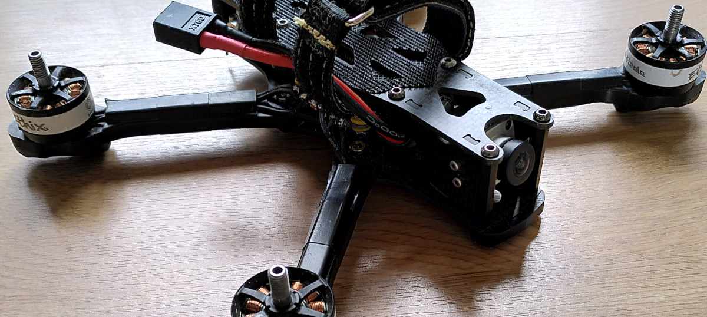{: style="opacity:0.5;"}

## Hardware list

!!! note
    Les liens ci-dessous ne sont **PAS** des liens d'affiliation. Ce sont tout simplement les liens où j'ai moi-même commandé le matériel nécessaire à ce build.

- [X] [ImpulseRC Apex Base Frame Kit](https://www.drone-fpv-racer.com/apex-5-base-frame-kit-5135.html)
    - [X] [T-Motor Combo F7 HD FC + F55A PRO II](https://www.drone-fpv-racer.com/t-motor-combo-f7-hd-fc-f55a-pro-ii-5548.html)
    - [X] [TBS Motor Steele Ethix Stout V3](https://www.drone-fpv-racer.com/tbs-moteur-steele-ethix-stout-v3-5183.html)
    - [X] [TBS Tracer Nano RX](https://www.drone-fpv-racer.com/tbs-tracer-micro-tx-6960.html)
    - [X] [Caddx Vista HD System](https://www.drone-fpv-racer.com/caddx-vista-hd-system-5821.html) (see improvement notes below)
    - [X] [Apex HD CAMERA SIDE PLATE KIT](https://www.drone-fpv-racer.com/apex-hd-camera-side-plate-kit-5208.html) (see improvement notes below)
    - [X] [20cm Coaxial Cable for Caddx Vista](https://www.drone-fpv-racer.com/cable-coaxial-pour-caddx-vista-6441.html) (20cm !)
    - [X] [Vifly Finder Mini - Buzzer](https://www.drone-fpv-racer.com/vifly-finder-mini-buzzer-autonome-7589.html) (lightweight, does a good job)
    - [X] [XT60 14AWG 10cm cable](https://www.drone-fpv-racer.com/cable-xt60-male-14awg-10cm-250.html) (longer)
    - [X] [Apex DJI antenna TPU holder](https://www.drone-fpv-racer.com/support-d-antenne-dji-pour-apex-hd-tpu-by-dfr-6029.html) (will fit tracer immortal-t)
- [X] [HQProp ETHIX P3 Peanut Butter & Jelly 5.1x3x3 - PC (2x CW + 2xCCW)](https://www.drone-fpv-racer.com/hqprop-ethix-p3-peanut-butter-jelly-51x3x3-pc-2x-cw-2xccw-6886.html)
- [X] [TrueRC Singularity U.FL Lite 112mm 5.8GHz - LHCP](https://www.drone-fpv-racer.com/antenne-truerc-singularity-ufl-lite-112mm-58ghz-lhcp-6994.html)
- [X] [Strap Lipo KEVLAR 240x16mm - DFR](https://www.drone-fpv-racer.com/strap-lipo-kevlar-antiderapant-240x16mm-dfr-3155.html)

## Notes pour améliorations futures

- [ ] Passer sur le [Caddx Nebula Pro Vista Kit](https://caddxfpv.com/collections/%E5%B0%81%E9%9D%A2%E5%88%86%E7%B1%BB-hd-digital-cameras/products/nebula-pro-vista-kit-720p-120fps-low-latency-hd-digital-fpv-system) pour ne plus dépendre du [Apex HD CAMERA SIDE PLATE KIT](https://www.drone-fpv-racer.com/apex-hd-camera-side-plate-kit-5208.html) et gagner 3 grammes et quelques euros ?

## Build steps

### Frame assembly

Suivre le [guide officiel de ImpulseRC](http://apex-docs.impulserc.com/) pour assembler la frame.

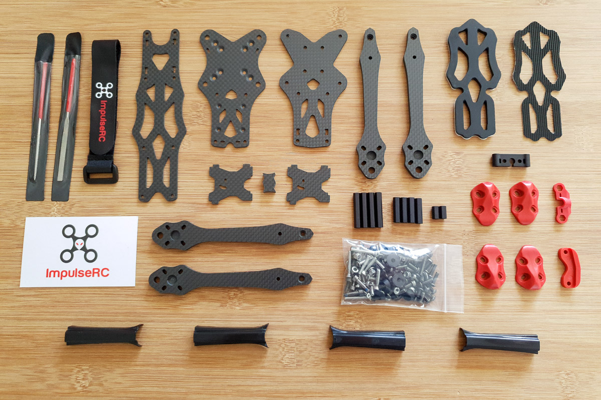

### Caddx Vista on the 20x20 rear mounting holes

!!! note
    Vous aurez besoin de 4 longues vis M2 non incluses dans le kit. Les écrous sont cependant ceux fournis avec le kit.

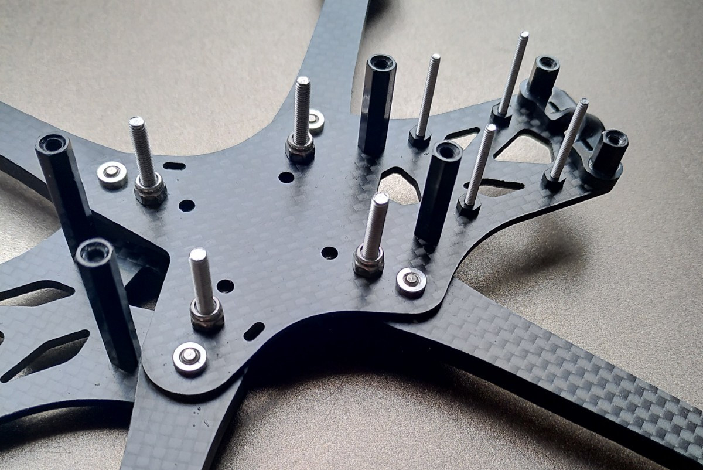

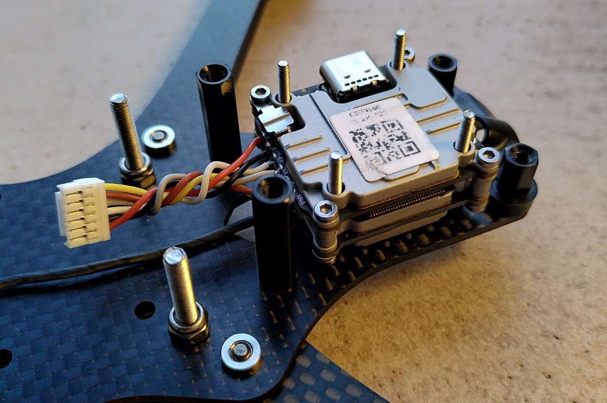

Le **câble de 20cm pour Caddx Vista** est mieux protégé que celui d'origine.


### Caddx Vista VTX antenna mounting

Utiliser le **TPU pour antennes DJI** fixé à l'arrière pour l'antenne U.FL en la zippant sur une entretoise pour protéger le vista.

Les antennes Tracer Immortal T tiennent bien : une est zippée sur le sabot de la plate du bas fourni et l'autre est enfichée dans la partie verticale du TPU.

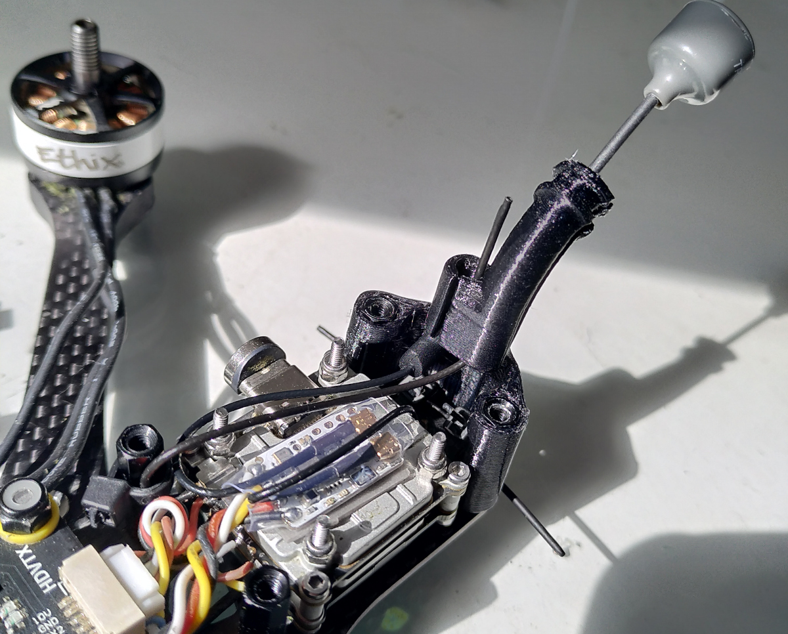

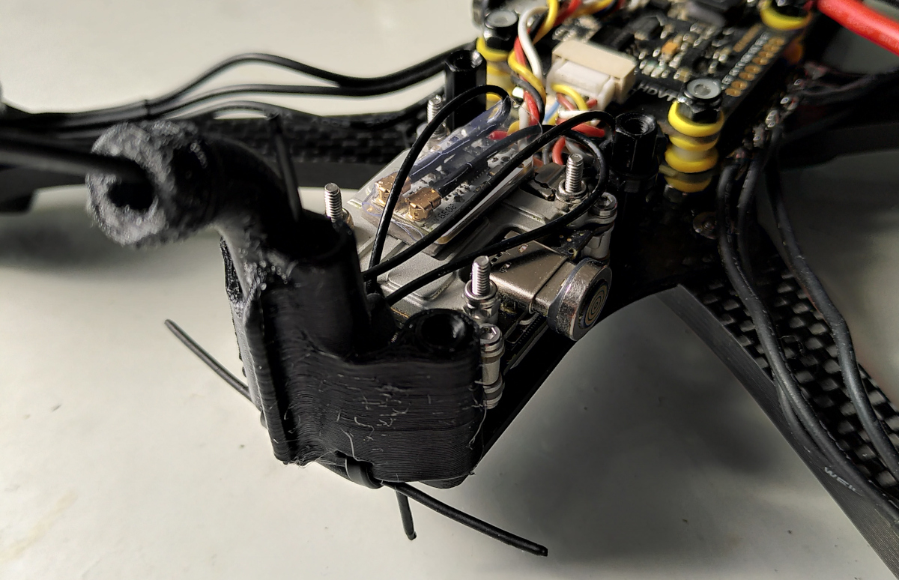

### ESC and XT60 mounting

Dans ma première version de ce build j'ai coupé le XT60 trop court et les hélices finissent par le toucher. Depuis j'utilise un XT60 de 10cm zippé à l'entretoise avant.

!!! warning
    Notez bien que **l'ESC est monté à l'envers** afin d'utiliser l'espace disponible à l'avant pour placer le capacitor. Vous devrez réallouer les ressources moteurs dans la CLI (voir la section betaflight ci-après).

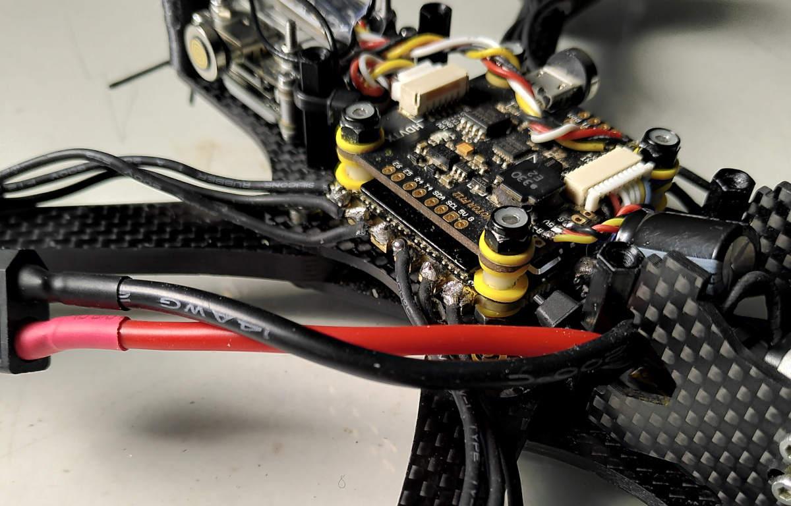

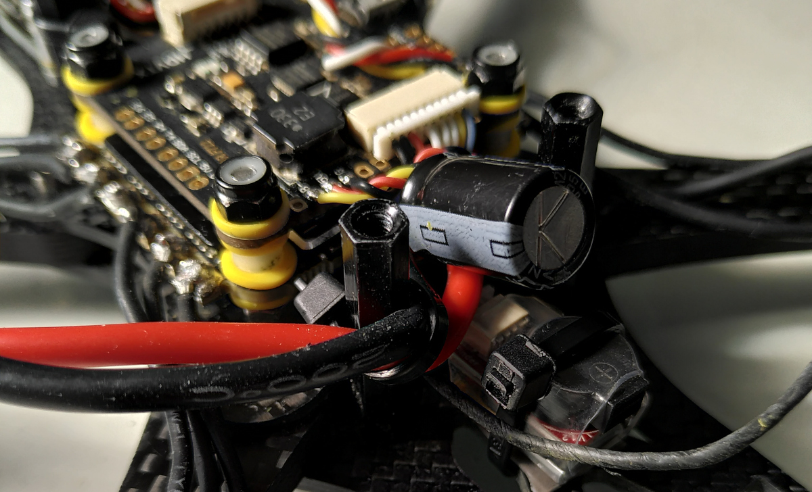

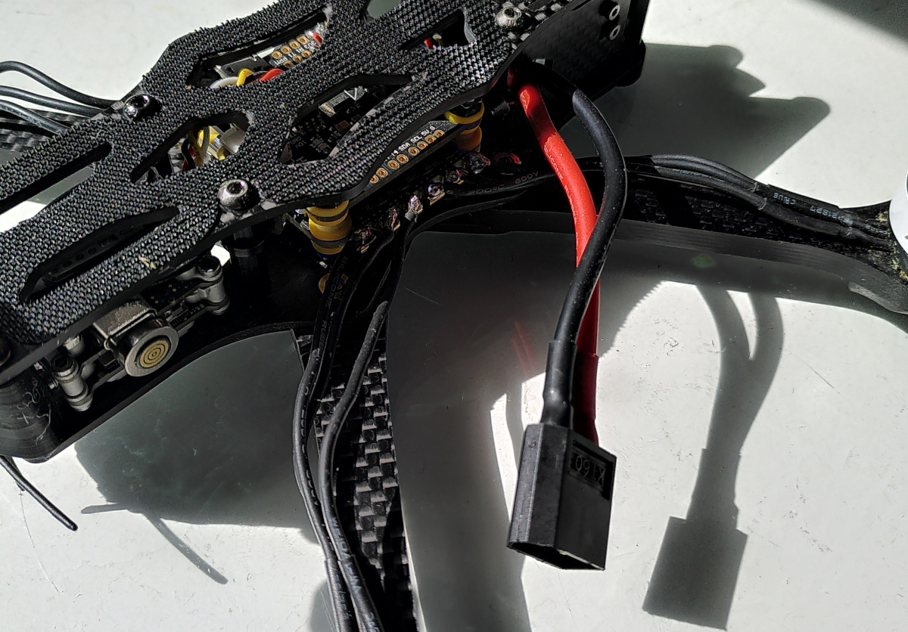

### RX wiring

Aucune surprise dans le branchement du TBS Tracer Nano RX !


### FC mounting

Utilisez le câble FC-vers-ESC fourni le plus long (cela passe parfaitement, attention il y a un sens) et connectez la Caddx Vista.

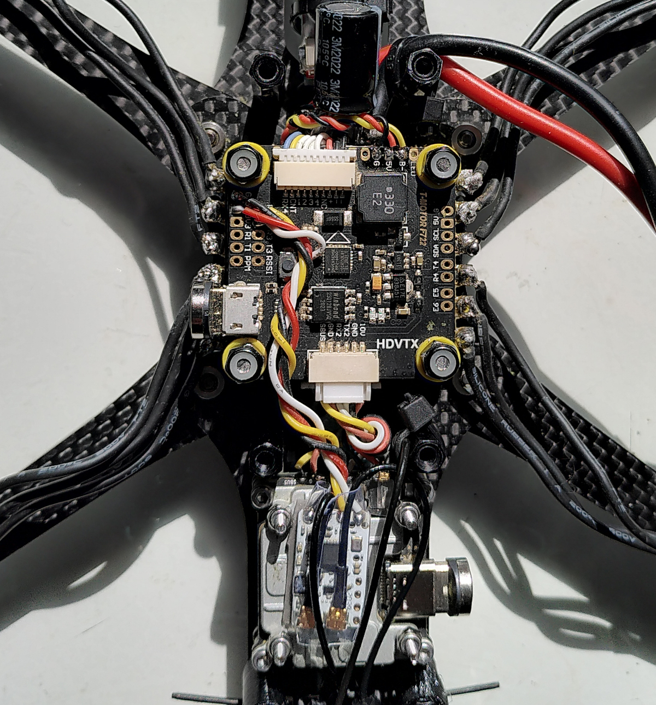

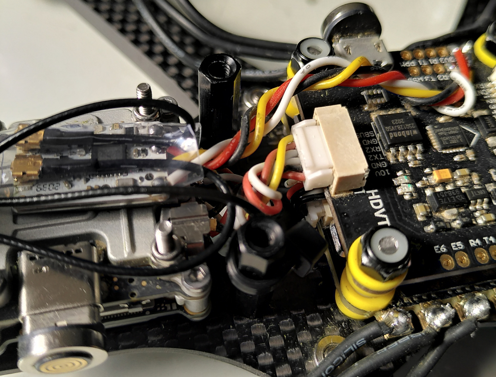

### RX placement

Une fois protégé, le RX tient sur le Caddx Vista grâce à du scotch double face.

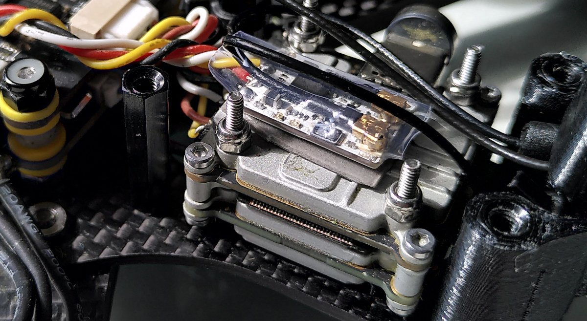

### Buzzer

Le Vifly finder mini est léger à l'avant et occupe parfaitement l'espace disponible, c'est un super compromis.

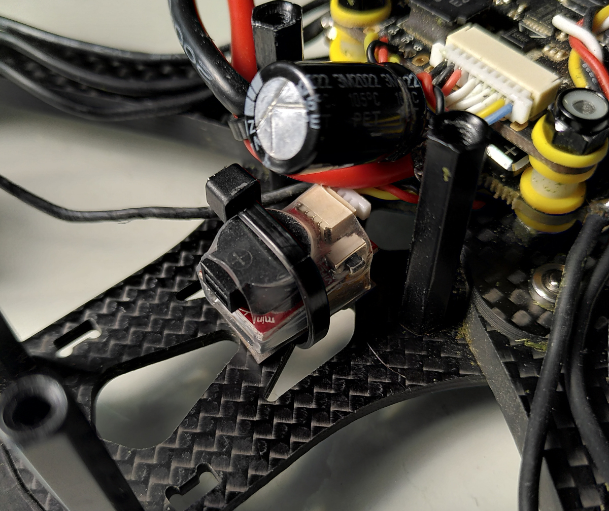

### Finishing the build

Finissez le build en plaçant la top plate et les caches en plastiques sur les bras fournis.

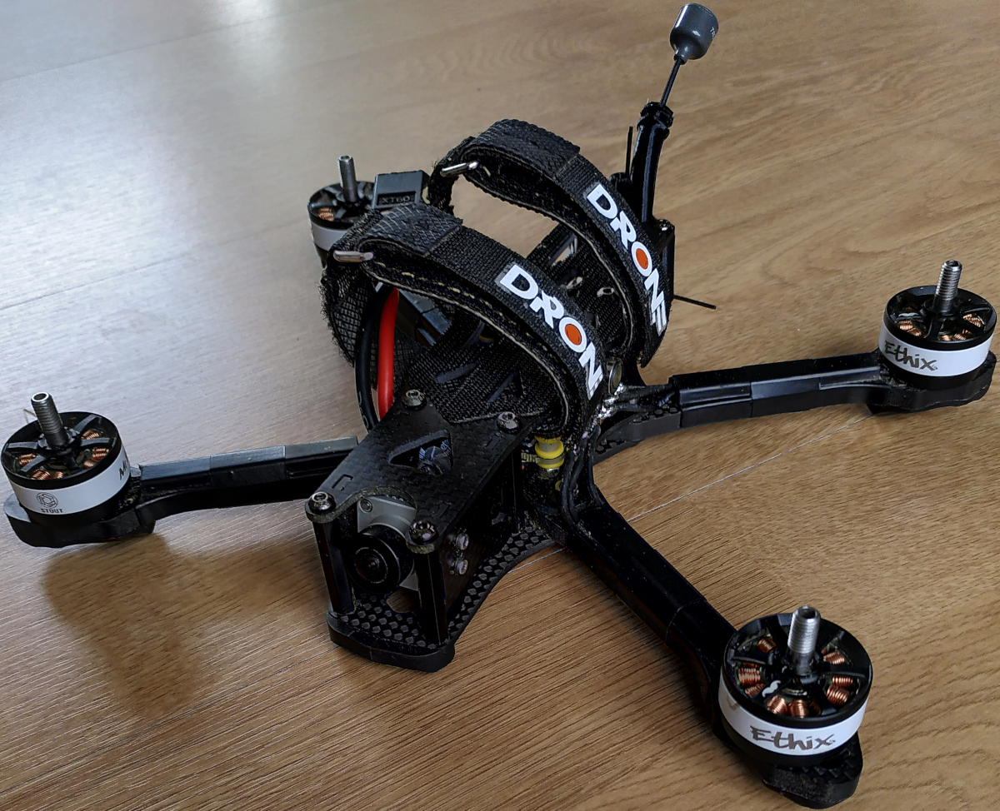


## Betaflight configuration

- Betaflight target: **TMTR/TMOTORF7(STM32F7X2)**

Ports:


Bi-directional DShot is enabled and supported natively by the BLHeli32 ESC:


Filter settings to accommodate the bi-directional DShot:

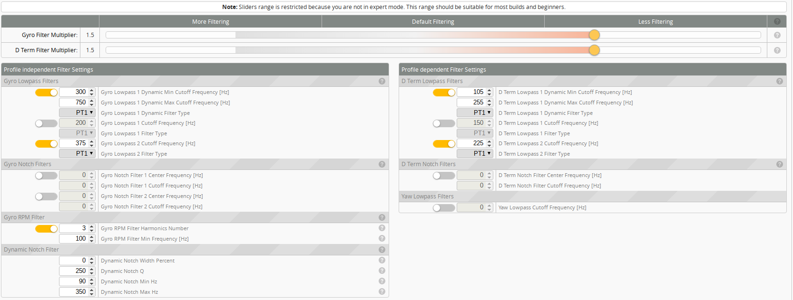

Modes:

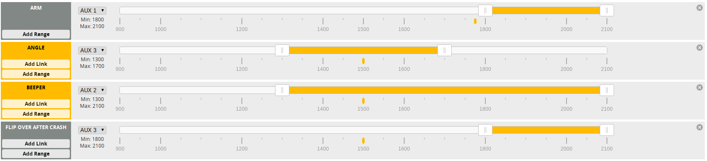

Joshua Bardwell's OSD for DJI FPV Google settings:


### Motor resource reallocation

Comme l'ESC a été monté à l'envers il est nécessaire de repositionner les moteurs dans la CLI. Selon votre montage, les ID peuvent changer.

```
# resources
resource MOTOR 1 B01
resource MOTOR 2 B00
resource MOTOR 3 C07
resource MOTOR 4 C06
save
```

### Minimal CLI diff

CLI diff de la configuration minimale sans tuning approfondi. Voir la section d'après pour avoir ma dernière version tunée.

```
#
# Building AutoComplete Cache ... Done!
#
# diff all

# version
# Betaflight / STM32F7X2 (S7X2) 4.2.6 Jan  5 2021 / 19:08:42 (a4b6db1e7) MSP API: 1.43
# config: manufacturer_id: TMTR, board_name: TMOTORF7, version: e02dd6f2, date: 2020-11-04T11:31:26Z

# start the command batch
batch start

# reset configuration to default settings
defaults nosave

board_name TMOTORF7
manufacturer_id TMTR
mcu_id 002f00263338510639393832
signature

# resources
resource MOTOR 1 B01
resource MOTOR 2 B00
resource MOTOR 3 C07
resource MOTOR 4 C06

# feature
feature -RX_PARALLEL_PWM
feature RX_SERIAL
feature TELEMETRY

# beacon
beacon RX_LOST
beacon RX_SET

# serial
serial 1 1 115200 57600 0 115200
serial 4 64 115200 57600 0 115200

# aux
aux 0 0 0 1800 2100 0 0
aux 1 1 2 1300 1700 0 0
aux 2 13 1 1300 2100 0 0
aux 3 35 2 1800 2100 0 0

# rxfail
rxfail 7 s 750

# master
set gyro_lowpass2_hz = 375
set dyn_notch_width_percent = 0
set dyn_notch_q = 250
set dyn_notch_min_hz = 90
set dyn_notch_max_hz = 350
set dyn_lpf_gyro_min_hz = 300
set dyn_lpf_gyro_max_hz = 750
set acc_calibration = 26,3,238,1
set min_check = 1000
set rssi_channel = 8
set serialrx_provider = CRSF
set dshot_bidir = ON
set motor_pwm_protocol = DSHOT600
set small_angle = 180
set osd_warn_rssi = ON
set osd_rssi_alarm = 40
set osd_vbat_pos = 257
set osd_rssi_pos = 2486
set osd_rssi_dbm_pos = 161
set osd_tim_1_pos = 353
set osd_tim_2_pos = 321
set osd_flymode_pos = 2241
set osd_throttle_pos = 313
set osd_vtx_channel_pos = 193
set osd_craft_name_pos = 33
set osd_gps_speed_pos = 161
set osd_gps_lon_pos = 33
set osd_gps_lat_pos = 1
set osd_gps_sats_pos = 65
set osd_home_dir_pos = 2275
set osd_home_dist_pos = 2145
set osd_flight_dist_pos = 184
set osd_altitude_pos = 2177
set osd_warnings_pos = 2441
set osd_avg_cell_voltage_pos = 2516
set osd_disarmed_pos = 2411
set osd_flip_arrow_pos = 65
set osd_core_temp_pos = 248
set osd_log_status_pos = 97
set osd_gps_sats_show_hdop = OFF

profile 0

# profile 0
set dyn_lpf_dterm_min_hz = 105
set dyn_lpf_dterm_max_hz = 255
set dterm_lowpass2_hz = 225
set d_pitch = 32
set d_roll = 30
set d_min_roll = 0
set d_min_pitch = 0

profile 1

profile 2

# restore original profile selection
profile 0

rateprofile 0

rateprofile 1

rateprofile 2

rateprofile 3

rateprofile 4

rateprofile 5

# restore original rateprofile selection
rateprofile 2

# save configuration
save
```

### CLI diff actuel

Ce CLI diff est mis à jour au fur et à mesure de l'avancement de mon tune.

J'ai commencé par me baser sur les [presets freestyle de UAV Tech](https://theuavtech.com/presets/#/5-freestyle) que je tente modestement d'améliorer avec le temps.

```
# 
# Building AutoComplete Cache ... Done!
# 
# diff all

# version
# Betaflight / STM32F7X2 (S7X2) 4.2.6 Jan  5 2021 / 19:08:42 (a4b6db1e7) MSP API: 1.43
# config: manufacturer_id: TMTR, board_name: TMOTORF7, version: e02dd6f2, date: 2020-11-04T11:31:26Z

# start the command batch
batch start

# reset configuration to default settings
defaults nosave

board_name TMOTORF7
manufacturer_id TMTR
mcu_id 002f00263338510639393832
signature 

# resources
resource MOTOR 1 B01
resource MOTOR 2 B00
resource MOTOR 3 C07
resource MOTOR 4 C06

# feature
feature -RX_PARALLEL_PWM
feature RX_SERIAL
feature TELEMETRY

# serial
serial 1 1 115200 57600 0 115200
serial 4 64 115200 57600 0 115200

# aux
aux 0 0 0 1800 2100 0 0
aux 1 1 2 1300 1700 0 0
aux 2 13 1 1300 2100 0 0
aux 3 35 2 1800 2100 0 0

# rxfail
rxfail 7 s 750

# master
set gyro_lowpass2_hz = 375
set dyn_notch_width_percent = 0
set dyn_notch_q = 250
set dyn_notch_max_hz = 350
set dyn_lpf_gyro_min_hz = 300
set dyn_lpf_gyro_max_hz = 750
set acc_calibration = 26,3,238,1
set min_check = 1000
set rssi_channel = 8
set serialrx_provider = CRSF
set sbus_baud_fast = ON
set dshot_bidir = ON
set motor_pwm_protocol = DSHOT600
set small_angle = 180
set osd_warn_rssi = ON
set osd_rssi_alarm = 40
set osd_vbat_pos = 257
set osd_rssi_pos = 2486
set osd_rssi_dbm_pos = 161
set osd_tim_1_pos = 353
set osd_tim_2_pos = 321
set osd_flymode_pos = 2241
set osd_throttle_pos = 313
set osd_vtx_channel_pos = 193
set osd_craft_name_pos = 33
set osd_gps_speed_pos = 161
set osd_gps_lon_pos = 33
set osd_gps_lat_pos = 1
set osd_gps_sats_pos = 65
set osd_home_dir_pos = 227
set osd_home_dist_pos = 97
set osd_flight_dist_pos = 184
set osd_altitude_pos = 129
set osd_warnings_pos = 2441
set osd_avg_cell_voltage_pos = 2516
set osd_disarmed_pos = 2411
set osd_flip_arrow_pos = 65
set osd_core_temp_pos = 248
set osd_log_status_pos = 97
set osd_gps_sats_show_hdop = OFF
set gyro_rpm_notch_harmonics = 2

profile 0

# profile 0
set dyn_lpf_dterm_min_hz = 105
set dyn_lpf_dterm_max_hz = 255
set dterm_lowpass2_hz = 225
set pidsum_limit = 1000
set pidsum_limit_yaw = 1000
set p_pitch = 69
set d_pitch = 44
set f_pitch = 171
set p_roll = 63
set d_roll = 40
set f_roll = 162
set p_yaw = 68
set f_yaw = 162
set d_min_roll = 0
set d_min_pitch = 0

profile 1

profile 2

# restore original profile selection
profile 0

rateprofile 0

rateprofile 1

rateprofile 2

# rateprofile 2
set rates_type = ACTUAL
set roll_rc_rate = 1
set pitch_rc_rate = 1
set yaw_rc_rate = 1
set roll_expo = 54
set pitch_expo = 54
set yaw_expo = 54
set roll_srate = 100
set pitch_srate = 100
set tpa_breakpoint = 1750

rateprofile 3

rateprofile 4

rateprofile 5

# restore original rateprofile selection
rateprofile 2

# save configuration
save
```
