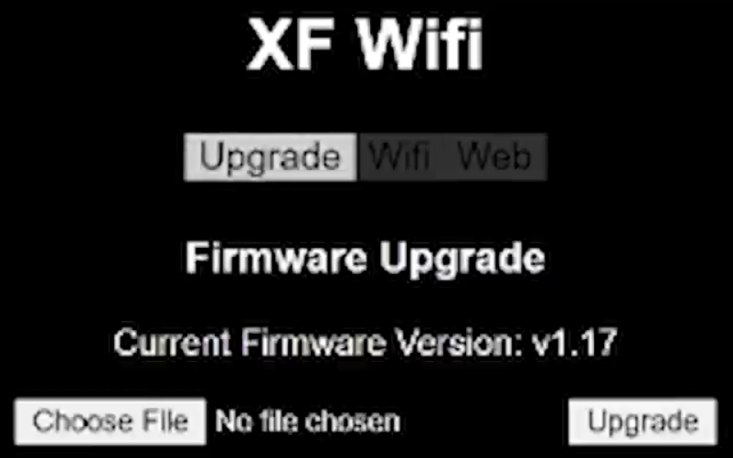

# TBS Tracer

## Manual

- [TBS Tracer Manual](assets/tbs-tracer-manual.pdf)

- Joshua Bardwell's complete setup guide:

<iframe width="560" height="315" src="https://www.youtube-nocookie.com/embed/zEWlYpDZuS0" frameborder="0" allow="accelerometer; autoplay; clipboard-write; encrypted-media; gyroscope; picture-in-picture" allowfullscreen></iframe>

## Nano receiver

{: style="width:500px;"}

## Nano receiver general wiring

{: style="width:500px;"}

## TBS Cloud XF WiFi firmware update

Updating the TBS Cloud WiFi firmware is done by using the TBS Agent X software and the TBS Cloud WiFi:

- You need to be logged into TBS Agent X
- Download the [TBS Cloud activation](https://www.team-blacksheep.com/tbs-cloud-activation.zip) ZIP file
- Unzip the file, you should get something like:

```
├── V1.15
│   ├── CROSSFIRE
│   │   └── firmware.bin
│   ├── FUSION
│   │   └── firmware.bin
│   └── TANGO2
│       └── firmware.bin
├── V1.17
│   ├── CROSSFIRE
│   │   └── firmware.bin
│   ├── FUSION
│   │   └── firmware.bin
│   └── TANGO2
│       └── firmware.bin
```

- Connect your TBS RX module using USB
- Make sure the Cloud XF WiFi module is green
- On your PC, look for and connect to a SSID named **tbs_crossfire_xxxx**
- Once connected to your TBS XF WiFi, go to [http://192.168.4.1](http://192.168.4.1)
- Select **Upgrade** on the XF WiFi interface, choose the latest **CROSSFIRE/firmware.bin**



- Push the **Upgrade** button and wait for the upgrade to be completed.

!!! note
    After the upgrade is done, your module will reboot but the version displayed in TBS Agent X will remain the same. To refresh it, just unplug/replug your RX module.
