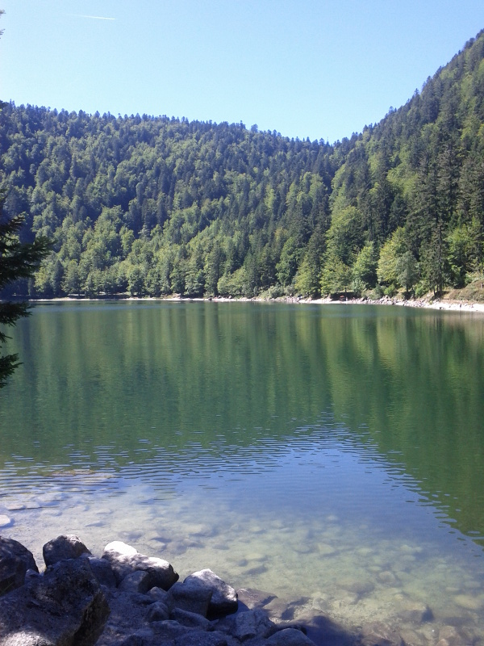
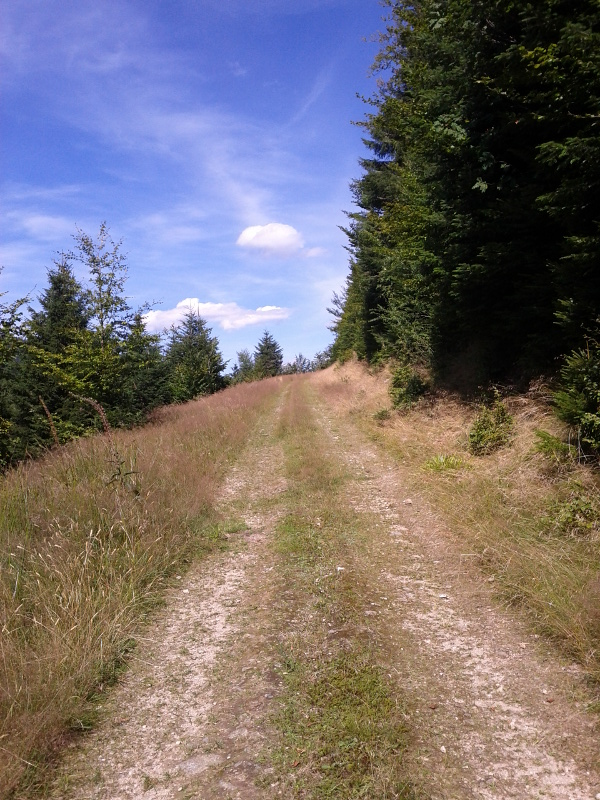
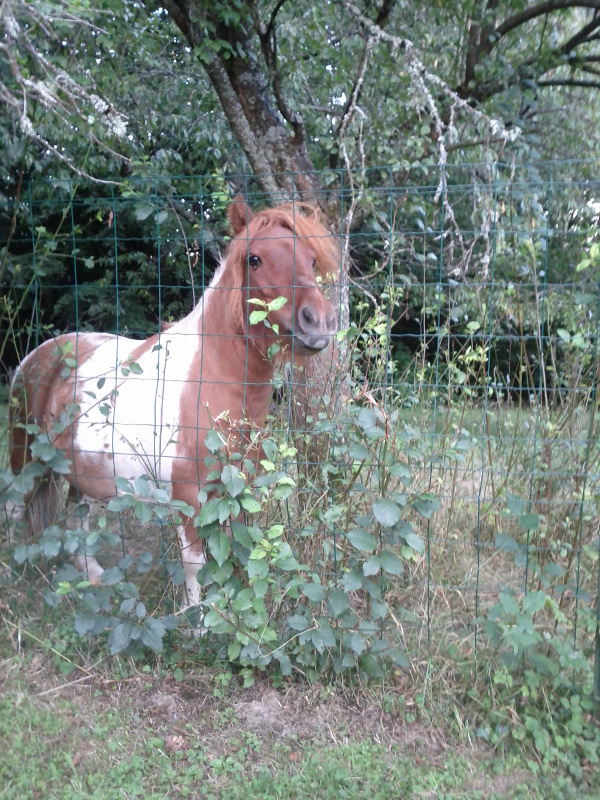
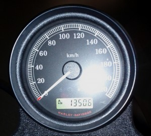
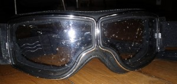

Premier roadtrip en Harley : les Vosges.

Nous les avons atteint après un passage sur Nancy pour profiter des [événements](http://www.jeanprouvenancy2012.com/levenement/presentation/) organisés pour rendre hommage au designer et architecte Jean Prouvé. Au programme : des paysages magnifiques, des routes qui sentent le sapin mais dans le vrai sens du terme, de l'urbex dans un manoir incroyable et du vert, beaucoup de vert.

5 jours, 1350 km parcourus et une tête de pare-brise à l'arrivée : on va recommencer, c'est sûr !

Disclamer : _photos de mauvaise qualité prises avec le téléphone portable._
