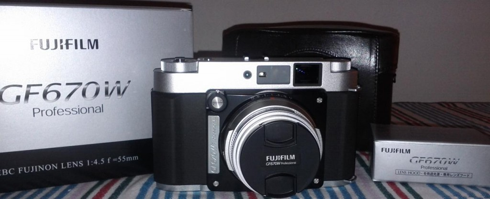
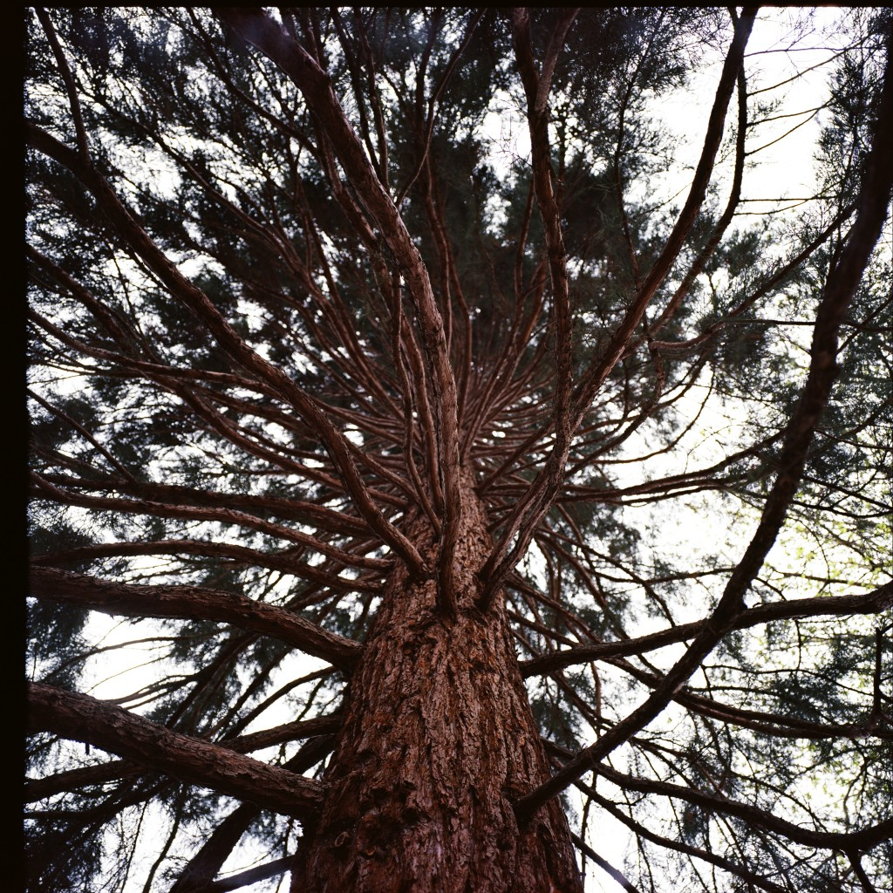
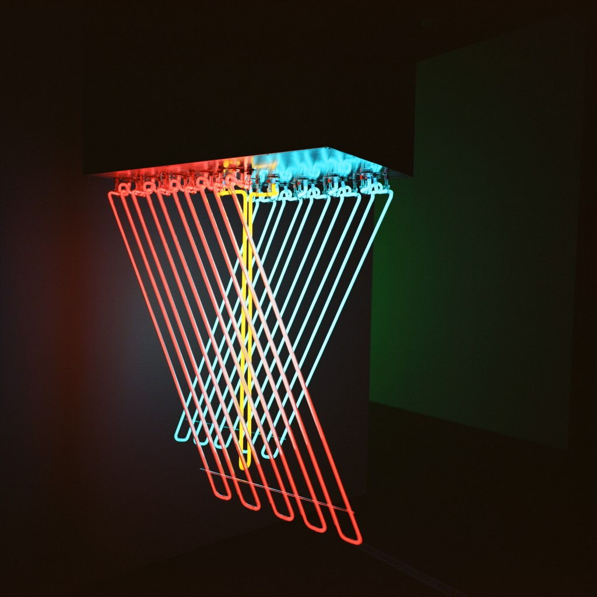

It's been so long since I switched to film-only photography that I decided a few months ago to sell all my digital equipment. I already own a Nikon FM2 camera which I love but I've to admit that I was and still am totally amazed by the pictures taken by my girlfriend's Rolleiflex 3.5F. The medium format is the kind of rendering I was craving to get and that sooner or later I'd step into the medium format world. Well, I didn't have to wait as when we were in Tokyo to celebrate new year 2013 I fell in love with what was the perfect match between my love for wide angles and medium format film photography : the **Fujifilm GF670W** !

For my soon to come birthday, I got myself my new toy in advance so I could use it in my upcoming roadtrip around France (I'll talk about it soon, it was awesome). Oddly, the only places in the world where you can get this camera is in the UK and in Japan so I bought it from the very nice guys at [Dale photographic](http://www.dalephotographic.co.uk/). Here is the beast (literally) :

Yes, this is a big camera and it comes with a very nice leather case and a lens hood. This is a telemetric camera with a comfortable visor, it accepts 120 and 220 films and is capable of shooting in standard 6x6 and 6x7 !

In the medium format world, the 55mm lens is actually a wide angle one as it is comparable to a 28mm in the usual 24x36 world. Its performances are not crazy on paper with a 4.5 aperture and a shutter speed going from 4s to 1/500s (as fast as a 1956 Rolleiflex) but the quality is just stunning as it's sharp and offers a somewhat inexistant chromatic abberation.

Want proof ? These are some of my first roll's shoots uploaded at full resolution :

