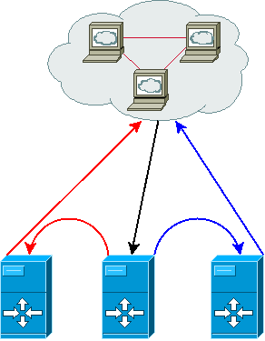

Load balancing traffic between servers can sometimes lead to headaches depending on your topology and budget. Here I'll discuss how to create a self load balanced cluster of web servers distributing HTTP requests between themselves and serving them at the same time. Yes, this means that **you don't need dedicated load balancers** !

I will not go into the details on how to configure your kernel for ipvsadm etc since it's already covered enough on the web but instead focus on the challenges and subtleties of achieving a load balancing based only on the realservers themselves. I expect you reader have a minimal knowledge of the terms and usage of **ipvsadm** and **keepalived**.

## The setup

Let's start with a scheme and some principles explaining our topology.

- 3 web servers / realservers (you can do the same using 2)
- Local subnet : 192.168.0.0/24
- LVS forwarding method : DR (direct routing)
- LVS scheduler : WRR (you can choose your own)
- VIP : 192.168.0.254
- Main interface for VIP : bond0

Let's take a look at what happens as this will explain a lot of why we should configure the servers in a quite special way.

**black arrow / serving**

1. the master server (the one who has the **VIP**) receives a HTTP port connection request
2. the load balancing scheduler decides he's the one who'll serve this request
3. the local web server handles the request and replies to the client

 **blue arrow / direct routing / serving**

1. the master server receives a HTTP port connection request
2. the load balancing scheduler decides the blue server should handle this request
3. the HTTP packet is given to the blue server as-this (no modification is made on the packet)
4. the blue server receives a packet whose destination IP is the VIP but he doesn't hold the VIP (tricky part)
5. the blue server's web server handles the request and replies to the client

## IP configuration

Almost all the tricky part lies in what needs to be done in order to solve the point #4 of the blue server example. Since we're using **direct routing**, we need to configure all our servers so they accept packets directed to the VIP even if they don't have it configured on their receiving interface.

The solution is to have the VIP configured on the loopback interface (lo) with a **host scope** on the keepalived BACKUP servers while it is configured on the main interface (bond0) on the keepalived MASTER server. This is what is usually done when you use pacemaker and ldirectord with IPAddr2 but keepalived does not handle this kind of configuration natively.

We'll use the notify\_master and notify\_backup directives of keepalived.conf to handle this :

notify\_master /etc/keepalived/to\_master.sh
notify\_backup /etc/keepalived/to\_backup.sh

We'll discuss a few problems to fix before detailing those scripts.

## The ARP problem

Now some of you wise readers will wonder about the ARP cache corruptions which will happen when multiple hosts claim to own the same IP address on the same subnet. Let's fix this problem now then as the kernel does have a way of handling this properly. Basically we'll ask the kernel not to advert the server's MAC address for the VIP on certain conditions using the **arp\_ignore** and **arp\_announce** sysctl.

Add those lines on the sysctl.conf of your servers :

net.ipv4.conf.all.arp\_ignore = 3
net.ipv4.conf.all.arp\_announce = 2

[Read more](http://kb.linuxvirtualserver.org/wiki/Using_arp_announce/arp_ignore_to_disable_ARP) about those parameters for the detailed explanation of those values.

## The IPVS synchronization problem

This is another problem arising from the fact that the load balancers are also acting as realservers. When keepalived starts, it spawns a synchronization process on the master and backup nodes so you load balancers' IPVS tables stay in sync. This is needed for a fully transparent fail over as it keeps track of the sessions' persistence so the clients don't get rebalanced when the master goes down. Well, this is the limitation of our setup : clients' HTTP sessions served by the master node will fail if he goes down. But note that the same will happen to the other nodes because we have to get rid of this synchronization to get our setup working. The reason is simple : IPVS table sync conflicts with the actual acceptance of the packet by our loopback set up VIP. Both mechanisms can't coexist together, so you'd better use this setup for stateless (API?) HTTP servers or if you're okay with this eventuality.

## Final configuration

**to\_master.sh**

#!/bin/bash

ip addr del 192.168.0.254/32 dev lo
ipvsadm --restore < /tmp/keepalived.ipvs

1. drop the VIP from the loopback interface (it will be setup by keepalived on the master interface)
2. restore the IPVS configuration

**to\_backup.sh**

#!/bin/bash

ip addr add 192.168.0.254/32 scope host dev lo
ipvsadm --save > /tmp/keepalived.ipvs
ipvsadm --clear

1. add the VIP to the loopback interface, scope host
2. keep a copy of the IPVS configuration, if we get to be master, we'll need it back
3. drop the IPVS local config so it doesn't conflict with our own web serving

## Conclusion

Even if it offers some serious benefits, remember the main limitation of this setup : if the master fails, all sessions of your web servers will be lost. So use it mostly for stateless stuff or if you're okay with this. My setup and explanations may have some glitches, feel free to correct me if I'm wrong somewhere.
