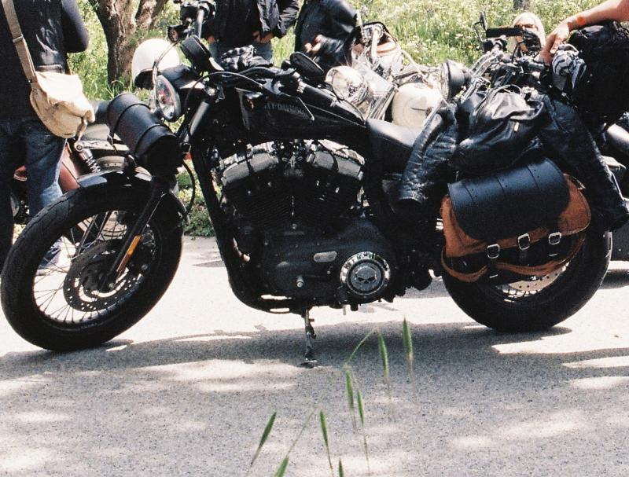
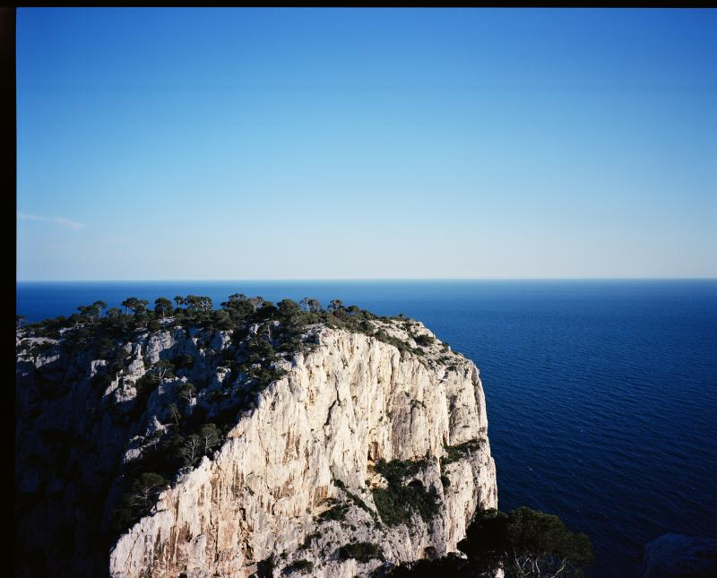
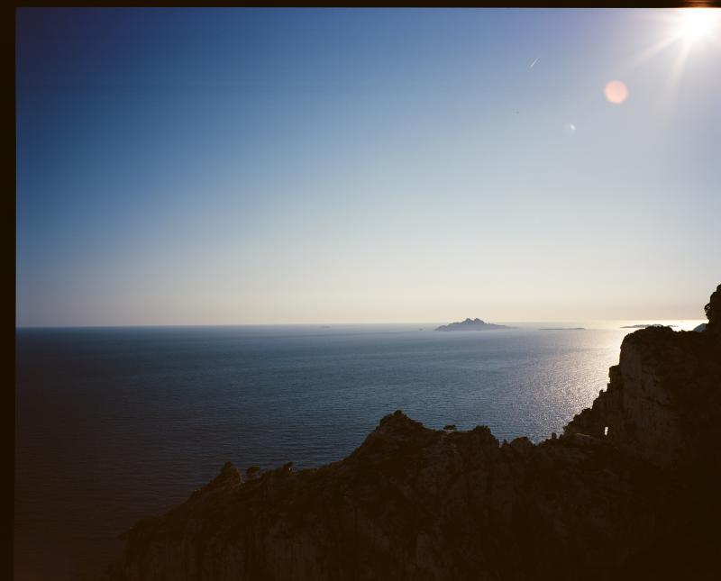

Deuxième roadtrip en Harley : la côte d'Azur et Biarritz.

Un vrai tour de France en un peu moins de deux semaines. 3600 kilomètres de liberté : Paris - Luberon - Gorges du Verdon - Grimaud (30 ans du HOG) - Marseille - Biarritz + les premières photos de vacances avec le GF670W, magique ](http://www.ultrabug.fr/wordpress/wp-content/uploads/2013/06/000059.jpg)

 
