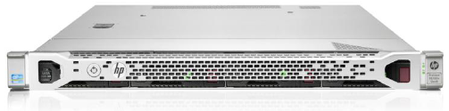
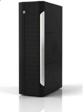
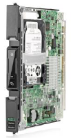
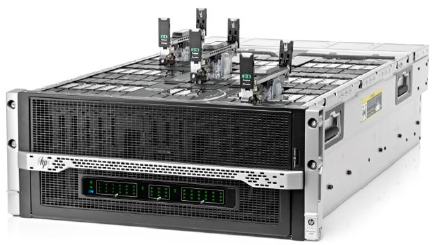

A few months ago I had the chance to get to know about one of the upcoming HP innovation in the server architecture : the Moonshot project. Now that it is public, I thought I'd take some time to talk about it as I'm convinced this is something big enough to change the way we see datacenter infrastructures and servers in general. I'll do my best to keep it short and understandable so if you want deeper technical insights, fell free to ask or search around.

## The nowadays servers

As a reminder, that's what a standard server looks like today :

 

 

 

 

We call them **pizza boxes** for their flat and tasty aspect.

Then in datacenters we put them in enclosures we call racks which look like this :

 

 

 

 

 

 

Now the basic stuff to understand and keep in mind is that those racks can typically hold 42 standard servers like the one above. Datacenters are just big hangars where you store and cool hundreds/thousands of those racks.

## The Moonshot project

The more processing power you need, the more racks you need, the more datacenters you need. Think of facebook or google and their enormous amount of servers/racks/datacenters around the world. Every new device (PC/tablet/smartphone) activated is a new client to an always-growing infrastructure of those powerhouses.

Basically, there's a limit in the number of full datacenters you can build and operate eventually (not to mention powering them up) but there's worse : the new devices/clients growth is higher than our datacenter building/powering capabilities.

The Moonshot project is one of HP's response to this challenge : permit businesses to accommodate and serve this rapidly growing demand of devices/clients without the datacenter model collapsing. Their method ? Invent a new server architecture from scratch.

## The cartridges are back !

No your Master System is still out of date... But HP's approach to getting more servers in less space while consuming way less power resides in turning the pizza-box above into a cartridge which looks like this :

 

 

 

 

 

No black magic involved : you can now store **45 servers in 4,3 units of space**. Based on their calculation, if you want the same computing power as you would have with standard pizza-boxes you'd need only one full rack of those new servers versus 4 to 6 racks filled with standard ones (depending on their config). Overall gain factors are huge :

- space divided by 4 to 6
- energy divided by 6 to 2
- cabling divided by 26 to 18
- not to mention the time saved by technicians to put everything up

That's what the beast looks like :

 

 

 

 

 

 

Of course, they have integrated redundant switches and all the flavors of modern enclosures.

## The right cartridge at the right place

Over the year, HP will launch a series of cartridges with their own specifications (RAM/HDD/CPU) which should be used to meet specific needs and designs. They can also accommodate your needs by designing your own server-cartridges if you're in a hurry of course.

As a DevOps, I love this idea of the hardware being designed and used upon your software's architecture because that's closer to real efficiency and will lead both developers and IT architects to distributed and massively scaling designs.

I'll conclude with the last thing you need to understand about this technology : **it does not fit everyone's need.** Moonshot will not take over the world and replace every server around, instead **it should be used as a hardware matching a real software design.**
