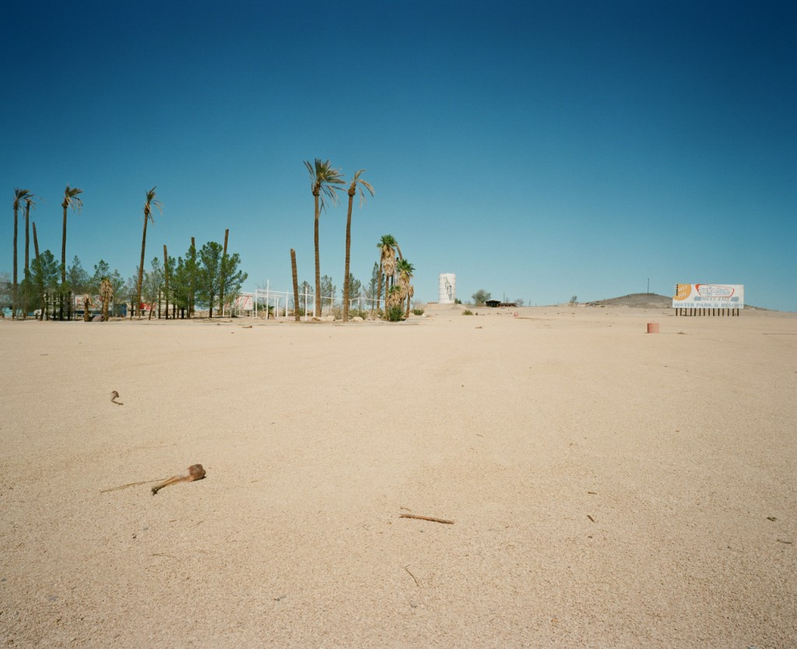
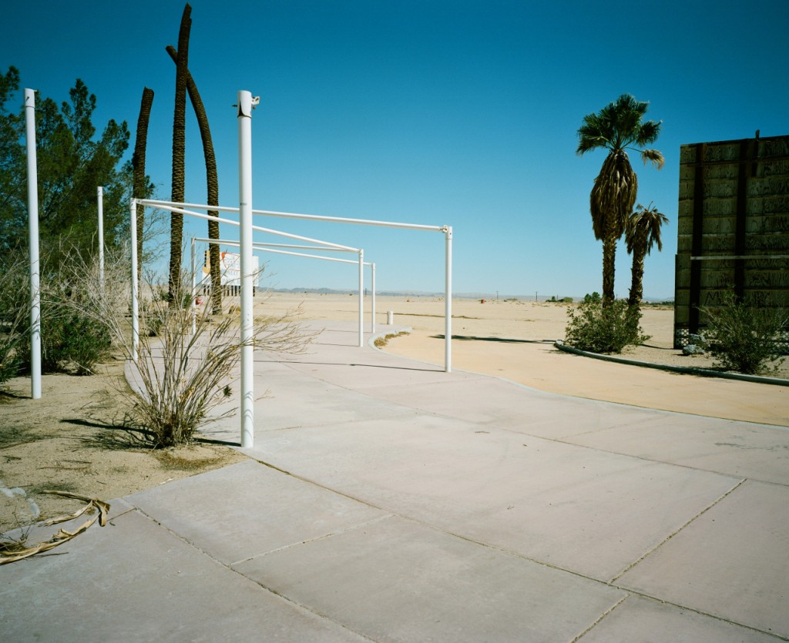
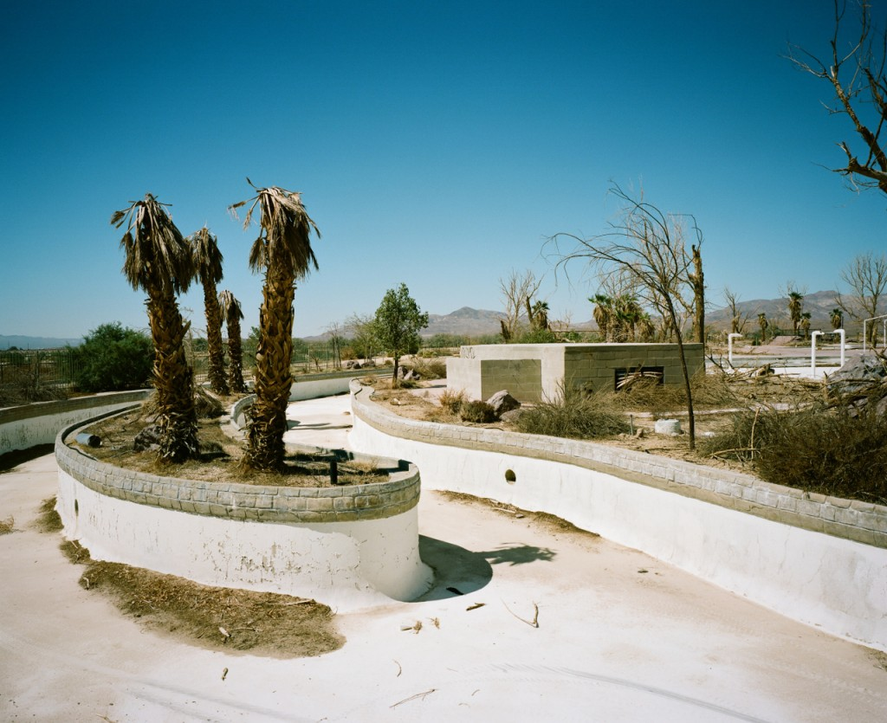
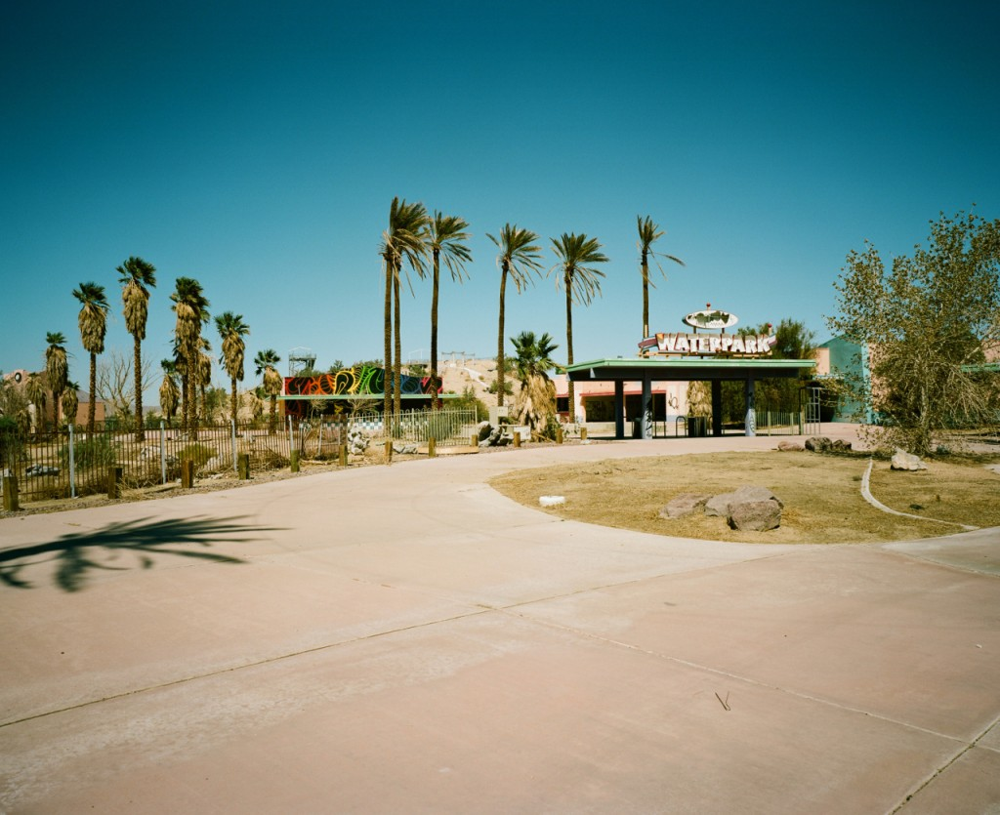

## The plan

We started our one month roadtrip in Los Angeles where we stayed 3 days to adjust to the -9h time zone shifting. We had planned and rented a SUV for the first 15 days to tour the national parks (just before the shutdown, lucky us) then we rented a motorbike for the last 15 days of our trip to ride the West coast. Needless to say it was an amazing trip, the photos I'll post will show it by themselves.

Still, it's always fun and quite stunning to look back at the odometers of the two vehicles we used to see how much miles/km we drove :

- In the **SUV**, touring the national parks : 4269 miles / **6870 km**
- With the **Harley-Davidson Street Glide**, riding the West coast : 2175 miles / **3500 km**

That's a nice total of 6444 miles / **10 370 km** ! It's more than the trip from Paris to LA ;)

## The start

We headed to the Death Valley but took a detour to "visit" an abandoned waterpark in the middle of the desert !

