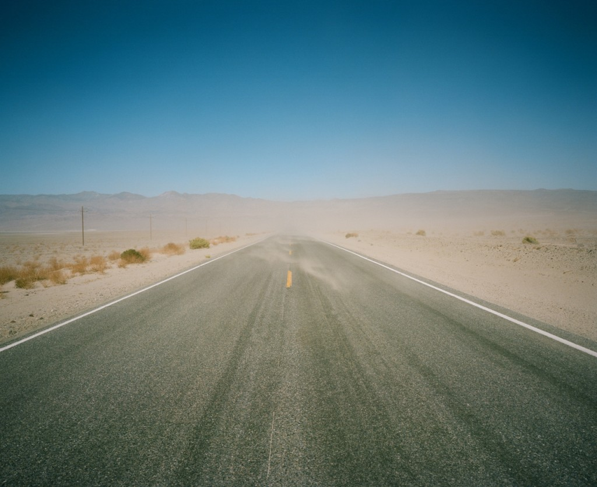
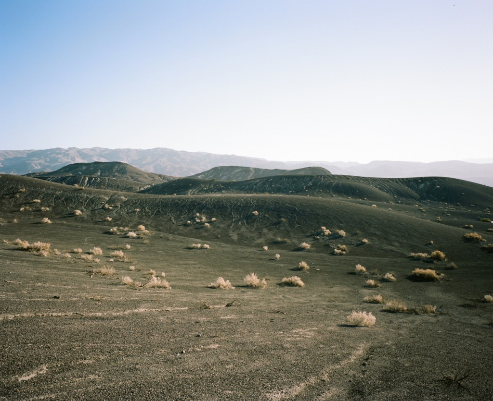
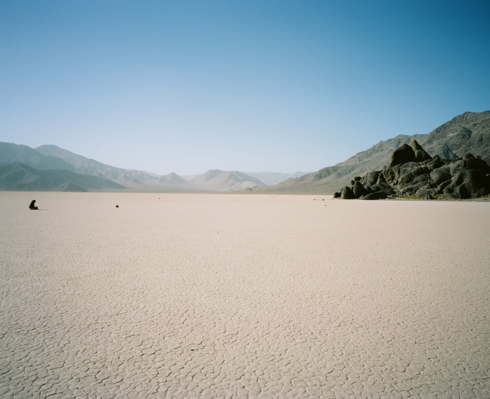
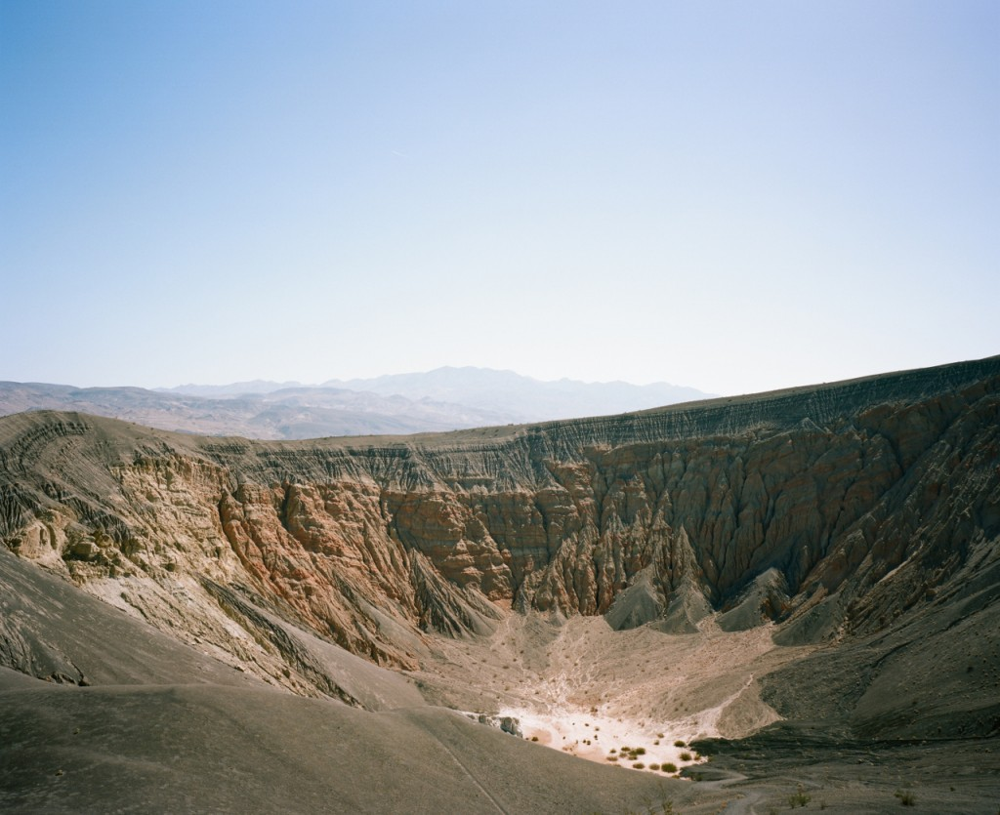

The Death Valley was our first shock of wilderness and immensity as we were welcomed by strong and sandy winds. We slept in our car at an almost empty campground inside the park. Spending the evening and waking up alone in the desert is something very special, especially there.

   
