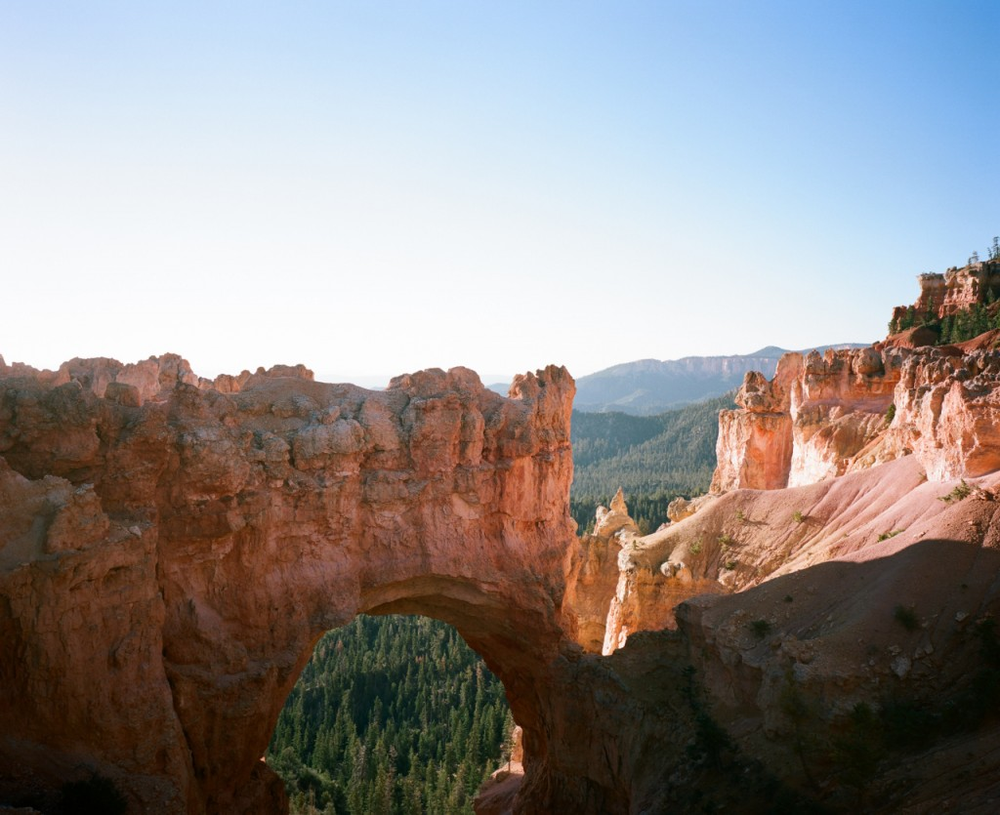
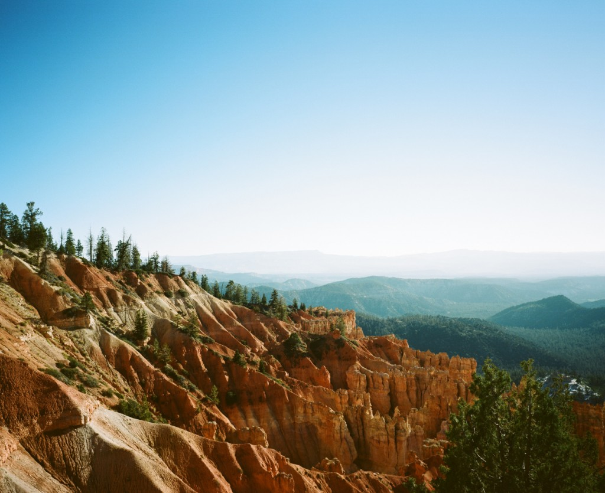
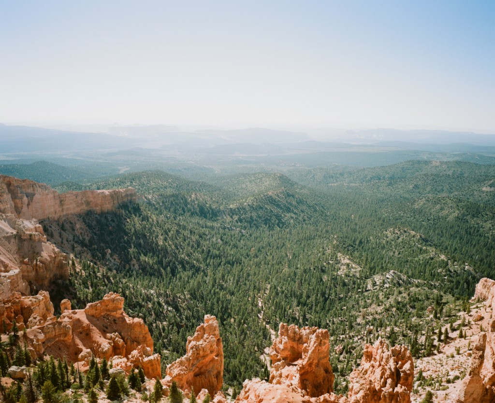

After the Death Valley, we headed North to reach Bryce Canyon. On the way up, we did take a quick detour to cruise Las Vegas by car but didn't stop there.

We had a pleasant night in a very old fashioned motel near Bryce Canyon where the tenant asked me if I really was French because _"the French are usually blond and don't have such dark hair as you mister"._

I'm willing to bet a great deal on the fact that the vast majority of us are brown/dark haired... Mister blond @Lujeni is NOT representative of us French people ! :)

  
