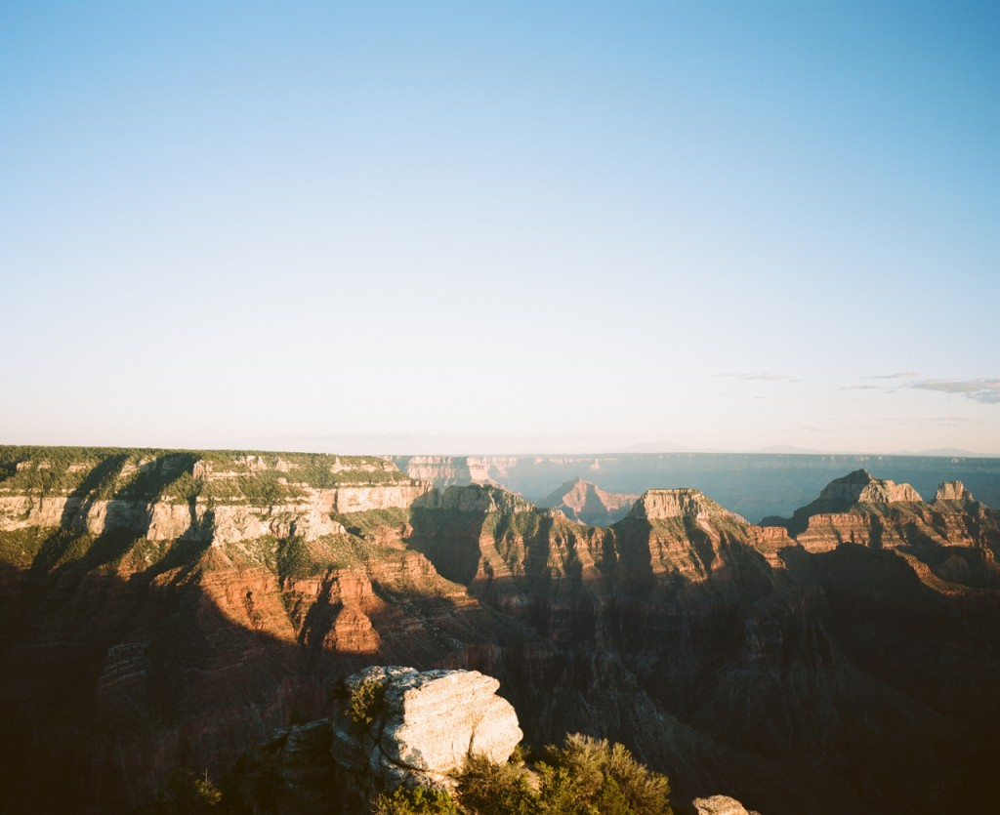
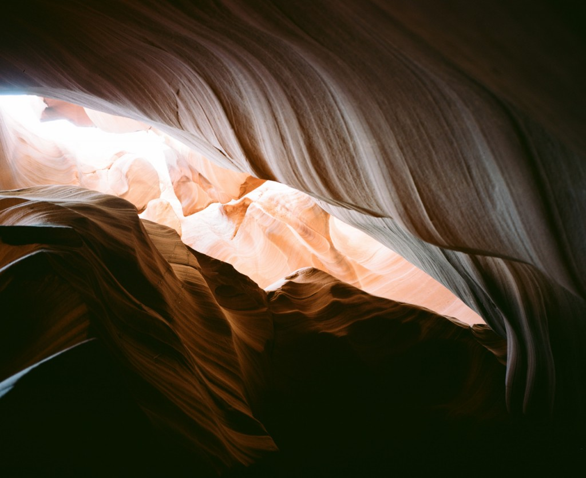
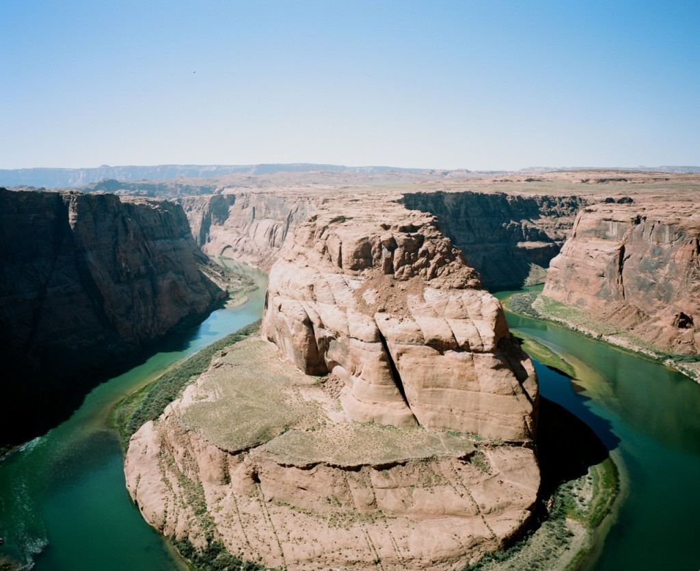

We then headed South towards the **North rim** of Grand Canyon, unfortunately the nights were already cold out there so the rangers did advise against sleeping in the car. We thus visited **Point Imperial** and stayed for the sunset. This was our first encounter with the Grand Canyon and it was amazing.

It was dark when we got out of there, we had to drive very carefully to avoid the numerous deers along the road. We had planned to sleep in Page but we hit a detour due to road work and had to take a huge detour which took us to Tuba City.

I could not stand driving one more mile but the only three hotels of the whole area were full. One person from the front desk of a hotel advised us to go to the nearby Greyhills Inn which remains one of the most exotic experience we had in Indian territory. **We slept in a room in the Tuba City High School** as they do rent rooms to outsiders ! We were welcomed nicely in this old fashioned place operated by the local Navajo people.

We visited Page and its (too) touristic area the next day along with the famous (and so crowded) **Antelope Canyon** and **Horseshoe Bend**.

 
