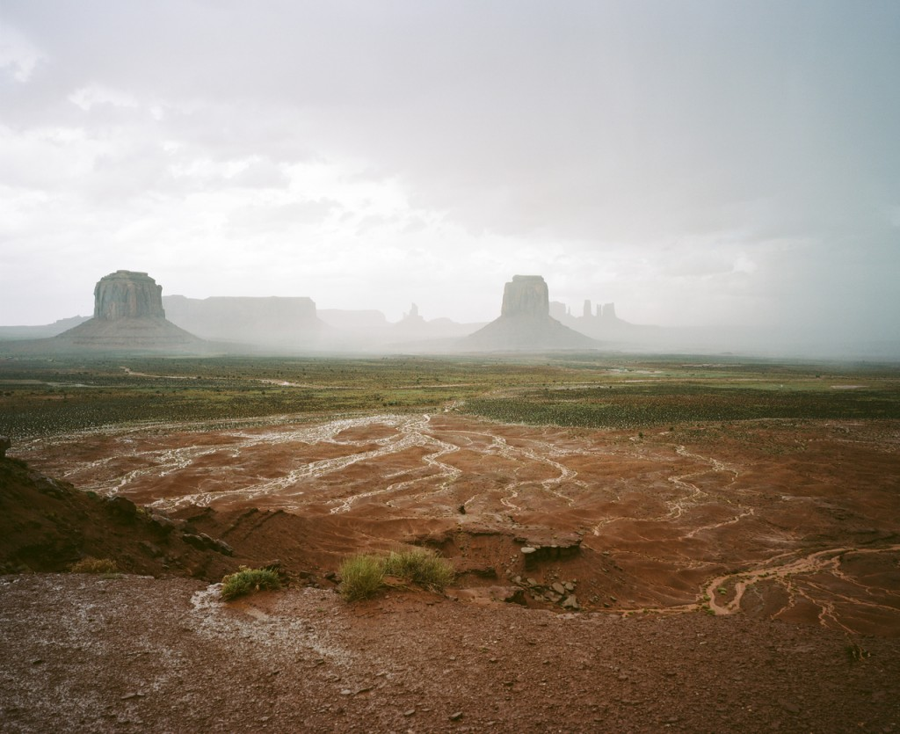
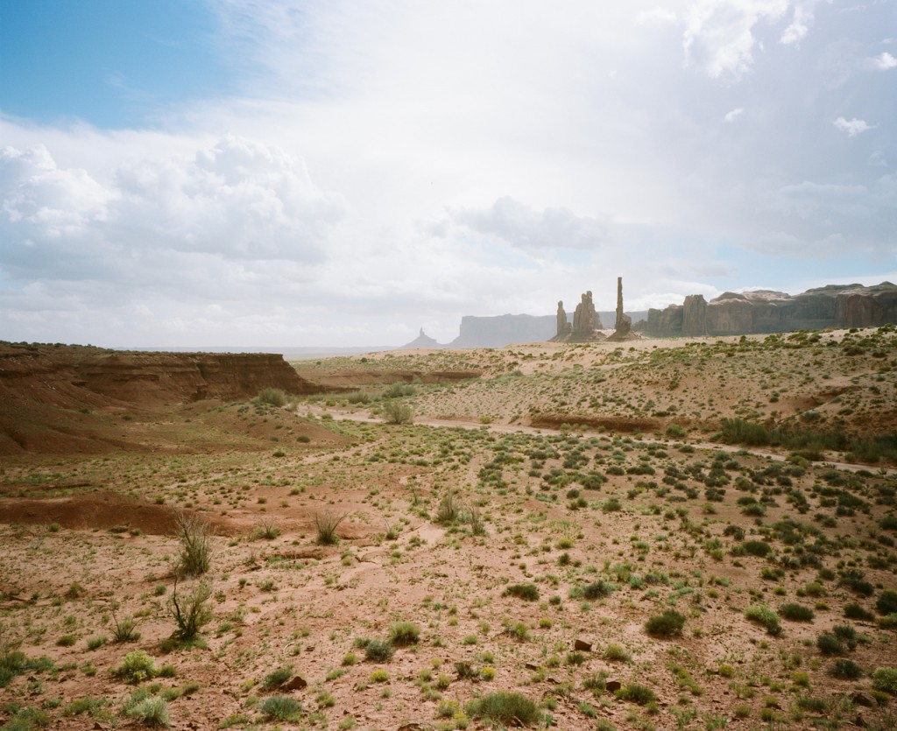
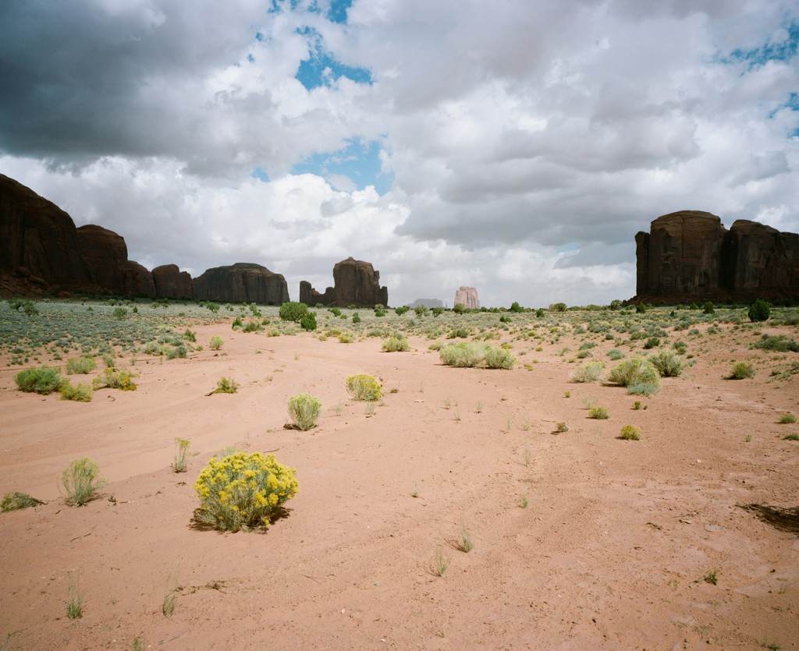
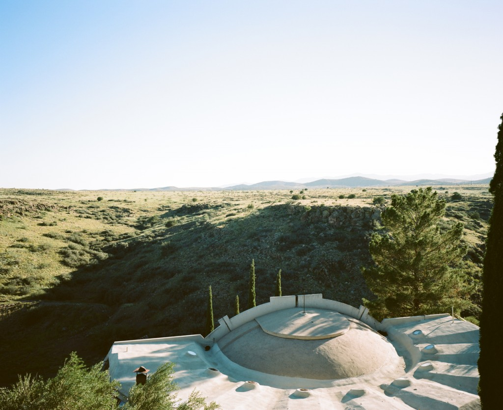

Forget about Marlboro, this Navajo nation area is way more than that. To be honest, you can see the money made from the tax you have to pay to enter the actual park is invested back in the community but I guess there's more and some drawbacks to it.

Meet the first 10 minutes of rain we experienced during a whole month ! Actually, it was a localized storm and it happened at the perfect moment where we had the most beautiful view. We felt this moment was quite unique and we were excited and glad to experience it. I guess you won't argue with me after looking at those pictures.

