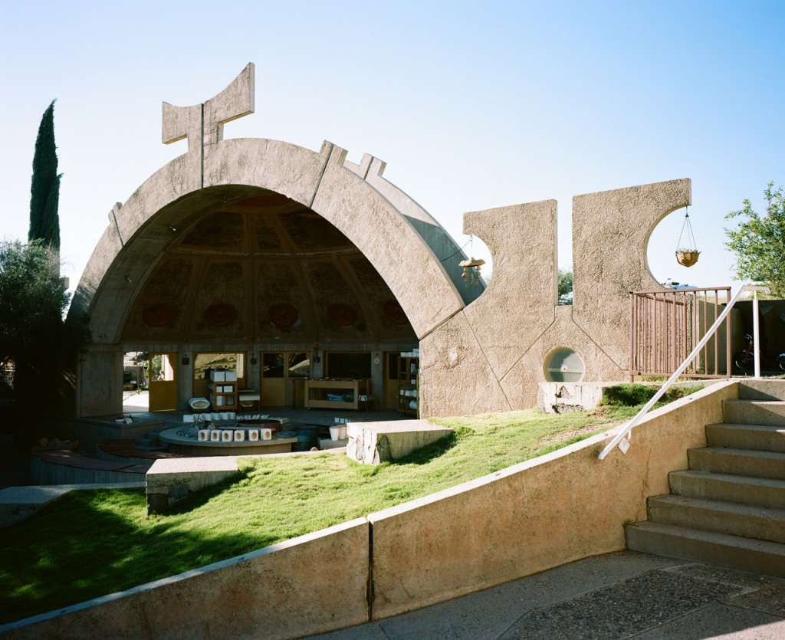
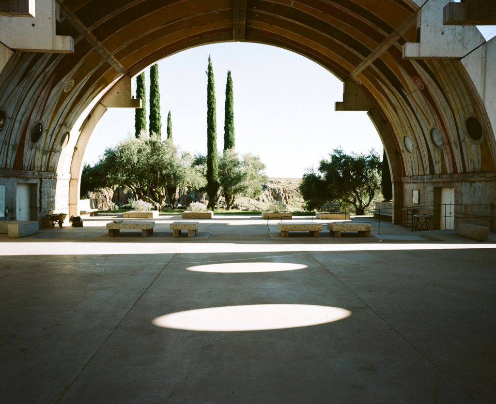
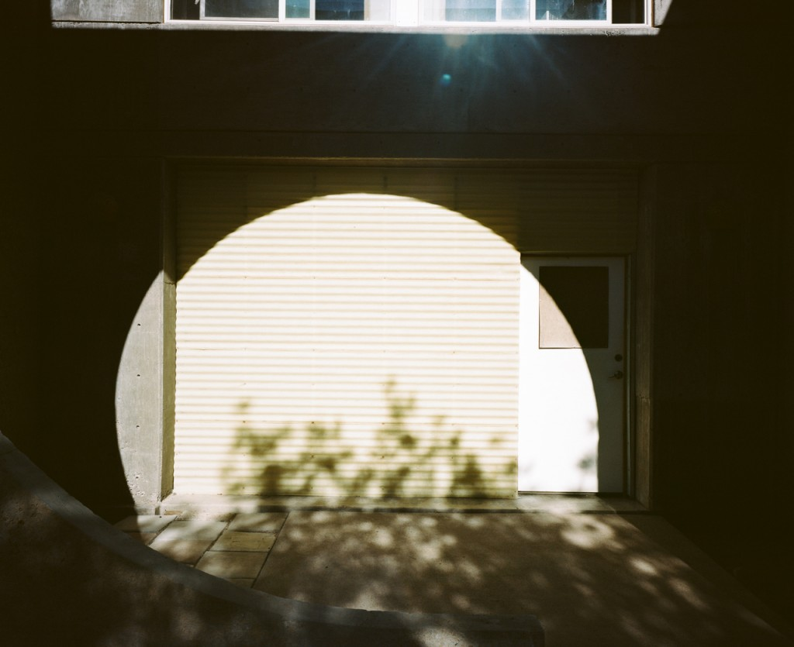

On the route down from Flagstaff to Phoenix, we stopped and stayed in [Arcosanti](http://arcosanti.org/). This experimental city is a unique place as it was imagined by an Italian architect who began its construction in the 70s with volunteers from all around the world. Today its construction is still ongoing and people come there to contribute for a certain period of time before going back home (we met a French lady from Britany there, this was weird).

The cool thing about this community is that you can book a room there to stay and live among them for some time. We had dinner and breakfast with them, everything was very cool and very tasty ! We didn't really know what to expect when arriving there and were amazed by the place and its incredible athmosphere.

We had the feeling of being in another world, far from everything we're used to. This is the kind of place where you can feel far from everything but close from the earth, a unique experience really. I even had the chance to take a dive in the swimming pool overlooking the surrounding desert.

I couldn't help but feel strange about how the architecture of this place made me feel like I was walking in the video game [Riven](http://en.wikipedia.org/wiki/Riven) !

