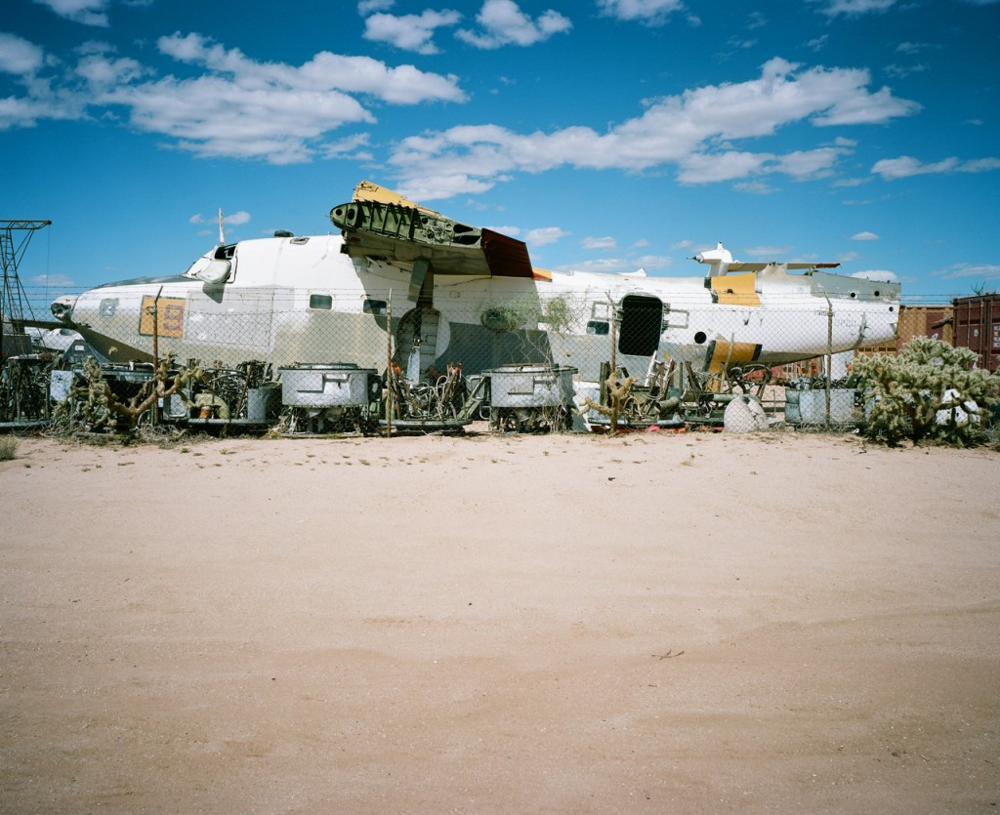
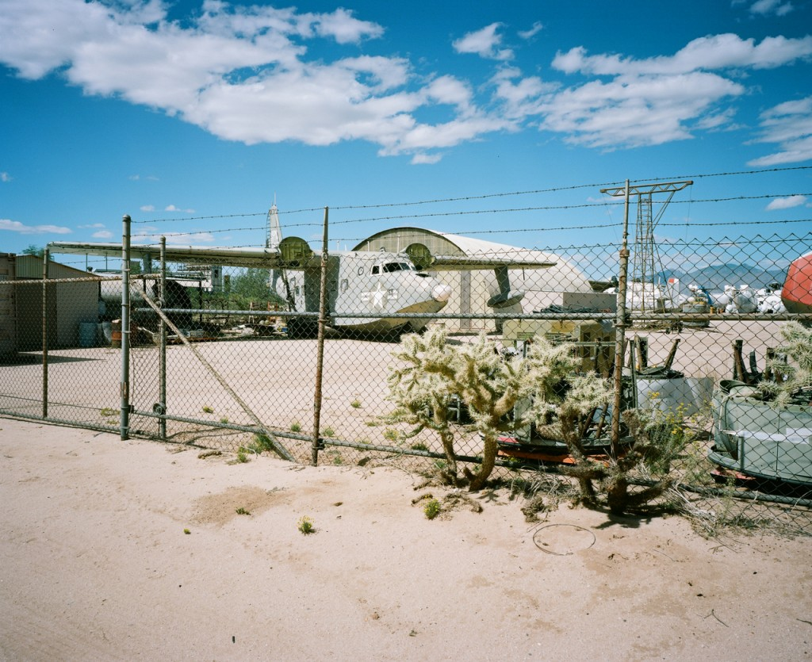
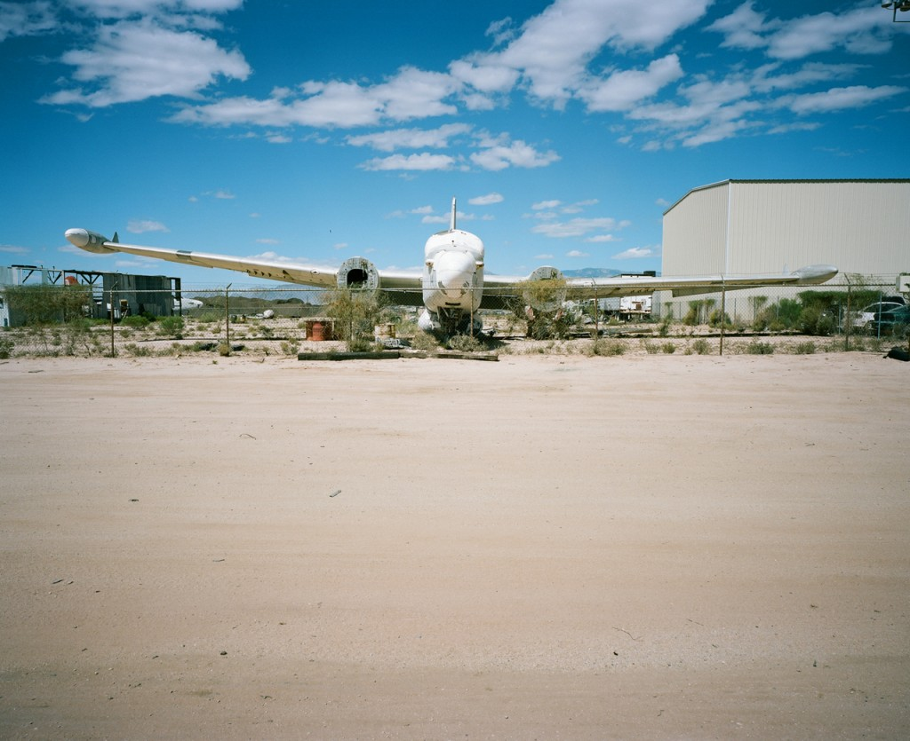

After Arcosanti, we kept on going south into **Arizona** where we headed to Phoenix and stayed in **Tuscon** for a few days. It was hot and sunny of course and we loved this part of Arizona.

We went to see the US Army Aircraft Boneyard which is located a bit South-East of Tuscon, in the middle of the desert. Imagine hundreds of planes parked in the sand, waiting to be dismantled !

 
