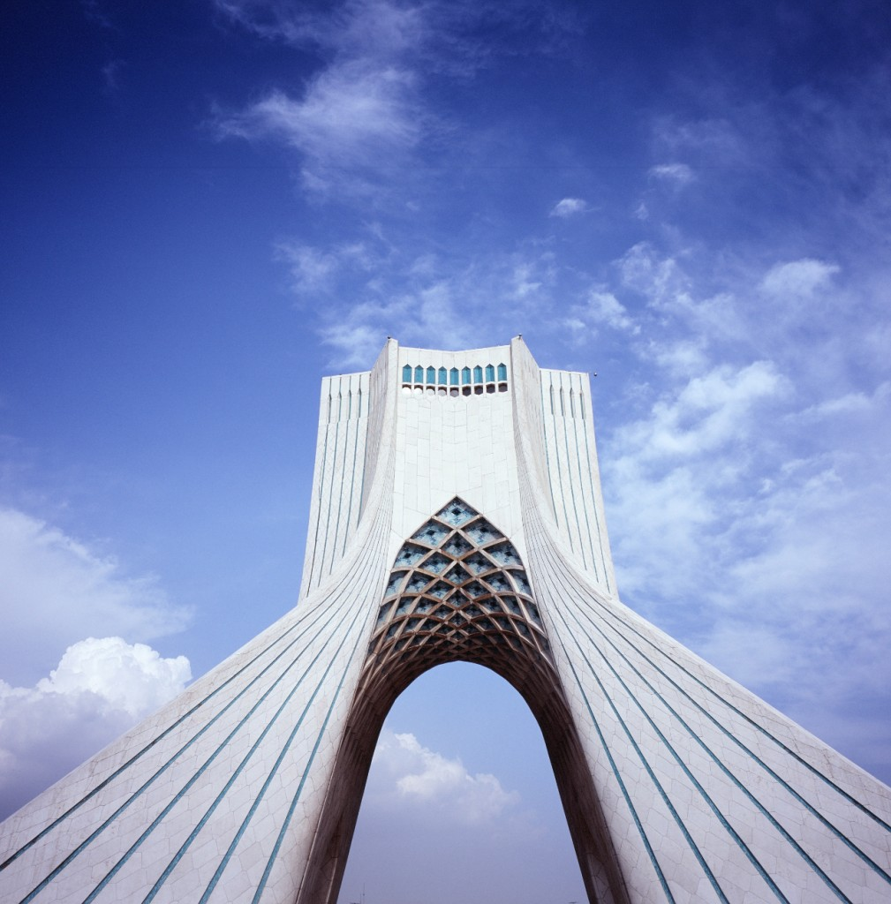
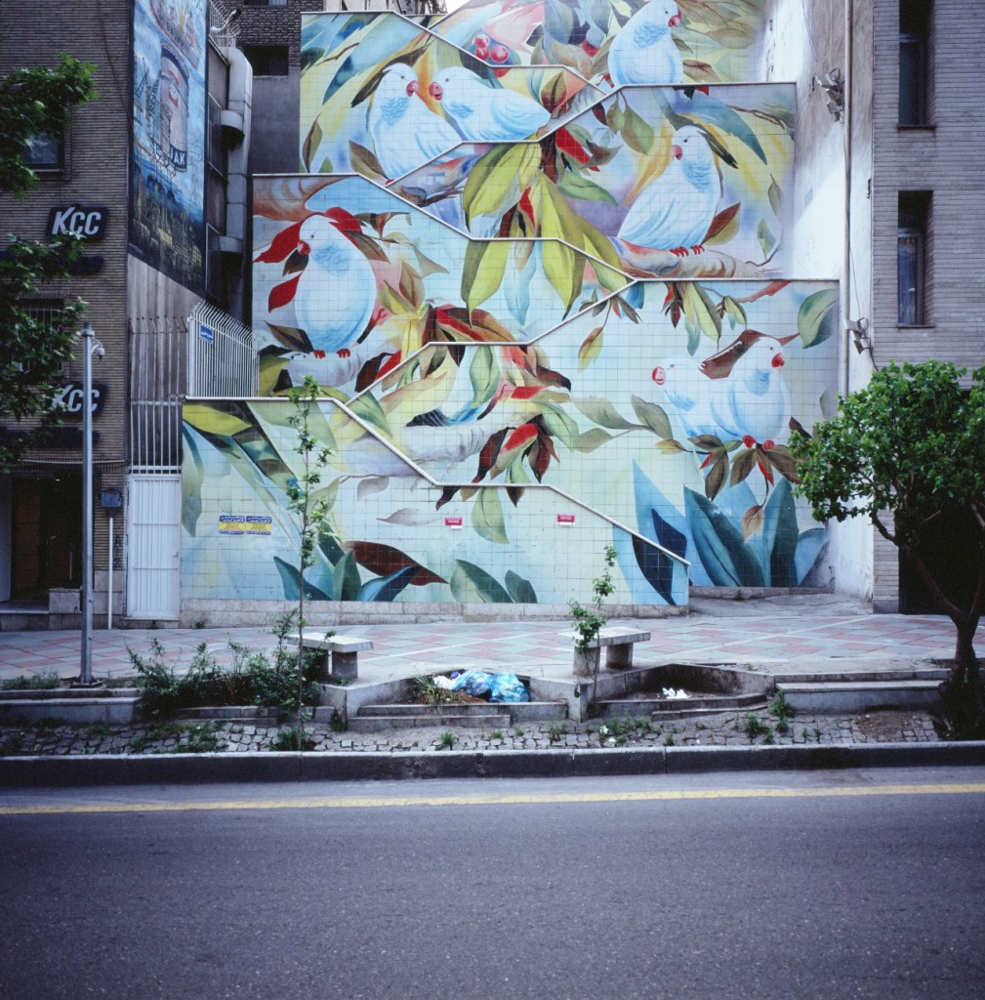
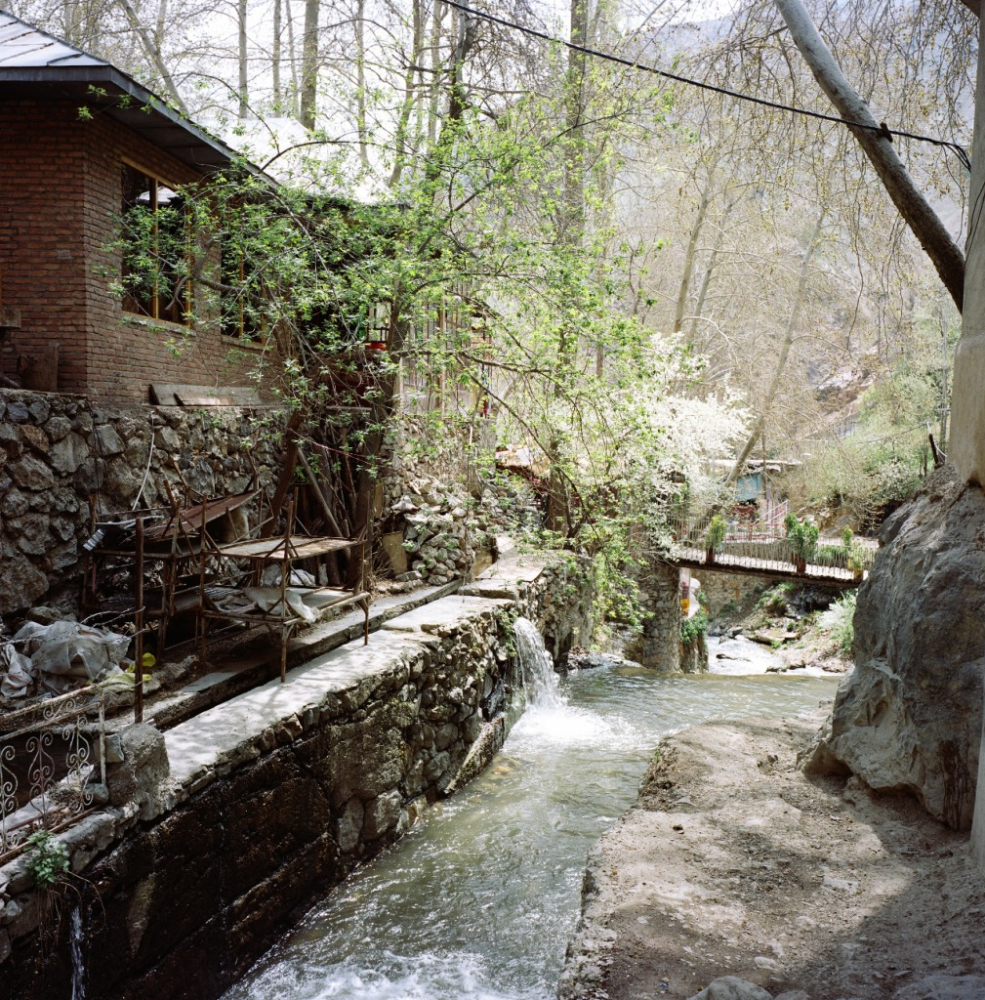
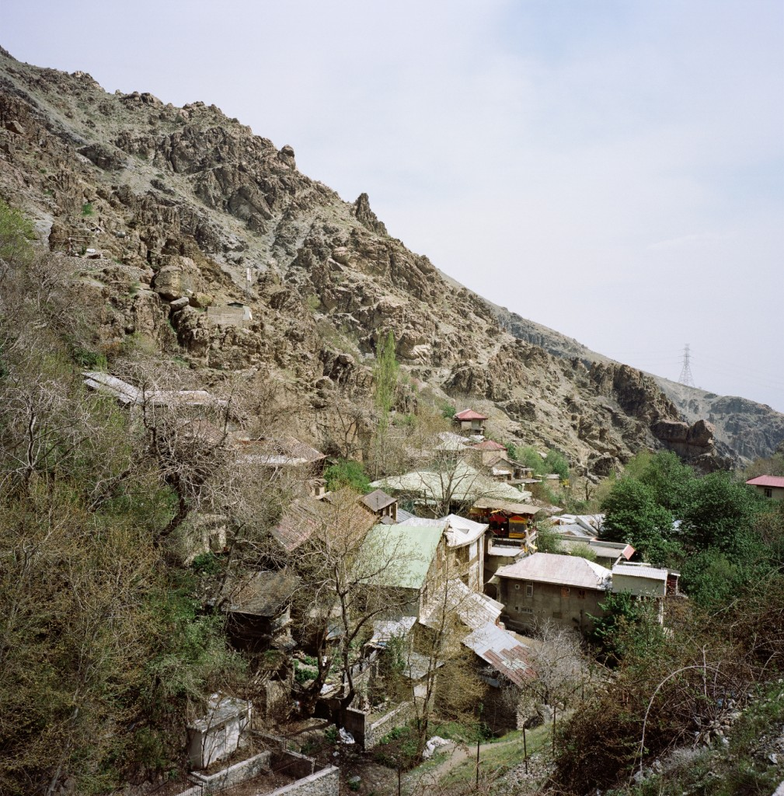
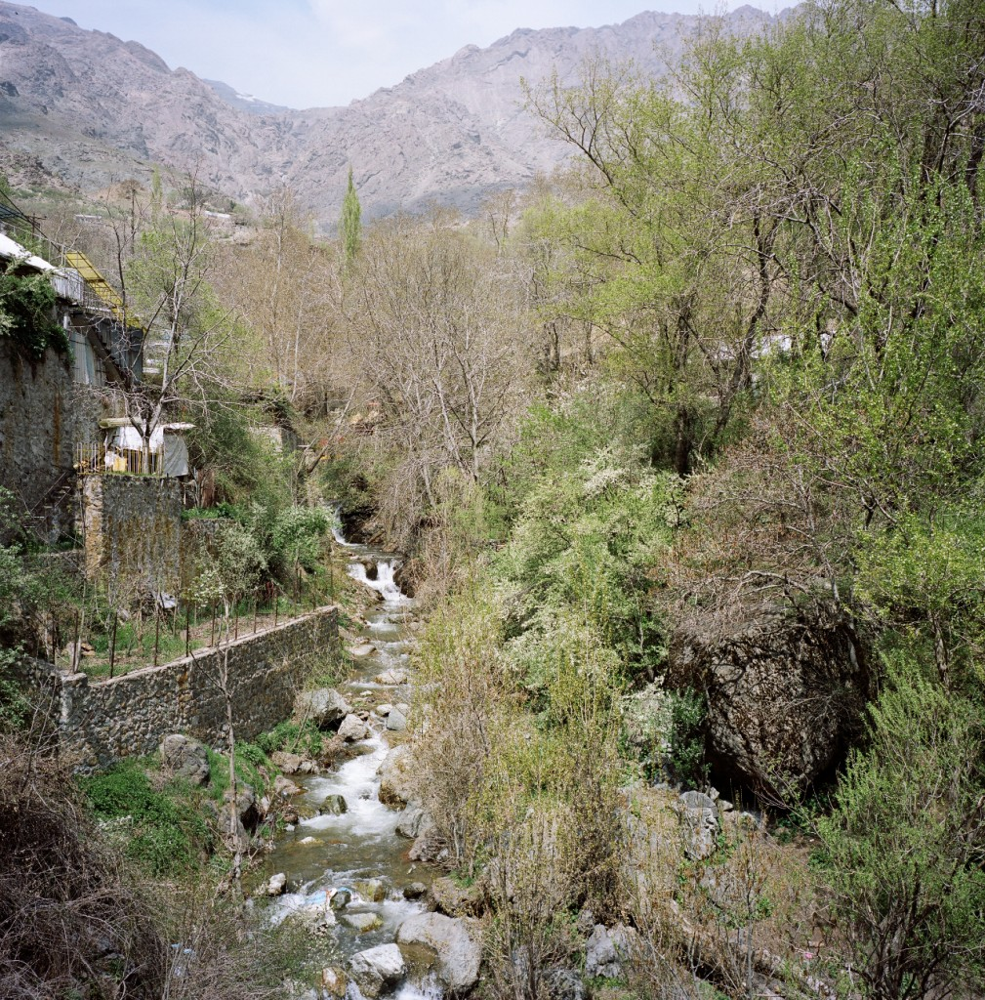
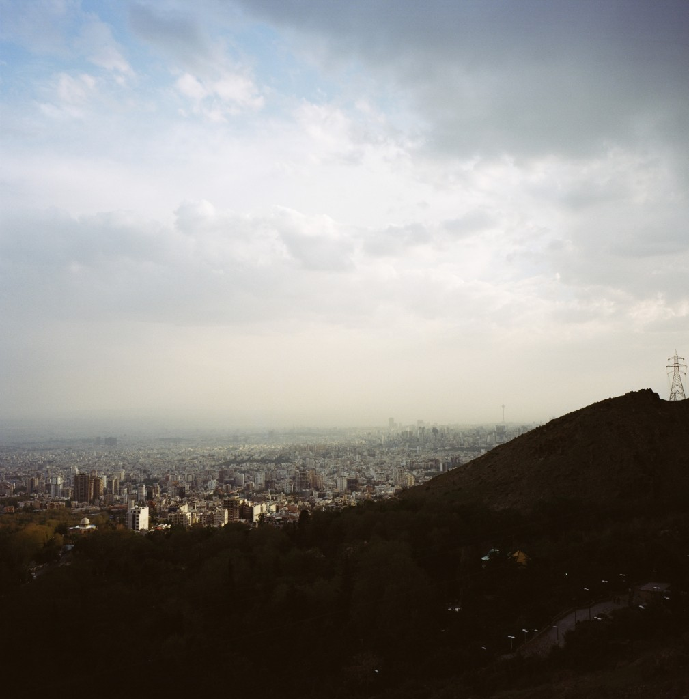

For our latest vacations, we spent two weeks in Iran and I must say that this country is astonishingly beautiful ! So forget what you think to know about this country as it's either biased or doesn't apply to its people who are very friendly and welcoming.

We started with two days in **Tehran**, a gigantic and lovely city where an Iranian friend we met on the internet invited us to a treck in the surroundings montains.

The first thing to have to get acquainted with is how to cross the streets. Seriously the traffic is madness and uncontrolled (no traffic lights) so you have to watch out everywhere. Then you discover their nice and cooled subway which is clean and shiny and so cheap you try and count four times as you're sure you've heard the man wrong : 10 000 rials a ticket, yeah that's like 0,2€...

Treck startpoint was **Darban** and then up to close to 3000m, thanks again Shayan. When we were awed by the beautiful mountains they had at the doorstep or their city, our Iranian friends told us that these mountains are also the cause of the massive pollution of Tehran in sping and summer because it blocks the winds from clearing the air...

Sunset from the **Jamshidieh park**, the tall tower on the background is the Milad Tower.

