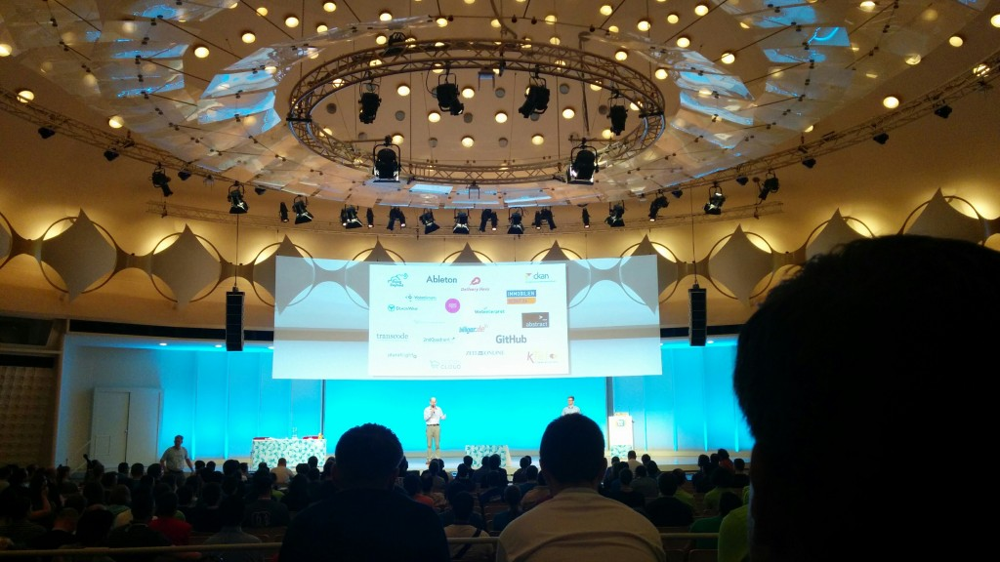

I had the chance to participate to [europython 2014](https://ep2014.europython.eu/en/) as my company was sponsoring the event.

This was a great week where I got to meet some very interesting people and hear about some neat python use cases, libraries and new technologies so I thought I'd write a quick summary of my biased point of view.

## ZeroMQ

I had the chance to meet **Pieter Hintjens** and participate in a 3 hours [workshop on ZeroMQ](https://github.com/1000mercis/ep2014_zeromq). This was very interesting and refreshing as to go in more depth into this technology which I've been using in production for several years now.

Pieter is also quite a philosophical person and I strongly encourage you to listen to [his keynote](https://www.youtube.com/watch?v=36bKE_JsHZs). I ended up pinging him in real life for an issue I've been waiting for [bug correction on the libzmq](https://github.com/zeromq/libzmq/issues/949) and it got answered nicely.

## uWSGI

Another big thing in our python stack is the uWSGI application container which I love and follow closely even if my lack of knowledge in C++ prevents me for going too deep in the source code... I got the chance to speak with **Roberto De Ioris** about the next 2.1 release and propose him two new features.

- [Allow message spooling directly from a gevent greenlet](https://github.com/unbit/uwsgi/issues/669) : I'm glad to say it's been committed today and I successfully test it, huge feature !
- **Consul.io** integration in uWSGI : [I wrote a RFC](https://github.com/ultrabug/uwsgi-consul-rfc) about it and [it's going to be done](https://github.com/unbit/uwsgi/issues/672) for the great good of uWSGI users and distributed architecture lovers !

Thanks a lot for your consideration Roberto !

## Trends

- Not tested = broken !
- Python is strong and very lively in the Big Data world
- Asynchronous and distributed architectures get more and more traction and interest

## Videos

All the [talks videos are already online](https://www.youtube.com/channel/UCadZ6_NWdCN6YolgQdfV8Pg), you should check them out !
