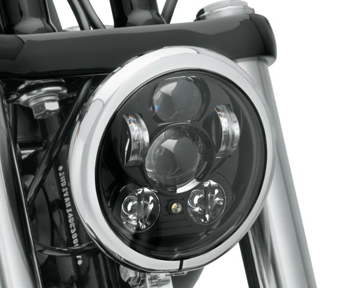
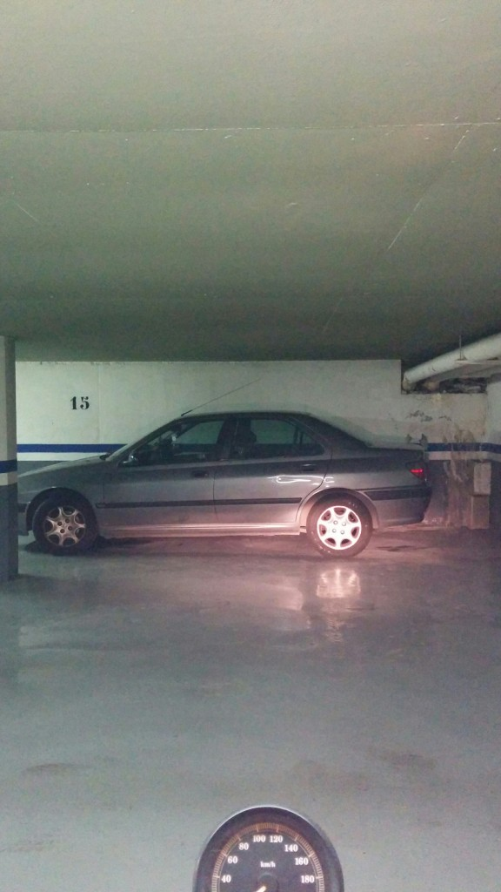
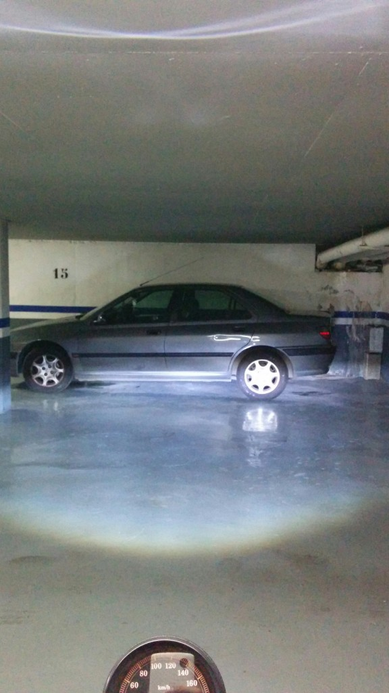

Short post to share my experience with the **Harley-Davidson Daymaker LED Headlamp**.

I came to buy it because I was not satisfied with the standard lamp fitted on my sportster and I guess whoever has to drive by night would feel that unpleasant feeling to not actually be able to properly see what's going on in front of you.

The LED Headlamp is worth the few hundred bucks it costs if at least for the sake of your own life but furthermore for the **incredible improvement** from the standard lamp. Don't hesitate a second just go for it and it's dead simple to mount yourself !

See the difference (passing lights) :

Now I feel way safer to drive on unlitten roads.
