Our latest roadtrip was as amazing as it was challenging because we decided that we'd spend an entire month in Turkey and use our own motorbike to get there from Paris.

## Transportation

Our main idea was to spare ourselves from the long hours of road riding to Turkey so we decided from the start to use ferries to get there. Turns out that it's pretty easy as you have to go through Italy and Greece before you set foot in Bodrum, Turkey.

- Paris -> Nice : train
- Nice -> Parma (IT) -> Ancona : road, (~7h drive)
- Ancona -> Patras (GR) : ferry (21h)
- Patras -> Piraeus (Athens) : road (~4h drive, constructions)
- Piraeus -> Kos : ferry (~11h by night)
- Kos -> Bodrum (TR) : ferry (1h)

Turkish customs are very friendly and polite, it's really easy to get in with your own vehicle.

## Tribute to the Nightster

This roadtrip added **6000 kms** to our brave and astonishing Harley-Davidson Nightster. We encountered no problem at all with the bike even though we clearly didn't go easy on her. We rode on gravels, dirt and mud without her complaining, not to mention the weight of our luggages and the passengers ;)

That's why this post will be dedicated to our bike and I'll share some of the photos I took of it during the trip. The real photos will come in some other posts.

## A quick photo tour

I can't describe well enough the pleasure and freedom feeling you get when travelling in motorbike so I hope those first photos will give you an idea.

I have to admit that it's really impressive to leave your bike alone between the numerous trucks parking, loading/unloading their stuff a few centimeters from it.

[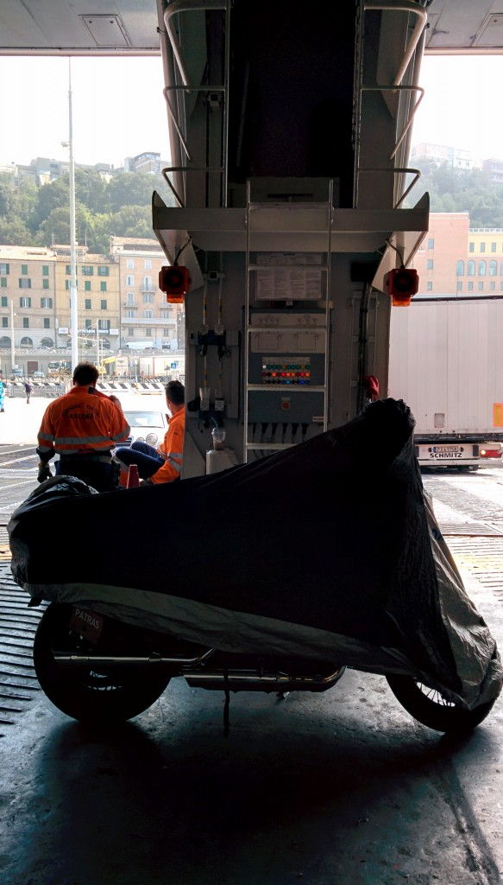](http://www.ultrabug.fr/wordpress/wp-content/uploads/2014/10/IMG_20140905_130004.jpg)

 

 

 

 

 

 

 

 

 

 

 

 

 

 

 

 

 

 

 

 

 

 

 

We arrived in Piraeus easily, time to buy tickets for the next boat to Kos.

[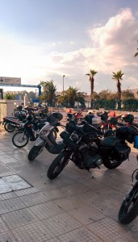](http://www.ultrabug.fr/wordpress/wp-content/uploads/2014/10/IMG_20140906_164101.jpg)  [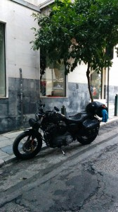](http://www.ultrabug.fr/wordpress/wp-content/uploads/2014/10/IMG_20140906_191845.jpg)

 

 

 

 

 

 

Kos is quite a big island that you can discover best by ... riding around !

[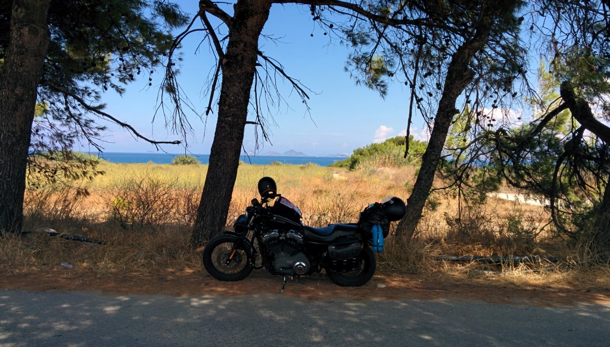](http://www.ultrabug.fr/wordpress/wp-content/uploads/2014/10/IMG_20140907_121148.jpg)

After Bodrum, where we only spent the night, you quickly discover the true nature of Turkish roads and scenery. Animals are everywhere and sometimes on the road such as those donkeys below.

[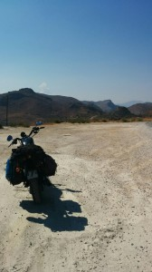](http://www.ultrabug.fr/wordpress/wp-content/uploads/2014/10/IMG_20140909_1501211.jpg)[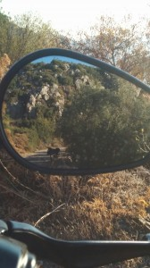](http://www.ultrabug.fr/wordpress/wp-content/uploads/2014/10/IMG_20140909_180844.jpg)

 

 

 

 

 

 

 

This is a view from the Bozburun bay. Two photos for two bike layouts : beach version and fully loaded version ;)

[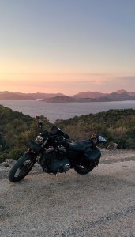](http://www.ultrabug.fr/wordpress/wp-content/uploads/2014/10/IMG_20140909_191337.jpg) [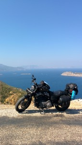](http://www.ultrabug.fr/wordpress/wp-content/uploads/2014/10/IMG_20140910_112858.jpg)

 

 

 

 

 

 

 

On the way to Cappadocia, near Karapinar :

[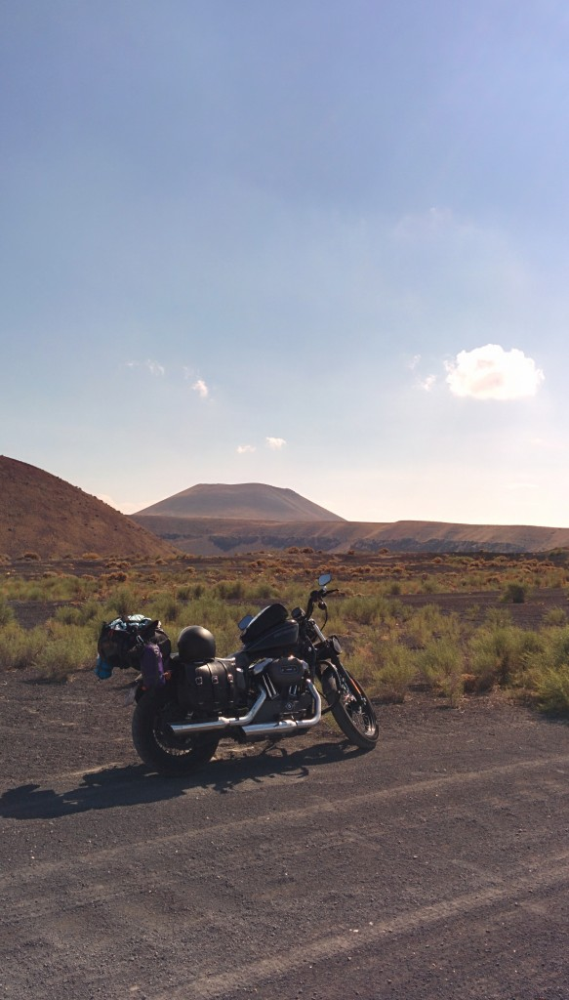](http://www.ultrabug.fr/wordpress/wp-content/uploads/2014/10/IMG_20140918_142943.jpg)

 

 

 

 

 

 

 

 

 

 

 

 

 

 

 

 

 

 

 

 

 

 

 

The amazing landscapes of Cappadocia, after two weeks by the sea it felt cold up there.

[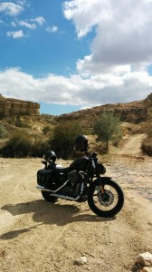](http://www.ultrabug.fr/wordpress/wp-content/uploads/2014/10/IMG_20140920_140433.jpg) [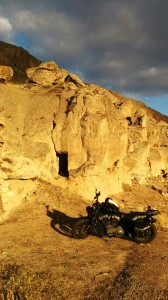](http://www.ultrabug.fr/wordpress/wp-content/uploads/2014/10/IMG_20140920_174936.jpg) [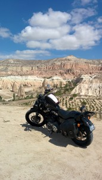](http://www.ultrabug.fr/wordpress/wp-content/uploads/2014/10/IMG_20140921_130308.jpg)

 

 

 

 

 

 

 

Our last picture from the bike next to the trail leading to our favorite and lonely "private" beach on the Datça peninsula.

[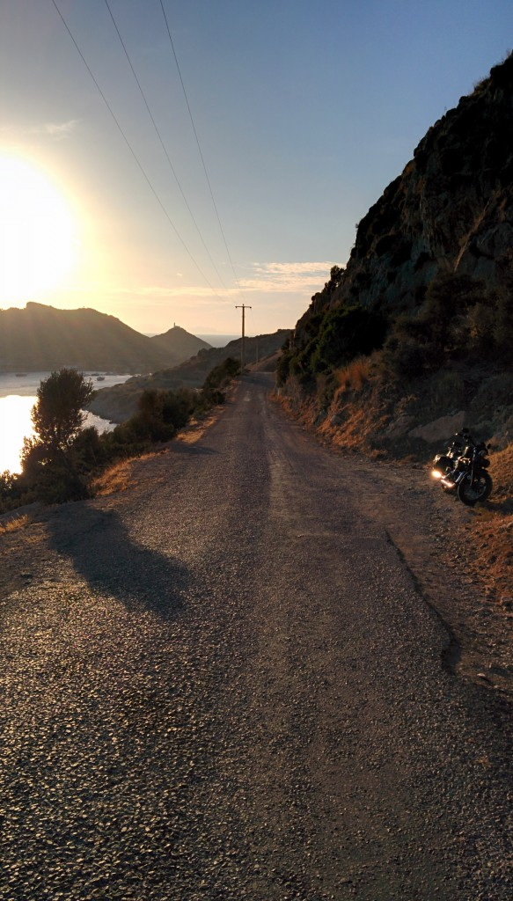](http://www.ultrabug.fr/wordpress/wp-content/uploads/2014/10/IMG_20140925_182326.jpg)
