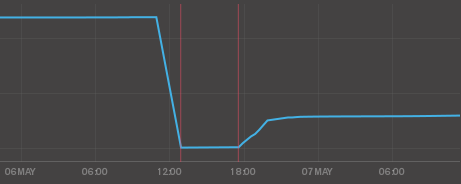
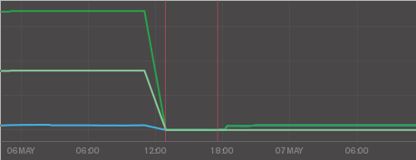
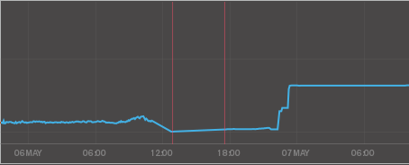

We've been running a nice **mongoDB cluster in production** for several years now in my company.

This cluster suits quite a wide range of use cases from very simple configuration collections to complex queried ones and real time analytics. This versatility has been the strong point of mongoDB for us since the start as it allows different teams to address their different problems using the same technology. We also run some dedicated replica sets for other purposes and network segmentation reasons.

We've waited a long time to see the latest 3.0 release features happening. The new WiredTiger storage engine hit the fan at the right time for us since we had reached the limits of our main production cluster and were considering alternatives.

So as surprising it may seem, it's the first of our mongoDB architecture we're upgrading to v3.0 as it has become a real necessity.

This post is about sharing our first experience about an ongoing and carefully planned major upgrade of a production cluster and does not claim to be a definitive migration guide.

## Upgrade plan and hardware

The [upgrade process is well covered in the mongoDB documentation](http://docs.mongodb.org/manual/release-notes/3.0-upgrade/) already but I will list the pre-migration base specs of every node of our cluster.

- mongodb v2.6.8
- RAID1 spinning HDD 15k rpm for the OS (Gentoo Linux)
- RAID10 4x SSD for mongoDB files under LVM
- 64 GB RAM

Our overall philosophy is to keep most of the configuration parameters to their default values to start with. We will start experimenting with them when we have sufficient metrics to compare with later.

## Disk (re)partitioning considerations

The master-get-all-the-writes architecture is still one of the main limitation of mongoDB and this does not change with v3.0 so you obviously need to challenge your current disk layout to take advantage of the new WiredTiger engine.

#### mongoDB 2.6 MMAPv1

Considering our cluster data size, we were forced to use our 4 SSD in a RAID10 as it was the best compromise to preserve performance while providing sufficient data storage capacity.

We often reached the limits of our I/O and moved the journal out of the RAID10 to the mostly idle OS RAID1 with no significant improvements.

#### mongoDB 3.0 WiredTiger

The main consideration point for us is the new feature allowing to store the indexes in a separate directory. So we anticipated the data storage consumption reduction thanks to the snappy compression and decided to split our RAID10 in two dedicated RAID1.

Our test layout so far is :

- RAID1 SSD for the data
- RAID1 SSD for the indexes and journal

## Our first node migration

After migrating our mongos and config servers to 3.0, we picked our worst performing secondary node to test the actual migration to WiredTiger. After all, we couldn't do worse right ?

We are aware that the strong suit of WiredTiger is actually about having the writes directed to it and will surely share our experience of this aspect later.

#### compression is bliss

To make this comparison accurate, we resynchronized this node totally before migrating to WiredTiger so we could compare a non fragmented MMAPv1 disk usage with the WiredTiger compressed one.

While I can't disclose the actual values, compression worked like a charm for us with a **gain ratio of 3,2 on disk usage** (data + indexes) which is way beyond our expectations !

This is the DB Storage graph from MMS, showing a gain ratio of 4 surely due to indexes being in a separate disk now.

 

 

 

 

#### memory usage

As with the disk usage, the node had been running hot on MMAPv1 before the actual migration so we can compare memory allocation/consumption of both engines.

There again the memory management of WiredTiger and its cache shows great improvement. For now, we left the default setting which has WiredTiger limit its cache to half the available memory of the system. We'll experiment with this setting later on.

 

 

 

 

#### connections

This I'm still not sure of the actual cause yet but the connections count is higher and more steady than before on this node.

## First impressions

The node is running smooth for several hours now. We are getting acquainted to the new metrics and statistics from WiredTiger. The overall node and I/O load is better than before !

While all the above graphs show huge improvements there is no major change from our applications point of view. We didn't expect any since this is only one node in a whole cluster and that the main benefits will also come from master node migrations.

I'll continue to share our experience and progress about our mongoDB 3.0 upgrade.
