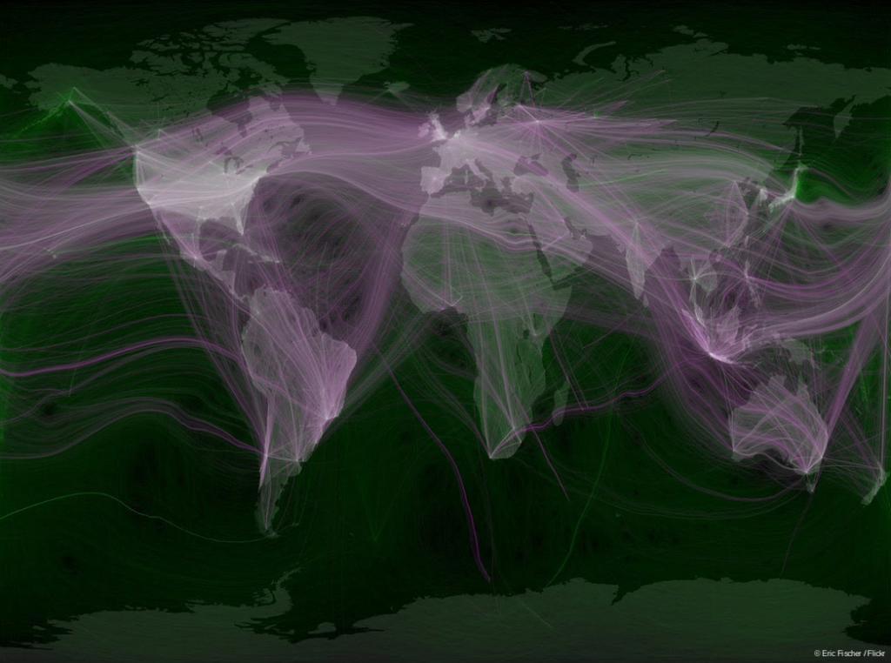

[These are the slides](https://docs.google.com/presentation/d/1bZ30UculKOM4IQ4ic5X2fLpz1Fe1QQPVqJLtshIO0pg/edit?usp=sharing) of my [EuroPython 2015 talk](https://ep2015.europython.eu/conference/talks/using-service-discovery-a-distributed-application).

The source code and ansible playbooks are [available on github](https://github.com/ultrabug/ep2015) !
