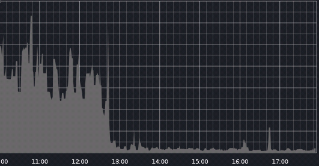
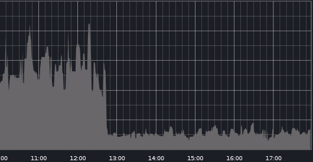
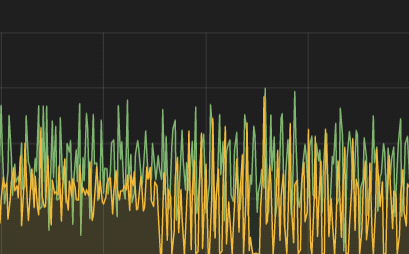
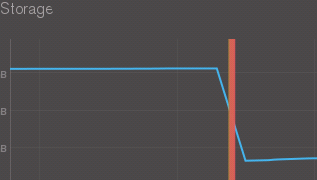

[In my last post](http://www.ultrabug.fr/mongodb-3-0-upgrade-in-production-step-3-hope/), I explained the new hope we had in following some newly added recommended steps before trying to migrate our production cluster to mongoDB 3.0 WiredTiger.

The most demanding step was migrating all our production servers data storage filesystems to **XFS** which obviously required a resync of each node... But we ended up being there pretty fast and were about to try again as 3.0.5 was getting ready, [until we saw this bug coming](https://jira.mongodb.org/browse/SERVER-19673) !

I guess you can understand why we decided to wait for 3.0.6... which eventually got released with a more peaceful changelog this time.

## The 3.0.6 crash test

We decided as usual to test the migration to WiredTiger in two phases.

1. **Migrate all our secondaries** to the WiredTiger engine (full resync). Wait a week to see if this has any effect on our cluster.
2. **Switch all the MMapv1 primary nodes to secondary** and let our WiredTiger secondary nodes become the primary nodes of our cluster. Pray hard that this time it will not break under our workload.

**Step 1** results were good, nothing major changed and even our mongo dumps were still working this time (yay!). One week later, everything was still working smoothly.

**Step 2** was the big challenge which [failed horribly last time](http://www.ultrabug.fr/mongodb-3-0-upgrade-in-production-step-2-failed/). Needless to say that we were quite stressed when doing the switch. But it worked smoothly and nothing broke + **performances gains were huge** !

## The results

Nothing speaks better than metrics, so I'll just comment them quickly as they speak by themselves. I obviously can't disclose the scales sorry.

**Insert-only operations gained 25x performance**

 

 

 

 

 

 

 

**Upsert-heavy operations gained 5x performance**

 

 

 

 

 

 

 

**Disk I/O also showed mercy to the disk overall usage.** This is due to WiredTiger superior caching and disk flushing mechanisms.

 

 

 

 

 

 

**Disk usage decreased dramatically thanks to WiredTiger compression**

 

 

 

 

## The last and next step

As of today, **we still run our secondaries with the MMapv1** engine and are waiting a few weeks to see if anything goes wrong in the long run. Shall we need to roll back, we'd be able to do so very easily.

Then when we get enough uptime using WiredTiger, we will make the final switch to a full Roarring production cluster !
