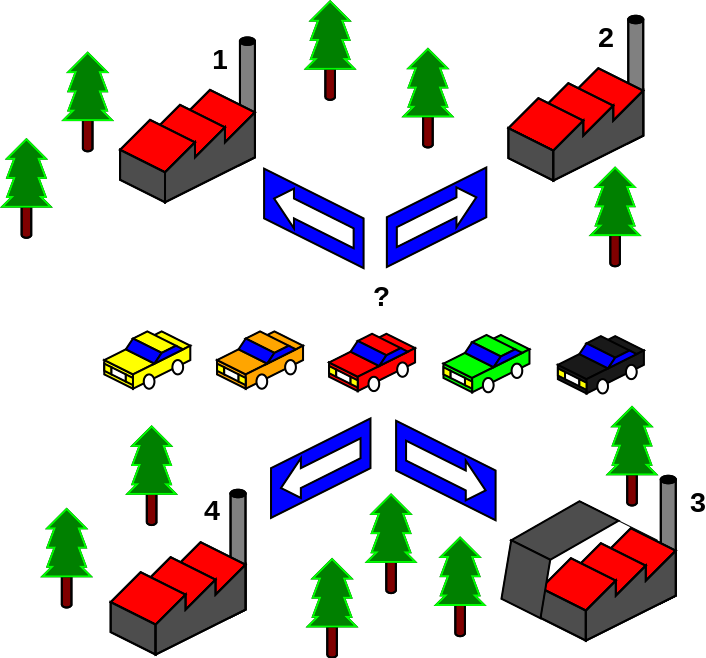
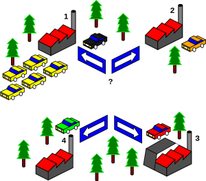
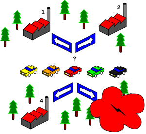
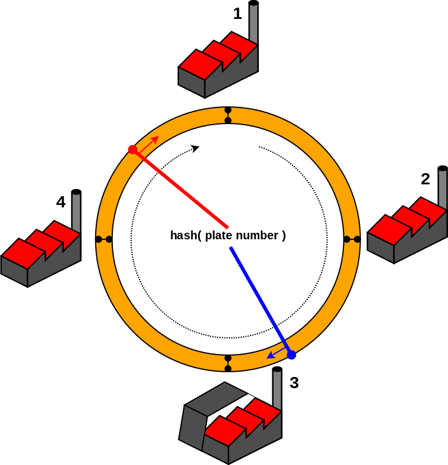

When working on distributed systems, we often have to distribute some kind of workload on different machines (nodes) of a cluster so we have to rely on a predictable and reliable **key/value mapping algorithm**.

If you're not sure about what that means, just consider the following questions when working on a cluster with a lot of machines (nodes):

- how could I make sure that all the data for a given user always gets delivered and processed on the same machine ?
- how could I make sure that I store and query the same cache server for a given key ?
- how do I split and distribute chunks of a large file across multiple storage machines and then make sure I can still access it through all those machines at once ?

A lot of technologies answer those kind of **mapping** questions by implementing a **hashing based distribution** of their workload (be it a distributed processing, file or cache).

**Consistent hashing** is one of those implementations and I felt like taking some time to explain it further.

# Example use case

Here is my attempt to explain what is **consistent hashing** and why it is needed on distributed systems. To make things fun, we'll take this simple use case:

- I have 5 broken cars
- There are 4 repair factories nearby
- I have to implement a way to figure out where to send each car to get it fixed
- I want to ensure that an even number of cars will get fixed on each factory

## 

This gets down to two major questions to solve:

- what is my **selection criteria** ? this will be my **key**.
- what is the expected **answer** ? this is my **value**.

# Static mapping

The first approach we could implement is to manually distribute the car based on their colour.

- key = car's colour
- value = factory number

To implement this, you use what we usually call **dictionaries** on various languages : those are static data structures where **you assign a value to a key**.

We would then write a mapping of **"car color" -> "factory n"** and apply this simple rule to decide where to ship a broken car.

{
  "yellow": "factory 1",
  "orange": "factory 2",
  "red": "factory 3",
  "green": "factory 4",
  "black": "factory 1"
}

This way we could indeed distribute the car repairs, but we can already see that with that an uneven number of colours ends up in over provisioning the factory 1. But there's worse:

**What if I start getting only yellow broken cars** ?

- I would end up sending all of them to the factory 1 and **the other factories would remain almost empty** !

This is a serious limitation. We need a dynamic way to calculate the car distribution between the factories, for this we will use a **hash algorithm** !

# Hash tables

A hash table is a data structure where we apply a hash function (algorithm) on the **key** to compute an **index** (pointer) into an array of **buckets** (values) from which we get the **value**.

MD5 gives very good hashing distribution and is widely available so this makes it a very good candidate for a hashing algorithm.

We can relate it like this to our example :

- key = car's plate number
- hash function = md5
- array of values = \[factory 1, factory 2, factory 3, factory 4\]

To find out where we send a car we just could do:

hash = md5(car plate number)
index = int(hash) % size\_of(array)
index = 0 if index > size\_of(array)
factory = array\[index\]

In python ? okay !

import md5

factories = \[1, 2, 3, 4\]

def get\_factory(plate):
    hash = int(md5.new(plate).hexdigest(), 16)
    index = hash % len(factories)
    if index > len(factories):
        index = 0
    return factories\[index\]

get\_factory('ah-993-xx')
>> 3

get\_factory('zz-6793-kh')
>> 3

Wow it's amazingly simple right ? :)

Now we have a way better car repair distribution !... until something bad happens:

**What if a factory burns ?**

Our algorithm is based on the number of available factories so **removing a factory from our array means that we will redistribute a vast majority of the key mappings from our hash table** !

Keep in mind that the more values (factories) you have in your array the worse this problem gets. In our case, given a car's plate number we are sure that we wouldn't be able to figure out where a vast majority of them were sent any more.

factories = \[1, 2, 4\]

get\_factory('ah-993-xx')
>> 2 (was 3 before)

get\_factory('zz-6793-kh')
>> 1 (was 3 before)

Even worse is that when factory 3 gets repaired and back in my hash table, I will once again loose track of all my dispatched cars... What we need is a more **consistent** way of sorting this out.

# Consistent hashing

The response to this kind of problem is to implement a consistent hashing algorithm. **The goal of this technique is to limit the number of remapped keys when the hash table is resized**.

This is possible by imagining our factories as a circle (ring) and the hash of our keys as points on the same circle. We would then select the next factory (value) by going through the circle, always on the same way, until we find a factory.

- Red hashed plate number would go to factory 1
- Blue hashed plate number would go to factory 3

This way, when a factory gets added or removed from the ring, we loose only a limited portion of the key/value mappings !

Of course on a real world example we would implement a ring with a lot more of slots by adding the same factories on the ring multiple times. This way the affected range of mappings would be smaller and the impact even more balanced !

For instance, [uhashring](https://github.com/ultrabug/uhashring) being fully compatible and defaulting to ketama's ring distribution, you get 160 points per node on the ring !

I hope I got this little example right and gave you some insight on this very interesting topic !
