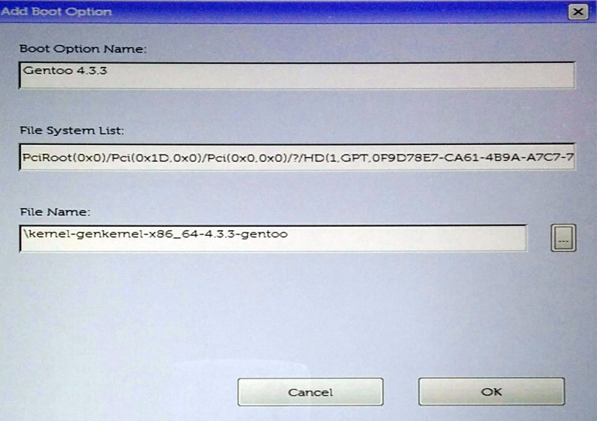
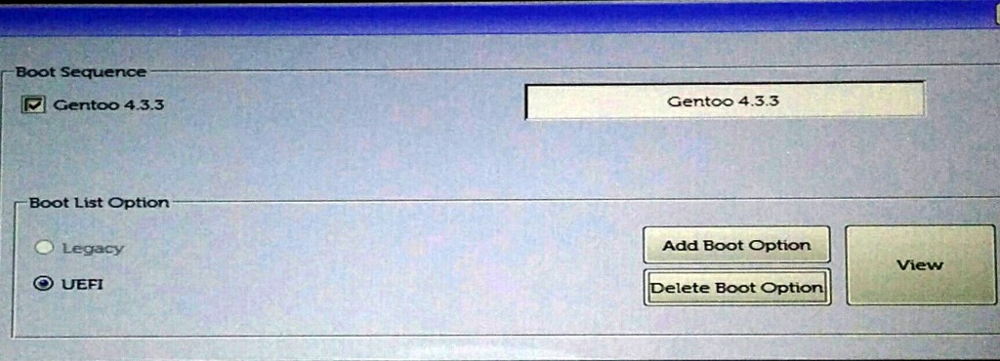

As I found little help about this online I figured I'd write a summary piece about my recent experience in installing **Gentoo Linux on a DELL XPS 13 9350**.

**EDIT: TL;DR if you need a working kernel config, you can also get my [4.12.5 kernel config here](http://ultrabug.fr/gentoo/xps9350/kernel-config-x86_64-4.12.5-gentoo).**

## UEFI or MBR ?

This machine ships with a **NVME SSD** so don't think twice : **UEFI** is the only sane way to go.

## BIOS configuration

I advise to use the pre-installed Windows 10 to update the XPS to the latest BIOS (1.1.7 at the time of writing). Then you need to change some stuff to boot and get the NVME SSD disk discovered by the live CD.

- **Turn off Secure Boot**
- Set **SATA Operation** to **AHCI** (will break your Windows boot but who cares)

## Live CD

Go for the latest SystemRescueCD (it's Gentoo based, you won't be lost) as it's quite more up to date and supports booting on UEFI. Make it a Live USB for example using **unetbootin** and the **ISO** on a **vfat formatted USB stick**.

## NVME SSD disk partitioning

We'll be using **GPT with UEFI**. I found that using **gdisk** was the easiest. The disk itself is found on **/dev/nvme0n1**. Here it is the partition table I used :

- 500Mo UEFI boot partition (type EF00)
- 16Go Swap partition
- 60Go Linux root partition
- 400Go home partition

The corresponding gdisk commands :

\# gdisk /dev/nvme0n1

Command: o ↵
This option deletes all partitions and creates a new protective MBR.
Proceed? (Y/N): y ↵

Command: n ↵
Partition Number: 1 ↵
First sector: ↵
Last sector: +500M ↵
Hex Code: EF00 ↵

Command: n ↵
Partition Number: 2 ↵
First sector: ↵
Last sector: +16G ↵
Hex Code: 8200 ↵

Command: n ↵
Partition Number: 3 ↵
First sector: ↵
Last sector: +60G ↵
Hex Code: ↵

Command: n ↵
Partition Number: 4 ↵
First sector: ↵
Last sector: ↵ (for rest of disk)
Hex Code: ↵

Command: w ↵
Do you want to proceed? (Y/N): Y ↵

## No WiFi on Live CD ? no panic

If your live CD is old (pre 4.4 kernel), the integrated broadcom 4350 wifi card won't be available !

My trick was to use my Android phone connected to my local WiFi as a USB modem which was detected directly by the live CD.

- get your Android phone connected on your local WiFi (unless you want to use your cellular data)
- plug in your phone using USB to your XPS
- on your phone, go to Settings / More / Tethering & portable hotspot
- enable **USB tethering**

Running **ip addr** will show the network card **enp0s20f0u2** (for me at least), then if no IP address is set on the card, just ask for one :

\# dhcpcd enp0s20f0u2

Et voilà, you have now access to the internet.

## Proceed with installation

The only thing to worry about is to format the UEFI boot partition as FAT32.

\# mkfs.vfat -F 32 /dev/nvme0n1p1

Then follow the Gentoo handbook as usual for the next steps of the installation process until you arrive to the kernel and the bootloader / grub part.

From this moment I can already say that **NO we won't be using GRUB at all** so don't bother installing it. Why ? Because at the time of writing, the efi-64 support of GRUB was totally not working at all as it failed to discover the NVME SSD disk on boot.

## Kernel sources and consideration

The trick here is that we'll setup the boot ourselves directly from the BIOS later so we only need to build a standalone kernel (meaning able to boot without an initramfs).

**EDIT: as of Jan. 10 2016, kernel 4.4 is available on portage so you don't need the patching below any more !**

Make sure you **install and use at least a 4.3.x kernel** (4.3.3 at the time of writing). Add **sys-kernel/gentoo-sources** to your **/etc/portage/package.keywords** file if needed. If you have a 4.4 kernel available, you can skip patching it below.

## Patching 4.3.x kernels for Broadcom 4350 WiFi support

To get the broadcom 4350 WiFi card working on 4.3.x, we need to patch the kernel sources. This is very easy to do thanks to Gentoo's user patches support. **Do this before installing gentoo-sources (or reinstall it afterwards)**.

This example is for gentoo-sources-4.3.3, adjust your version accordingly :

(chroot) # mkdir -p /etc/portage/patches/sys-kernel/gentoo-sources-4.3.3
(chroot) # cd /etc/portage/patches/sys-kernel/gentoo-sources-4.3.3
(chroot) # wget http://ultrabug.fr/gentoo/xps9350/0001-bcm4350.patch

When emerging the gentoo-sources package, you should see the patch being applied. Check that it worked by issuing :

(chroot) # grep BRCM\_CC\_4350 /usr/src/linux/drivers/net/wireless/brcm80211/brcmfmac/chip.c
case BRCM\_CC\_4350\_CHIP\_ID:

The resulting kernel module will be called **brcmfmac**, make sure to load it on boot by adding it in your **/etc/conf.d/modules** :

modules="brcmfmac"

**EDIT: as of Jan. 7 2016, version 20151207 of linux-firmware ships with the needed files so you don't need to download those any more !**

Then we need to download the WiFi card's firmware files which are not part of the **linux-firmware** package at the time of writing (20150012).

(chroot) # emerge '>=sys-kernel/linux-firmware-20151207'

# DO THIS ONLY IF YOU DONT HAVE >=sys-kernel/linux-firmware-20151207 available !
(chroot) # cd /lib/firmware/brcm/
(chroot) # wget http://ultrabug.fr/gentoo/xps9350/BCM-0a5c-6412.hcd
(chroot) # wget http://ultrabug.fr/gentoo/xps9350/brcmfmac4350-pcie.bin

## Kernel config & build

I used **genkernel** to build my kernel. I've done a very few adjustments but these are the things to mind in this pre-built kernel :

- support for NVME SSD added as builtin
- it is builtin for ext4 only (other FS are not compiled in)
- support for DM\_CRYPT and LUKS ciphers for encrypted /home
- the root partition is hardcoded in the kernel as **/dev/nvme0n1p3** so if yours is different, you'll need to change **CONFIG\_CMDLINE** and compile it yourself
- the CONFIG\_CMDLINE above is needed because you can't pass kernel parameters using UEFI so you have to hardcode them in the kernel itself
- support for the intel graphic card DRM and framebuffer (there's a kernel bug with skylake CPUs which will spam the logs but it still works good)

Get the kernel config and compile it :

**EDIT: updated kernel config to 4.4.4 with SD Card support.**

(chroot) # mkdir -p /etc/kernels
(chroot) # cd /etc/kernels
(chroot) # wget http://ultrabug.fr/gentoo/xps9350/kernel-config-x86\_64-4.4.4-gentoo
(chroot) # genkernel kernel

The proposed kernel config here is for gentoo-sources-4.4.4 so **make sure to rename the file for your current version**.

**EDIT: you can use and download a recent working kernel config at the beginning of the article.**

This kernel is far from perfect but it works very good so far, sound, webcam and suspend work smoothly !

## make.conf settings for intel graphics

I can recommend using the following on your **/etc/portage/make.conf** :

INPUT\_DRIVERS="evdev synaptics"
VIDEO\_CARDS="intel i965"

## fstab for SSD

Don't forget to make sure the **noatime** option is used on your fstab for / and /home !

/dev/nvme0n1p1    /boot    vfat    noauto,noatime    1 2
/dev/nvme0n1p2    none     swap    sw                0 0
/dev/nvme0n1p3    /        ext4    noatime   0 1
/dev/nvme0n1p4    /home    ext4    noatime   0 1

As pointed out by **stefantalpalaru** on comments, it is recommended to schedule a SSD TRIM on your crontab once in a while, see [Gentoo Wiki on SSD](https://wiki.gentoo.org/wiki/SSD#Rootfs) for more details.

## encrypted /home auto-mounted at login

I advise adding the **cryptsetup** to your USE variable in **/etc/portage/make.conf** and then updating your @world with a **emerge -NDuq @world**.

I assume you don't have created your user yet so your unmounted /home is empty. Make sure that :

- your /dev/nvme0n1p4 home partition is **not mounted**
- you **removed** the corresponding **/home** line from your **/etc/fstab** (we'll configure pam\_mount to get it auto-mounted on login)

AFAIK, the LUKS password you'll set on the first slot when issuing luksFormat below should be the same as your user's password !

(chroot) # cryptsetup luksFormat -s 512 /dev/nvme0n1p4
(chroot) # cryptsetup luksOpen /dev/nvme0n1p4 crypt\_home
(chroot) # mkfs.ext4 /dev/mapper/crypt\_home
(chroot) # mount /dev/mapper/crypt\_home /home
(chroot) # useradd -m -G wheel,audio,video,plugdev,portage,users USERNAME
(chroot) # passwd USERNAME
(chroot) # umount /home
(chroot) # cryptsetup luksClose crypt\_home

We'll use sys-auth/**pam\_mount** to manage the mounting of our /home partition when a user logs in successfully, so make sure you **emerge pam\_mount** first, then configure the following files :

- **/etc/security/pam\_mount.conf.xml** (only line added is the _volume_ one)

<?xml version="1.0" encoding="utf-8" ?>
<!DOCTYPE pam\_mount SYSTEM "pam\_mount.conf.xml.dtd">
<!--
	See pam\_mount.conf(5) for a description.
-->

<pam\_mount>

		<!-- debug should come before everything else,
		since this file is still processed in a single pass
		from top-to-bottom -->

<debug enable="0" />

		<!-- Volume definitions -->

<volume user="USERNAME" fstype="auto" path="/dev/nvme0n1p4" mountpoint="/home" options="fsck,noatime" />

		<!-- pam\_mount parameters: General tunables -->

<!--
<luserconf name=".pam\_mount.conf.xml" />
-->

<!-- Note that commenting out mntoptions will give you the defaults.
     You will need to explicitly initialize it with the empty string
     to reset the defaults to nothing. -->
<mntoptions allow="nosuid,nodev,loop,encryption,fsck,nonempty,allow\_root,allow\_other" />
<!--
<mntoptions deny="suid,dev" />
<mntoptions allow="\*" />
<mntoptions deny="\*" />
-->
<mntoptions require="nosuid,nodev" />

<!-- requires ofl from hxtools to be present -->
<logout wait="0" hup="no" term="no" kill="no" />

		<!-- pam\_mount parameters: Volume-related -->

<mkmountpoint enable="1" remove="true" />

</pam\_mount>

- **/etc/pam.d/system-auth** (only lines added are the ones with _pam\_mount.so_)

auth		required	pam\_env.so 
auth		required	pam\_unix.so try\_first\_pass likeauth nullok 
auth		optional	pam\_mount.so
auth		optional	pam\_permit.so

account		required	pam\_unix.so 
account		optional	pam\_permit.so

password	optional	pam\_mount.so
password	required	pam\_cracklib.so difok=2 minlen=8 dcredit=2 ocredit=2 retry=3 
password	required	pam\_unix.so try\_first\_pass use\_authtok nullok sha512 shadow 
password	optional	pam\_permit.so

session		optional	pam\_mount.so
session		required	pam\_limits.so 
session		required	pam\_env.so 
session		required	pam\_unix.so 
session		optional	pam\_permit.so

That's it, easy heh ?! When you login as your user, pam\_mount will decrypt your home partition using your user's password and mount it on /home !

## UEFI booting your Gentoo Linux

The best (and weird ?) way I found for booting the installed Gentoo Linux and its kernel is to configure the UEFI boot directly from the XPS BIOS.

The idea is that the BIOS can read the files from the EFI boot partition since it is formatted as FAT32. All we have to do is create a new boot option from the BIOS and configure it to use the kernel file stored in the EFI boot partition.

- reboot your machine
- get on the BIOS (hit F2)
- get on the **General / Boot Sequence** menu
- click Add
- set a name (like Gentoo 4.3.3) and find + select the kernel file (use the integrated file finder)

- remove all unwanted boot options

- save it and reboot

Your Gentoo kernel and OpenRC will be booting now !

## Suggestions, corrections, enhancements ?

As I said, I wrote all this quickly to spare some time to whoever it could help. I'm sure there are a lot of improvements to be done still so I'll surely update this article later on.
