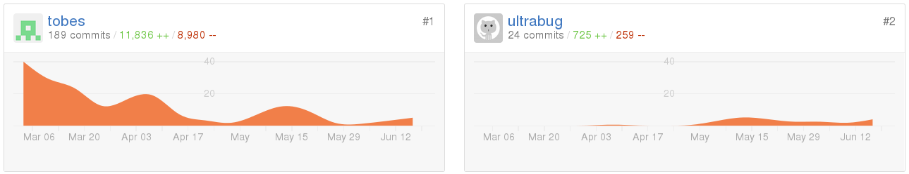

Oh boy, this new version is so amazing in terms of improvements and contributions that it's hard to sum it up !

Before going into more explanations I want to dedicate this release to **tobes** whose contributions, hard work and patience have permitted this ambitious 3.0 : **THANK YOU** !

This is the graph of contributed commits since 2.9 just so you realise how much this version is thanks to him: I can't continue on without also thanking **Horgix** who started this madness by splitting the code base into modular files and **pydsigner** for his everlasting contributions and code reviews !

The git stat since 2.9 also speaks for itself:

 73 files changed, 7600 insertions(+), 3406 deletions(-)

## So what's new ?

- the monolithic **code base have been split into modules** responsible for the given tasks py3status performs
- major improvements on modules output orchestration and execution resulting in **considerable CPU consumption reduction and i3bar responsiveness**
- refactoring of **user notifications with added dbus support** and rate limiting
- improved **modules error reporting**
- py3status can now **survive an i3status crash** and will try to respawn it
- a new 'container' module output type gives the **ability to group modules together**
- **refactoring of the time and tztime modules support** brings the support of all the time macros (%d, %Z etc)
- **support** for stopping py3status and its modules when **i3bar hide mode** is used
- refactoring of general, contribution and most noticeably modules **documentation**
- [more details on the rest of the changelog](https://github.com/ultrabug/py3status/blob/master/CHANGELOG)

## Modules

Along with a cool list of improvements on the existing modules, these are the new modules:

- new **group** module to cycle display of several modules (check it out, it's insanely handy !)
- new **fedora\_updates** module to check for your Fedora packages updates
- new **github** module to check a github repository and notifications
- new **graphite** module to check metrics from graphite
- new **insync** module to check your current insync status
- new **timer** module to have a simple countdown displayed
- new **twitch\_streaming** module to check is a Twitch Streamer is online
- new **vpn\_status** module to check your VPN status
- new **xrandr\_rotate** module to rotate your screens
- new **yandexdisk\_status** module to display Yandex.Disk status

## Contributors

And of course thank you to all the others who made this version possible !

- @egeskow
- Alex Caswell
- Johannes Karoff
- Joshua Pratt
- Maxim Baz
- Nathan Smith
- Themistokle Benetatos
- Vladimir Potapev
- Yongming Lai
