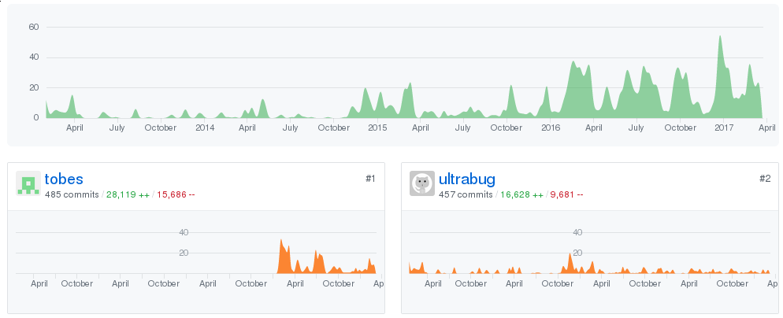
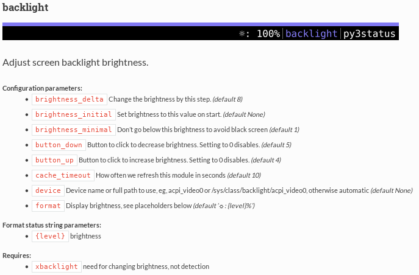

Howdy folks,

I'm obviously slacking a bit on my blog and I'm ashamed to say that it's not the only place where I do. **py3status** is another of them and it wouldn't be the project it is today without **@tobes.**

In fact, this new 3.5 release has witnessed his takeover on the top contributions on the project, so I want to extend a warm thank you and lots of congratulations on this my friend :)

Also, an amazing new contributor from the USA has come around in the nickname of **@lasers**. He has been doing a tremendous job on module normalization, code review and feedbacks. His high energy is amazing and more than welcome.

This release is mainly his, so thank you **@lasers** !

## What's new ?

Well the [changelog](https://github.com/ultrabug/py3status/blob/master/CHANGELOG) has never been so large that I even don't know where to start. I guess the most noticeable change is the gorgeous and brand new **[documentation of py3status on readthedocs](http://py3status.readthedocs.io/en/latest/)** !

Apart from the enhanced guides and sections, what's amazing behind this new documentation is the level of automation efforts that @lasers and @tobes put into it. They even generate modules' screenshots programmatically ! I would never have thought of it possible :D

The other main efforts on this release is about **modules normalization** where @lasers put so much energy in taking advantage of the formatter features and bringing all the modules to a new level of **standardization**. This long work brought to light some lack of features or bugs which got corrected along the way.

Last but not least, **the way py3status notifies you when modules fail to load/execute got changed**. Now modules which fail to load or execute will not pop up a notification (i3 nagbar or dbus) but display directly in the bar where they belong. Users can **left click to show the error** and **right click to discard** them from their bar !

## New modules

Once again, new and recurring contributors helped the project get better and offer a cool set of modules, thank you contributors !

- **air\_quality** module, to display the air quality of your place, by @**beetleman** and @lasers
- **getjson** module to display fields from a json url, by @**vicyap**
- **keyboard\_locks** module to display keyboard locks states, by @**lasers**
- **systemd** module to check the status of a systemd unit, by @**adrianlzt**
- **tor\_rate** module to display the incoming and outgoing data rates of a Tor daemon instance, by @**fmorgner**
- **xscreensaver** module, by @lasers and @**neutronst4r**

Special mention to @**maximbaz** for his continuous efforts and help. And also a special **community mention** to @**valdur55** for his responsiveness and help for other users on IRC !

## What's next ?

The 3.6 version will focus on the following ideas, some sane and some crazy :)

- we will continue to work on the ability to add/remove/move modules in the bar at runtime
- i3blocks and i3pystatus support, to embed their configurations and modules inside py3status
- formatter optimizations
- finish modules normalization
- write more documentation and clean up the old ones

Stay tuned
