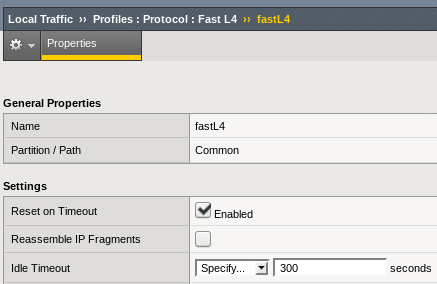
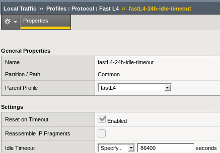
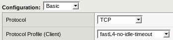

In our quest to a highly available **HiveServer2**, we faced so many problems and a clear lack of documentation when it came to do it with **F5 BIG-IP** load balancers that I think it's worth a blog post to help around.

We are using the Cloudera Hadoop distribution but this applies whatever your distribution.

# Hive HA configuration

This appears to be well documented at a first glance but the HiveServer2 (HS2) documentation vanished at the time of writing.

- [Hive Metastore HA](https://www.cloudera.com/documentation/enterprise/5-5-x/topics/admin_ha_hivemetastore.html)
- [HiveServer2 HA](https://www.cloudera.com/documentation/enterprise/5-5-x/topics/admin_ha_hiveserver2.html) = 404

Anyway, using Cloudera Manager to set up HS2 HA is not hard but there are a few gotchas that I want to highlight and that you will need to be careful with:

- As for every Keberos based service, **make sure you have a dedicated IP for the HiveServer2 Load Balancer URL** and that it's reverse DNS is setup properly. Else you will get GSSAPI errors.
- When running a secure cluster with Kerberos, the **HiveServer2 Load Balancer** URL is to be used as your connection host (obvious) **AND in your Kerberos principal connection string** (maybe less obvious).

Example beeline connection string before HA:

!connect jdbc:hive2://hive-server:10000/default;principal=hive/_HOST@REALM.COM

and with HA (notice we changed also the _HOST):

!connect jdbc:hive2://ha-hive-fqdn:10000/default;principal=hive/ha-hive-fqdn@REALM.COM

We found out the kerberos principal gotcha the hard way... The reason behind this is that the **_HOST** is basically a macro that will get resolved to the client host name which will then be used to validate the kerberos ticket. When running in load balanced/HA mode , the actual source IP will be replaced by the load balancer's IP (SNAT) and the kerberos reverse DNS lookup will then fail!

So if you do not use the HS2 HA URL in the kerberos principal string, you will get Kerberos GSSAPI errors when the load balanding SNAT will be used (see next chapter).

**This will require you to update all your jobs using HS2 to reflect these changes before load balancing HS2 with F5 BIG-IP.**

# Load balancing HiveServer2 with F5

Our pals at Cloudera have brought a good doc for [Impala HA with F5](http://www.cloudera.com/documentation/other/reference-architecture/PDF/Impala-HA-with-F5-BIG-IP.pdf) and they instructed we followed it to set up HS2 HA too because they had nothing better.

## Kerberos GSSAPI problem

When we applied it the first time and tried to switch to using the F5, all our jobs failed because of the kerberos _HOST principal problem mentioned on the previous chapter. This one is not that hard to find out and debug with a google search and explained on Cloudera community forums.

We then migrated (again) all our jobs to update the principal connection strings before migrating again to the F5 load balancers.

## Connection Reset problems

After our next migration to F5 load balancers, we had most of our jobs running well and the Kerberos problems vanished but we faced a new problem: some of our jobs failed with **Connection Reset** errors on HiveServer2:

java.sql.SQLException: org.apache.thrift.transport.TTransportException: java.net.SocketException: Connection reset

After some debugging and traffic analysis we found out that the F5 were actually responsible for those connection reset but we struggled to understand why.

It turned out that the **Protocol Profile** set up on the Virtual Server was the root cause of the problem and specifically its **idle timeout setting default of 300s**:

Note the _Reset on Timeout_ setting as well which is responsible for the actual Reset packet sent by the F5 to the client.

This could also be proven by the Virtual Server statistics showing an **increasing Connection Expires count**.

**The solution is to create a new Protocol Profile** based on the _fastL4_ with a higher Idle Timeout setting **and update our Virtual Server to use this profile instead** of the default one.

It seemed sensible in our case to increase the 5 minutes expiration to 1 day, so let's call our new profile **fastL4-24h-idle-timeout:**

Then change the Hive Virtual Server configuration to use this Protocol Profile:

You will see no more expired connections on the Virtual Server statistics!

## Connection mirroring

When creating a Virtual Server, there is a hidden but critical option to enable named **Connection Mirroring** under the **Configuration:** **Advanced** drop-down.

Make sure you enable this feature so that your Hive queries and applications can survive a failover of your F5 load balancers. If you do not **enable** this, you will experience stalled connections and jobs which could take up to multiple hours before failing!

## Job design consideration

We could argue whether or not a default 5 minutes idle timeout is reasonable or not for Hive or any other Hadoop component but it is important to point out that the jobs which were affected also had sub-optimal design pattern in the first place. This also explains why most of our jobs (including also long running ones) were not affected.

The affected jobs allowed were Talend jobs where the Hive connection was established at the beginning of the job, used at that time and then the job went on doing other things before using the Hive connection again.

When those in between computation took more than 300s, the remaining of the job failed because the initial Hive connection got reset by the F5:

This is clearly not a good job design for long processing jobs and you should refrain from doing it. Instead open a connection to Hive when you need it, use it and close it properly. Shall you need it later in your job, open a new connection to Hive and use that one.

This will also have the benefit of not keeping open idle connections to Hive itself and favour resources allocation fairness across your jobs.

I hope this will be of help to anyone facing these kind of issues.
