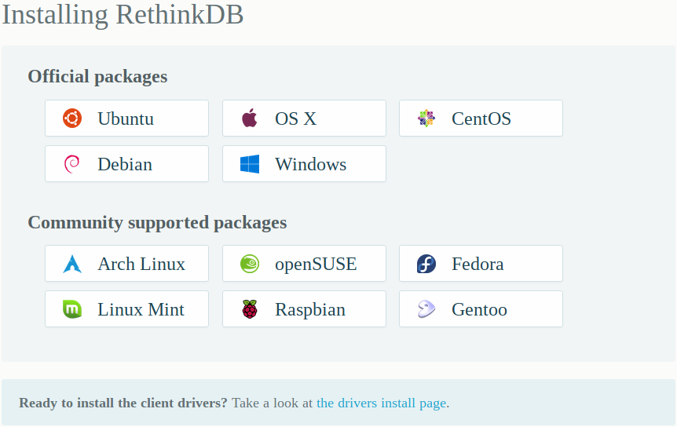

 

The **rethinkdb**'s website has (finally) been updated and Gentoo Linux is now listed on the installation page!

Meanwhile, we have bumped the ebuild to [version 2.3.6 with fixes for building on gcc-6](https://github.com/gentoo/gentoo/pull/5911) thanks to **Peter Levine** who kindly proposed a nice PR on github.
