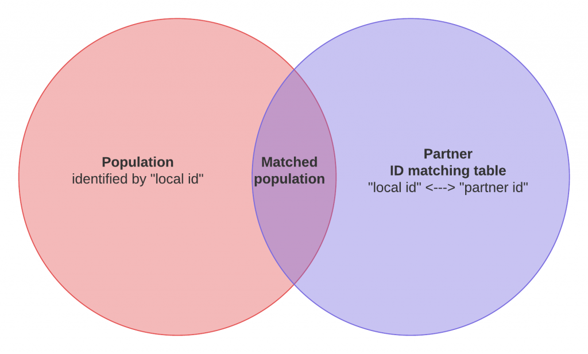
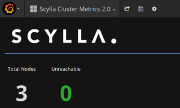

In my previous blog post, I shared [7 lessons on our experience in evaluating Scylla](https://www.ultrabug.fr/evaluating-scylladb-for-production-1-2/) for production.

Those lessons were focused on the setup and execution of the POC and I promised a more technical blog post with technical details and lessons learned from the POC, here it is!

Before you read on, be mindful that **our POC was set up to test workloads** and workflows, **not to benchmark** technologies. So even if the Scylla figures are great, they have not been the main drivers of the actual conclusion of the POC.

# Business context

As a data driven company working in the Marketing and Advertising industry, we help our clients make sense of multiple sources of data to build and improve their relationship with their customers and prospects.

Dealing with multiple sources of data is nothing new but their volume has dramatically changed during the past decade. I will spare you with the Big-Data-means-nothing term and the technical challenges that comes with it as you already heard enough of it.

Still, it is clear that our line of business is tied to our capacity at **mixing and correlating a massive amount of different types of events** (data sources/types) coming from various sources which all have their own identifiers (think primary keys):

- Web navigation tracking: identifier is a cookie that's tied to the tracking domain (we have our own)
- CRM databases: usually the email address or an internal account ID serve as an identifier
- Partners' digital platform: identifier is also a cookie tied to their tracking domain

To try to make things simple, let's take a concrete example:

You work for UNICEF and want to optimize their banner ads budget by targeting the donors of their last fundraising campaign.

- Your reference user database is composed of the donors who registered with their email address on the last campaign: main identifier is the email address.
- To buy web display ads, you use an Ad Exchange partner such as AppNexus or DoubleClick (Google). From their point of view, users are seen as cookie IDs which are tied to their own domain.

So you basically need to be able to translate an email address to a cookie ID for every partner you work with.

# Use case: ID matching tables

**We operate and maintain huge ID matching tables** for every partner and a great deal of our time is spent translating those IDs from one to another. In SQL terms, we are basically doing JOINs between a dataset and those ID matching tables.

- You select your reference population
- You JOIN it with the corresponding ID matching table
- You get a matched population that your partner can recognize and interact with

Those ID matching tables have a **pretty high read AND write throughput** because they're updated and queried all the time.

Usual figures are **JOINs between a 10+ Million dataset and 1.5+ Billion ID** matching tables.

The reference query basically looks like this:

SELECT count(m.partnerid)
FROM population_10M_rows AS p JOIN partner_id_match_400M_rows AS m
ON p.id = m.id

##  Current implementations

We operate a lambda architecture where we handle real time ID matching using **MongoDB** and batch ones using **Hive** (Apache Hadoop).

The first downside to note is that it requires us to maintain **two copies of every ID matching table.** We also couldn't choose one over the other because **neither MongoDB nor Hive can sustain both the read/write lookup/update ratio while performing within the low latencies that we need**.

**This is an operational burden** and requires quite a bunch of engineering to ensure data consistency between different data stores.

### Production hardware overview:

- MongoDB is running on a 15 nodes (5 shards) cluster
    - 64GB RAM, 2 sockets, RAID10 SAS spinning disks, 10Gbps dual NIC
- Hive is running on 50+ YARN NodeManager instances
    - 128GB RAM, 2 sockets, JBOD SAS spinning disks, 10Gbps dual NIC

## Target implementation

The key question is simple: is there a technology out there that can sustain our ID matching tables workloads while maintaining consistently low upsert/write and lookup/read latencies?

Having one technology to handle both use cases would allow:

- Simpler data consistency
- Operational simplicity and efficiency
- Reduced costs

### POC hardware overview:

So we decided to find out if Scylla could be that technology. For this, we used three decommissioned machines that we had in the basement of our Paris office.

- 2 DELL R510
    - 19GB RAM, 2 socket 8 cores, RAID0 SAS spinning disks, 1Gbps NIC
- 1 DELL R710
    - 19GB RAM, 2 socket 4 cores, RAID0 SAS spinning disks, 1Gbps NIC

I know, these are not glamorous machines and they are even inconsistent in specs, but we still set up a 3 node Scylla cluster running **Gentoo Linux** with them.

Our take? If those three lousy machines can challenge or beat the production machines on our current workloads, then Scylla can seriously be considered for production.

# Step 1: Validate a schema model

Once the POC document was complete and the ScyllaDB team understood what we were trying to do, we started iterating on the schema model using a query based modeling strategy.

So we wrote down and rated the questions that our model(s) should answer to, they included stuff like:

- What are all our cookie IDs associated to the given partner ID ?
- What are all the cookie IDs associated to the given partner ID over the last N months ?
- What is the last cookie ID/date for the given partner ID ?
- What is the last date we have seen the given cookie ID / partner ID couple ?

As you can imagine, the reverse questions are also to be answered so ID translations can be done both ways (ouch!).

## Prototyping

This is no news that I'm a Python addict so I did all my prototyping using Python and the **cassandra-driver**.

I ended up using a **test-driven data modelling** strategy using **pytest**. I wrote tests on my dataset so I could concentrate on the model while making sure that all my questions were being answered correctly and consistently.

## Schema

In our case, we ended up with three denormalized tables to answer all the questions we had. To answer the first three questions above, you could use the schema below:

CREATE TABLE IF NOT EXISTS ids_by_partnerid(
 partnerid text,
 id text,
 date timestamp,
 PRIMARY KEY ((partnerid), date, id)
 )
 WITH CLUSTERING ORDER BY (date DESC)

## Note on clustering key ordering

One important learning I got in the process of validating the model is about the internals of Cassandra's file format that resulted in the choice of using a descending order DESC on the date clustering key as you can see above.

If your main use case of querying is to look for the **latest value** of an history-like table design like ours, then make sure to change the default ASC order of your clustering key to DESC. This will ensure that the latest values (rows) are stored at the beginning of the sstable file effectively reducing the read latency when the row is not in cache!

Let me quote Glauber Costa's detailed explanation on this:

> _Basically in Cassandra's file format, the index points to an entire partition (for very large partitions there is a hack to avoid that, but the logic is mostly the same). So if you want to read the first row, that's easy you get the index to the partition_ _and read the first row. I__f you want to read the last row, then you get the index to the partition_ _and do a linear scan to the next._

This is the kind of learning you can only get from experts like Glauber and that can justify the whole POC on its own!

# Step 2: Set up scylla-grafana-monitoring

As I said before, make sure to set up and run the [scylla-grafana-monitoring](https://github.com/scylladb/scylla-grafana-monitoring) project before running your test workloads. This easy to run solution will be of great help to **understand the performance** of your cluster and to **tune your workload for optimal performances**.

If you can, also discuss with the ScyllaDB team to allow them to access the Grafana dashboard. This will be very valuable since they know where to look better than we usually do... I gained a lot of understandings thanks to this!

## Note on scrape interval

I advise you to **lower the Prometheus scrape interval** to have a shorter and finer sampling of your metrics. This will allow your dashboard to be more reactive when you start your test workloads.

For this, change the **prometheus/prometheus.yml** file like this:

scrape_interval: 2s # Scrape targets every 2 seconds (5s default)
scrape_timeout: 1s # Timeout before trying to scrape a target again (4s default)

## Test your monitoring

Before going any further, **I strongly advise you to run a stress test on your POC cluster** using the **cassandra-stress** tool and share the results and their monitoring graphs with the ScyllaDB team.

This will give you a common understanding of the general performances of your cluster as well as help in outlining any obvious misconfiguration or hardware problem.

## Key graphs to look at

There are a lot of interesting graphs so I'd like to share the ones that I have been mainly looking at. Remember that depending on your test workloads, some other graphs may be more relevant for you.

- **number of open connections**

You'll want to see a steady and high enough number of open connections which will prove that your clients are pushed at their maximum (at the time of testing this graph was not on Grafana and you had to add it yourself)

- **cache hits / misses**

Depending on your reference dataset, you'll obviously see that cache hits and misses will have a direct correlation with disk I/O and overall performances. Running your test workloads multiple times should trigger higher cache hits if your RAM is big enough.

- **per shard/node distribution**

The _Requests Served per_ _shard_ graph should display a nicely distributed load between your shards and nodes so that you're sure that you're getting the best out of your cluster.

The same is true for almost every other "per shard/node" graph: you're looking for evenly distributed load.

- **sstable reads**

Directly linked with your disk performances, you'll be trying to make sure that you have almost no queued sstable reads.

# Step 3: Get your reference data and metrics

We obviously need to have **some reference metrics** on our current production stack so we can compare them with the results on our POC Scylla cluster.

Whether you choose to use your current production machines or set up a similar stack on the side to run your test workloads is up to you. We chose to run the vast majority of our tests on our current production machines to be as close to our real workloads as possible.

## Prepare a reference dataset

During your work on the POC document, you should have detailed the usual **data cardinality and volume** you work with. Use this information to set up a reference dataset that you can use on all of the platforms that you plan to compare.

In our case, we chose a 10 Million reference dataset that we JOINed with a 400+ Million extract of an ID matching table. Those volumes seemed easy enough to work with and allowed some nice ratio for memory bound workloads.

## Measure on your current stack

Then it's time to load this reference datasets on your current platforms.

- If you run a MongoDB cluster like we do, **make sure to shard and index the dataset** just like you do on the production collections.
- On Hive, make sure to **respect the storage file format** of your current implementations **as well as their partitioning**.

If you chose to run your test workloads on your production machines, make sure to run them multiple times and at different hours of the day and night so you can correlate the measures with the load on the cluster at the time of the tests.

## Reference metrics

For the sake of simplicity I'll focus on the Hive-only batch workloads. I performed a count on the JOIN of the dataset and the ID matching table using Spark 2 and then I also ran the JOIN using a simple Hive query through Beeline.

I gave the following definitions on the reference load:

- **IDLE**: YARN available containers and free resources are optimal, parallelism is very limited
- **NORMAL**: YARN sustains some casual load, parallelism exists but we are not bound by anything still
- **HIGH**: YARN has pending containers, parallelism is high and applications have to wait for containers before executing

There's always an error margin on the results you get and I found that there was not significant enough differences between the results using Spark 2 and Beeline so I stuck with a simple set of results:

- IDLE: 2 minutes, 15 seconds
- NORMAL: 4 minutes
- HIGH: 15 minutes

# Step 4: Get Scylla in the mix

It's finally time to do your best to break Scylla or at least to push it to its limits on your hardware... But most importantly, you'll be looking to understand what those limits are depending on your test workloads as well as outlining out all the required tuning that you will be required to do on the client side to reach those limits.

Speaking about the results, we will have to differentiate two cases:

1. The Scylla cluster is fresh and its **cache is empty** (cold start): performance is mostly **Disk I/O bound**
2. The Scylla cluster has been running some test workload already and its **cache is hot**: performance is mostly **Memory bound** with some Disk I/O depending on the size of your RAM

## Spark 2 / Scala test workload

Here I used Scala (yes, I did) and DataStax's [**spark-cassandra-connector**](https://github.com/datastax/spark-cassandra-connector) so I could use the magic **joinWithCassandraTable** function.

- spark-cassandra-connector-2.0.1-s_2.11.jar
- Java 7

I had to stick with the 2.0.1 version of the spark-cassandra-connector because newer version (2.0.5 at the time of testing) were performing bad with no apparent reason. The ScyllaDB team couldn't help on this.

You can interact with your test workload using the spark2-shell:

spark2-shell --jars jars/commons-beanutils_commons-beanutils-1.9.3.jar,jars/com.twitter_jsr166e-1.1.0.jar,jars/io.netty_netty-all-4.0.33.Final.jar,jars/org.joda_joda-convert-1.2.jar,jars/commons-collections_commons-collections-3.2.2.jar,jars/joda-time_joda-time-2.3.jar,jars/org.scala-lang_scala-reflect-2.11.8.jar,jars/spark-cassandra-connector-2.0.1-s_2.11.jar

Then use the following Scala imports:

// main connector import
import com.datastax.spark.connector._

// the joinWithCassandraTable failed without this (dunno why, I'm no Scala guy)
import com.datastax.spark.connector.writer._
implicit val rowWriter = SqlRowWriter.Factory

Finally I could run my test workload to select the data from Hive and JOIN it with Scylla easily:

val df_population = spark.sql("SELECT id FROM population_10M_rows")
val join_rdd = df_population.rdd.repartitionByCassandraReplica("test_keyspace", "partner_id_match_400M_rows").joinWithCassandraTable("test_keyspace", "partner_id_match_400M_rows")
val joined_count = join_rdd.count()

### Notes on tuning spark-cassandra-connector

I experienced **pretty crappy performances at first**. Thanks to the easy Grafana monitoring, I could see that Scylla was not being the bottleneck at all and that I instead had trouble getting some real load on it.

So I engaged in a thorough tuning of the spark-cassandra-connector with the help of Glauber... and it was pretty painful but we finally made it and got the best parameters to get the load on the Scylla cluster close to 100% when running the test workloads.

This tuning was done in the **spark-defaults.conf** file:

- have a **fixed set of executors** and boost their overhead memory

This will increase test results reliability by making sure you always have a reserved number of available workers at your disposal.

spark.dynamicAllocation.enabled=false
spark.executor.instances=30
spark.yarn.executor.memoryOverhead=1024

- set the **split size to 1MB**

Default is 8MB but Scylla uses a split size of 1MB so you'll see a great boost of performance and stability by setting this setting to the right number.

spark.cassandra.input.split.size_in_mb=1

- align **driver timeouts with server timeouts**

It is advised to make sure that your read request timeouts are the same on the driver and the server so you do not get stalled states waiting for a timeout to happen on one hand. You can do the same with write timeouts if your test workloads are write intensive.

/etc/scylla/scylla.yaml

read_request_timeout_in_ms: 150000

spark-defaults.conf

spark.cassandra.connection.timeout_ms=150000
spark.cassandra.read.timeout_ms=150000

// optional if you want to fail / retry faster for HA scenarios
spark.cassandra.connection.reconnection_delay_ms.max=5000
spark.cassandra.connection.reconnection_delay_ms.min=1000
spark.cassandra.query.retry.count=100

- adjust your **reads per second** rate

Last but surely not least, this setting you will need to try and find out the best value for yourself since it has a direct impact on the load on your Scylla cluster. You will be looking at pushing your POC cluster to almost 100% load.

spark.cassandra.input.reads_per_sec=6666

As I said before, I could only get this to work perfectly using the 2.0.1 version of the spark-cassandra-connector driver. But then it worked very well and with great speed.

### Spark 2 results

Once tuned, the best results I was able to reach on this hardware are listed below. It's interesting to see that with spinning disks, the cold start result can compete with the results of a heavily loaded Hadoop cluster where pending containers and parallelism are knocking down its performances.

- **hot cache:** 2min
- **cold cache:** 12min

Wow! **Those three refurbished machines can compete with our current production machines and implementations**, they can even match an idle Hive cluster of a medium size!

## Python test workload

I couldn't conclude on a Scala/Spark 2 only test workload. So I obviously went back to my language of choice **Python** only to discover at my disappointment that there is no **joinWithCassandraTable** equivalent available on **pyspark**...

I tried with some projects claiming otherwise with no success until I changed my mind and decided that I probably didn't need Spark 2 at all. So **I went into the crazy quest of beating Spark 2 performances using a pure Python implementation**.

This basically means that instead of having a JOIN like helper, I had to do a massive amount of single "id -> partnerid" lookups. Simple but greatly inefficient you say? Really?

When I broke down the pieces, I was left with the following steps to implement and optimize:

- Load the 10M rows worth of population data from Hive
- For every row, lookup the corresponding partnerid in the ID matching table from Scylla
- Count the resulting number of matches

The main problem to compete with Spark 2 is that it is a distributed framework and Python by itself is not. So **you can't possibly imagine outperforming Spark 2 with your single machine**.

However, let's remember that Spark 2 is shipped and ran on executors using YARN so we are firing up JVMs and dispatching containers all the time. This is a quite expensive process that we have a chance to avoid using Python!

So what **I needed was a distributed computation framework** that would allow to load data in a partitioned way and run the lookups on all the partitions in parallel before merging the results. In Python, this framework exists and is named **Dask!**

You will obviously need to have to deploy a dask topology (that's easy and [well documented](https://dask.pydata.org/en/latest/)) to have a comparable number of dask workers than of Spark 2 executors (30 in my case) .

The corresponding Python [code samples are here](https://gist.github.com/ultrabug/8a13fe2ef7a616aa7301c3e4e88eda13).

### Hive + Scylla results

Reading the population id's from Hive, the workload can be split and executed concurrently on multiple dask workers.

- read the 10M population rows from Hive in a partitioned manner
- for each partition (slice of 10M), query Scylla to lookup the possibly matching partnerid
- create a dataframe from the resulting matches
- gather back all the dataframes and merge them
- count the number of matches

The results showed that **it is possible to compete with Spark 2 with Dask**:

- hot cache: **2min** (rounded up)
- cold cache: **6min**

Interestingly, those almost two minutes can be broken down like this:

- distributed read data from Hive: 50s
- distributed lookup from Scylla: 60s
- merge + count: 10s

This meant that if I could cut down the reading of data from Hive **I could go even faster**!

### Parquet + Scylla results

Going further on my previous remark **I decided to get rid of Hive** and put the 10M rows population data in a **parquet file** instead. I ended up trying to find out the most efficient way to read and load a parquet file from HDFS.

My conclusion so far is that you can't be the amazing **libhdfs3 + pyarrow** combo. It is faster to load everything on a single machine than loading from Hive on multiple ones!

The results showed that I could almost get rid of a whole minute in the total process, **effectively and easily beating Spark 2**!

- hot cache: **1min 5s**
- cold cache: **5min**

### Notes on the Python **cassandra-driver**

Tests using Python showed robust queries experiencing far less failures than the spark-cassandra-connector, even more during the cold start scenario.

- The usage of **execute_concurrent()** provides a clean and linear interface to submit a large number of queries while providing some level of concurrency control
- Increasing the **concurrency** parameter from 100 to **512** provided additional throughput, but increasing it more looked useless
- **Protocol version 4** forbids the tuning of connection requests / number to some sort of auto configuration. All tentative to hand tune it (by lowering protocol version to 2) failed to achieve higher throughput
- Installation of **libev** on the system allows the cassandra-driver to use it to handle concurrency instead of asyncore with a somewhat lower load footprint on the worker node but no noticeable change on the throughput
- When reading a parquet file stored on HDFS, the **hdfs3 + pyarrow** combo provides an insane speed (less than 10s to fully load 10M rows of a single column)

# Step 5: Play with High Availability

I was quite disappointed and surprised by the lack of maturity of the Cassandra community on this critical topic. Maybe the main reason is that the cassandra-driver allows for too many levels of configuration and strategies.

I wrote this simple bash script to allow me to **simulate node failures.** Then I could play with handling those failures and retries on the Python client code.

#!/bin/bash

iptables -t filter -X
iptables -t filter -F

ip="0.0.0.0/0"
for port in 9042 9160 9180 10000 7000; do
	iptables -t filter -A INPUT -p tcp --dport ${port} -s ${ip} -j DROP
	iptables -t filter -A OUTPUT -p tcp --sport ${port} -d ${ip} -j DROP
done

while true; do
	trap break INT
	clear
	iptables -t filter -vnL
	sleep 1
done

iptables -t filter -X
iptables -t filter -F
iptables -t filter -vnL

This topic is worth going in more details on a dedicated blog post that I shall write later on while providing code samples.

# Concluding the evaluation

I'm happy to say that **Scylla passed our production evaluation** and will soon go live on our infrastructure!

As I said at the beginning of this post, the conclusion of the evaluation has not been driven by the good figures we got out of our test workloads. Those are no benchmarks and never pretended to be but we could still prove that performances were solid enough to not be a blocker in the adoption of Scylla.

Instead we decided on the following points of interest (in no particular order):

- data consistency
- production reliability
- datacenter awareness
- ease of operation
- infrastructure rationalisation
- developer friendliness
- costs

On the side, I tried Scylla on two other different use cases which proved interesting to follow later on to displace MongoDB again...

# Moving to production

Since our relationship was great **we also decided to partner with ScyllaDB and support them by subscribing to their enterprise offerings**. They also accepted to support us using **Gentoo Linux**!

We are starting with a three nodes heavy duty cluster:

- DELL R640
    - dual socket 2,6GHz 14C, 512GB RAM, Samsung 17xxx NVMe 3,2 TB

I'm eager to see ScyllaDB building up and will continue to help with my modest contributions. **Thanks again to the ScyllaDB team** for their patience and support during the POC!
