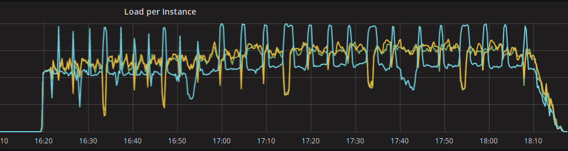
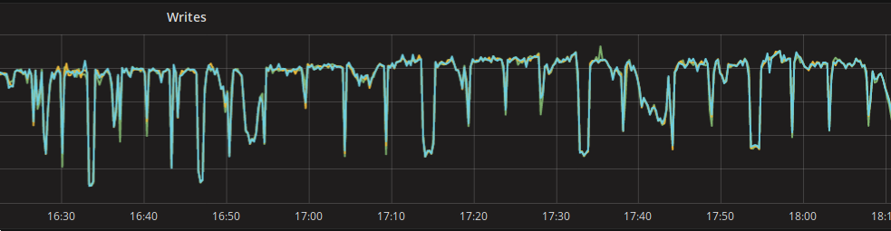
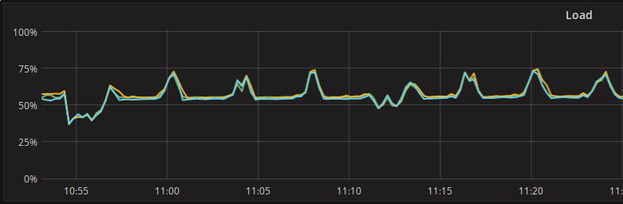
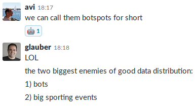

I felt like sharing a recent story that allowed us identify a bot in a haystack thanks to Scylla.

 

# The scenario

While working on loading up 2B+ of rows into Scylla from Hive (using Spark), we noticed a strange behaviour in the performances of one of our nodes:

 

So we started wondering why that server in blue was having those peaks of load and was clearly diverging from the two others... As we obviously **expect the three nodes to behave the same**, there were two options on the table:

1. **hardware problem** on the node
2. **bad data distribution** (bad schema design? consistent hash problem?)

We shared this with our pals from ScyllaDB and started working on finding out what was going on.

# The investigation

## Hardware?

Hardware problem was pretty quickly evicted, nothing showed up on the monitoring and on the kernel logs. I/O queues and throughput were good:

## Data distribution?

Avi Kivity (ScyllaDB's CTO) quickly got the feeling that something was wrong with the data distribution and that we could be facing a **hotspot situation**. He quickly nailed it down to shard 44 thanks to the scylla-grafana-monitoring platform.

Data is distributed between shards that are stored on nodes (consistent hash ring). This distribution is done by hashing the primary key of your data which dictates the shard it belongs to (and thus the node(s) where the shard is stored).

If one of your keys is over represented in your original data set, then the shard it belongs to can be overly populated and the related node overloaded. **This is called a hotspot situation**.

### tracing queries

The first step was to **trace queries in Scylla** to try to get deeper into the hotspot analysis. So we enabled tracing using the following formula to get about 1 trace per second in the **system_traces** namespace.

tracing probability = 1 / expected requests per second throughput

In our case, we were doing between 90K req/s and 150K req/s so we settled for 100K req/s to be safe and enabled tracing on our nodes like this:

\# nodetool settraceprobability 0.00001

Turns out tracing didn't help very much in our case because the traces do not include the query parameters in Scylla 2.1, it is becoming available in the soon to be released 2.2 version.

**NOTE**: traces expire on the tables, make sure your TRUNCATE the **events** and **sessions** tables while iterating. Else you will have to wait for the next gc_grace_period (10 days by default) before they are actually removed. If you do not do that and generate millions of traces like we did, querying the mentioned tables will likely time out because of the "tombstoned" rows even if there is no trace inside any more.

### looking at cfhistograms

Glauber Costa was also helping on the case and got us looking at the **cfhistograms** of the tables we were pushing data to. That proved to be clearly highlighting a hotspot problem:

histograms
Percentile  SSTables     Write Latency      Read Latency    Partition Size        Cell Count
                             (micros)          (micros)           (bytes)                  
50%             0,00              6,00              0,00               258                 2
75%             0,00              6,00              0,00               535                 5
95%             0,00              8,00              0,00              1916                24
98%             0,00             11,72              0,00              3311                50
99%             0,00             28,46              0,00              5722                72
Min             0,00              2,00              0,00               104                 0
Max             0,00          45359,00              0,00          14530764            182785

What this basically means is that 99% percentile of our partitions are small (5KB) while the biggest is 14MB! That's a huge difference and clearly shows that we have a hotspot on a partition somewhere.

So now we know for sure that we have an over represented key in our data set, **but what key is it and why?**

# The culprit

So we looked at the cardinality of our data set keys which are SHA256 hashes and found out that indeed we had one with more than 1M occurrences while the second highest one was around 100K!...

Now that we had the main culprit hash, we turned to our data streaming pipeline to figure out what kind of event was generating the data associated to the given SHA256 hash... and surprise! **It was a client's quality assurance bot that was constantly browsing their own website with legitimate behaviour and identity credentials associated to it**.

So we modified our pipeline to detect this bot and discard its events so that it stops polluting our databases with fake data. Then we cleaned up the million of events worth of mess and traces we stored about the bot.

# The aftermath

Finally, we cleared out the data in Scylla and tried again from scratch. Needless to say that the curves got way better and are exactly **what we should expect from a well balanced cluster**:

**Thanks a lot to the ScyllaDB team** for their thorough help and high spirited support!

I'll quote them conclude this quick blog post:

