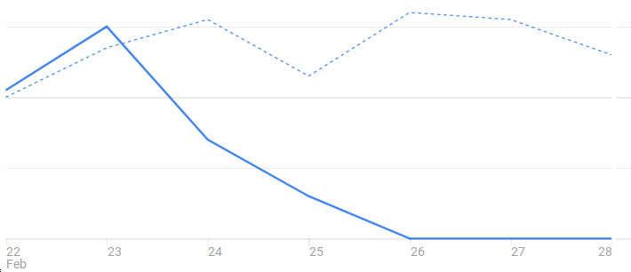
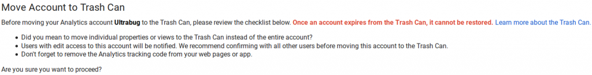

A few days ago, **I removed Google Analytics** from my blog and trashed the associated account.

I've been part of the Marketing Tech and Advertising Tech industries for over 15 years. I design and operate data processing platforms (including web navigation trackers) for a living. So I thought that maybe sharing the reasons of why I took this decision might be of interest for some people. I'll keep it short.

## MY convenience is not a enough reason to send YOUR data to Google

The first and obvious question I asked myself is why did I (and so many people) set up this tracker on my web site?

My initial answer was a mix of:

- **convenience** : it's easy to set up, there's a nice interface, you get a lot of details, you don't have to ask yourself how it's done, it just works
- **insight** : it sounded somewhat important to know who was visiting what content and somehow know about the interest of people visiting

With also a (hopefully not too much) of:

- **pride**: are some blog posts popular? if so which one and let's try to do more like this!

I don't think those are good enough reasons to add a tracker that sends **YOUR** data to Google.

## Convenience kills diversity

I'm old enough to have witnessed the rise of internet and its availability to (almost) everyone. The first things I did when I could connect was create and host my own web site, it was great and looked ugly!

But while Internet could have been a catalyst for diversity, it turned out to create an over concentration on services and tools that we think are hard to live without because of their convenience (and a human tendency for mimicry).

When your choices are reduced and the mass adoption defines your standards, it's easy to let it go and pretend you don't care that much.

I decided to stop pretending that I don't care. I don't want to participate in the concentration of web navigation tracking to Google.

## Open Internet is at risk

When diversity is endangered so is Open Internet. This idea that a rich ecosystem can bring their own value and be free to grow by using the data they generate or collect is threatened by the GAFA who are building walled gardens around **OUR** data.

For instance, Google used the GDPR regulation as an excuse to close down the access to the data collected by their (so convenient) services. If a company (or you) wants to access / query this data (**YOUR** data) then you can only by using **their billed tools**.

What should have been only a clear win for us people turned out to also benefit those super blocks and threaten diversity and Open Internet even more.

Adding Google Analytics to your web site helps Google have a larger reach and tracking footprint on the whole web: imagine all those millions of web sites visits added together, that's where the value is for them. No wonder GA is free.

So in this regard too, I decided to stop contributing to the empowerment of Google.

## This blog is Tracking Free

So from now on if you want to share your thoughts of just let me know you enjoyed a post on this blog, take the lead on **YOUR data** and use the comment box.

**The choice is yours!**
