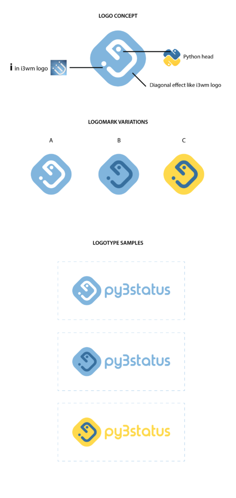

I'm proud and very pleased to introduce the **py3status logo** that **[Tobaloidee](https://github.com/Tobaloidee)** has created for our beloved project!

We've been discussing and dreaming about this for a while in the dedicated [logo issue](https://github.com/ultrabug/py3status/issues/1528). So when Tobaloidee came with his awesome concept and I first saw the logo I was amazed at how he perfectly gave life to the poor brief that I expressed.

### Concept

Thanks again Tobaloidee and of course all of the others who participated (with a special mention to @cyrinux's girlfriend)!

### Variants

We have a few other variants that exist, I'm putting some of them here for quick download & use.

