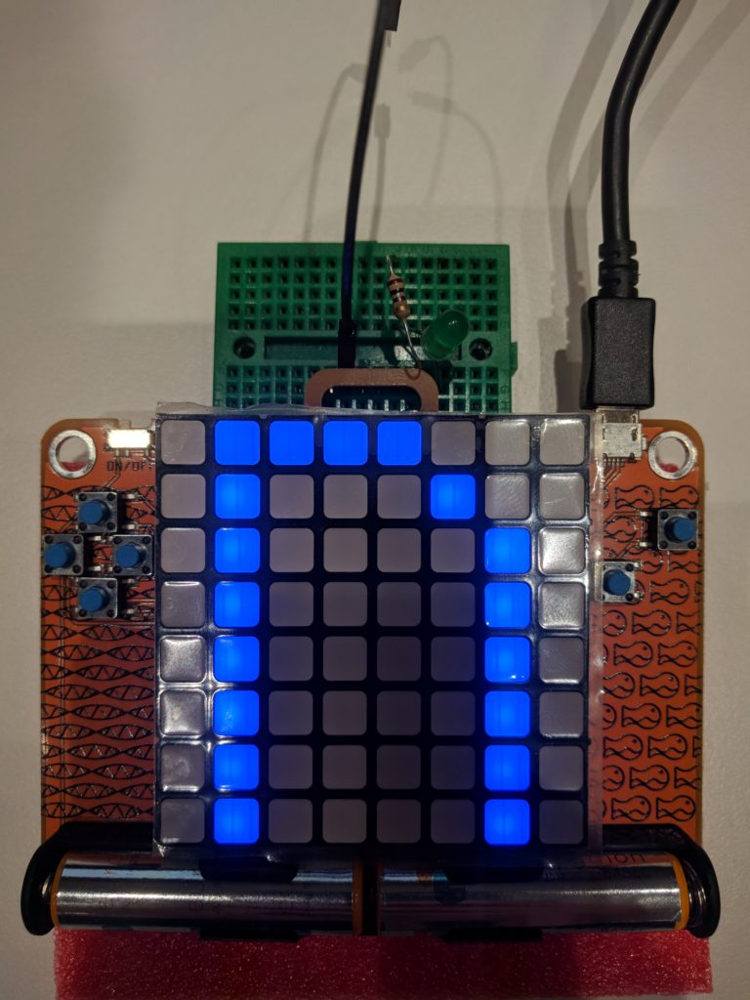

Shame on me to post this so long after it happened... Still, that's a funny story to tell and a lot of thank you to give so let's go!

### The py3status EuroPython 2019 sprint

I've attended all EuroPython conferences since 2013. It's a great event and I encourage everyone to get there!

The last two days of the conference week are meant for Open Source projects collaboration: this is called **sprints**.

I don't know why but this year I decided that I would propose a sprint to welcome anyone willing to work on py3status to come and help...

To be honest I was expecting that nobody would be interested so when I sat down at an empty table on saturday I thought that it would remain empty... but hey, I would have worked on py3status anyway so every option was okay!

Then two students came. They ran Windows and Mac OS and never heard of i3wm or py3status but were curious so I showed them. They could read C so I asked them if they could understand how i3status was reading its horrible configuration file... and they did!

Then Oliver Bestwalter (main maintainer of tox) came and told me he was a long time py3status user... followed by Hubert Bryłkowski and Ólafur Bjarni! Wow..

We joined forces to create a [py3status module](https://github.com/obestwalter/py3status-pewpew) that allows the use of the great PewPew hardware device created by Radomir Dopieralski (which was given to all attendees) to control i3!

And we did it and had a lot of fun!

https://www.youtube.com/watch?v=0Oy2CE2GZ7s

### Oliver's major contribution

The module itself is awesome okay... but thanks to Oliver's experience with tox he proposed and contributed one of the most significant feature py3status has had: **the ability to import modules from other pypi packages**!

The idea is that you have your module or set of modules. Instead of having to contribute them to py3status you could just publish them to pypi and py3status will automatically be able to detect and load them!

The usage of entry points allow custom and more distributed modules creation for our project!

[Read more about this amazing feature on the docs.](https://py3status.readthedocs.io/en/latest/writing_modules.html#publishing-custom-modules-on-pypi)

All of this happened during EuroPython 2019 and I want to extend once again my gratitude to everyone who participated!

### Thank you contributors

Version 3.20 is also the work of cool contributors.  
See the [changelog](https://github.com/ultrabug/py3status/blob/master/CHANGELOG).

- Daniel Peukert
- Kevin Pulo
- Maxim Baz
- Piotr Miller
- Rodrigo Leite
- lasers
- luto
