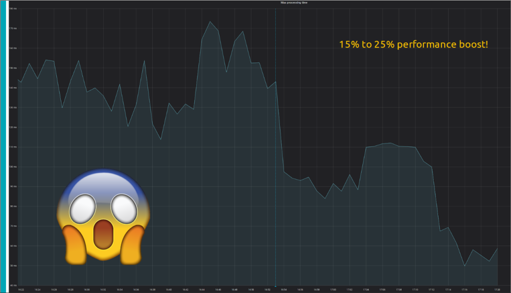

At [Scylla summit 2019](https://www.ultrabug.fr/scylla-summit-2019/) I had the chance to meet **Israel Fruchter** and we dreamed of working on adding **shard-awareness** support to the Python cassandra-driver which would be known as **scylla-driver**.

A few months later, when Israel reached out to me on the Scylla-Users #pythonistas Slack channel with the [first draft PR](https://github.com/scylladb/python-driver/pull/6) I was so excited that I jumped in the wagon to help!

The efforts we put into the scylla-driver paid off and significantly improved the performance of the production applications that I had the chance to switch to using it by 15 to 25%!

Before we reached those numbers and even released the scylla-driver to PyPi, EuroPython 2020 RFP was open and [I submitted a talk proposal which was luckily accepted](https://ep2020.europython.eu/talks/a-deep-dive-and-comparison-of-python-drivers-for-cassandra-and-scylla/) by the community.

So I had the chance to deep-dive into Cassandra vs Scylla architecture differences, explain the rationale behind creating the scylla-driver and give Python code details on how we implemented it and the challenges we faced doing so. Check my talk spage for

I also explained that I wrote an [RFC on the scylla-dev mailing list](https://groups.google.com/g/scylladb-dev/c/SUx0OBlY7iw) which lead the developers of Scylla to implement a new connection-to-shard algorithm that will allow clients connecting to a new listening port to select the actual shard they want a connection to.

This is an expected major optimization from the current mostly random way of connecting to all shards and I'm happy to say that [it's been implemented](https://github.com/scylladb/scylla/commit/1572b9e41cd02e8b676404ba72a549398d281a66) and is ready to be put to use by all the scylla drivers.

I've recently been contacted by PyCon India and other Python related conferences organizers for a talk so I've submitted one to PyCon India where I hope I'll be able to showcase even better numbers thanks to the new algorithm!

After my Europython talk we also had very interesting discussions with Pau Freixes about his work on a [fully asynchronous Python driver that wraps the C++ driver](https://github.com/pfreixes/acsylla) to get the best possible performance. First results are absolutely amazing so if you're interested in this, make sure to give it a try and contribute to the driver!

Stay tuned for more amazing query latencies ;)
