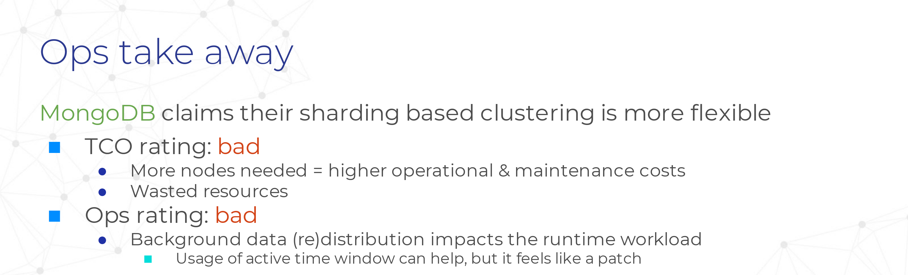
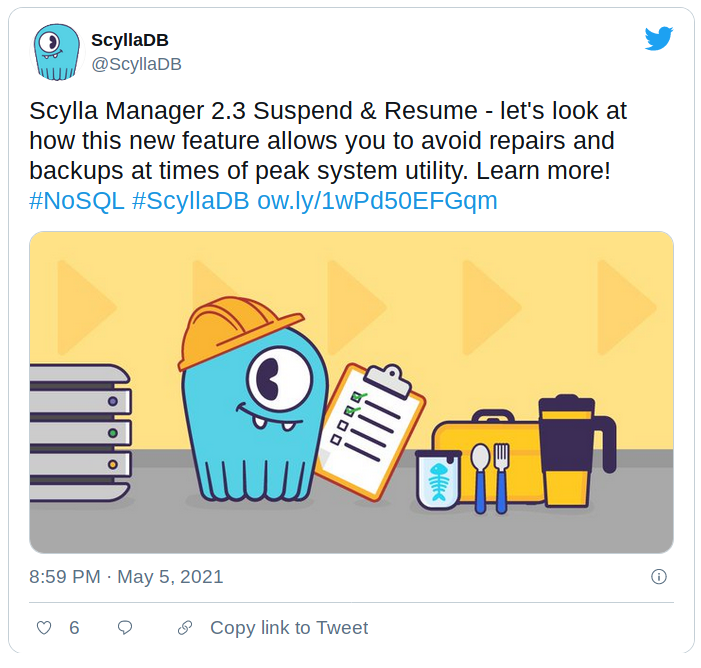

# On Scylla Manager Suspend & Resume feature

!!! warning "Disclaimer"
    This blog post is neither a rant nor intended to undermine the great
    work that Michal and his team are doing on scylla-manager.

    I felt the need to write about it because I took a public stance on this
    topic during Scylla Summit 2019.

## Scylla Manager 2.3 Suspend & Resume

Scylla Manager 2.3 [released a way to suspend maintenance operations] such as
backups and repairs and resume them using `sctool` commands or API calls. This
allows Scylla users to make sure that they can preserve their precious
CPU resources for their needs during high demand hours (usually during the day).

It is interesting to note that the feature is actually not a schedule per se
but rather offers the possibility to manually suspend and resume scheduled
tasks in scylla-manager. You'll have a setup a contrab to use it!

On paper this is great as it comes as a nice addition to the 2.1 and 2.2
releases featuring [repair parallelism and intensity controls]. There surely
are plenty of users out there that were expecting this news so thank you for
this but...

**Will I use it? yes. Am I happy that I have to? no.**

[released a way to suspend maintenance operations]: https://www.scylladb.com/2021/05/05/scylla-manager-2-3-suspend-resume/
[repair parallelism and intensity controls]: https://www.scylladb.com/product/release-notes/scylla-manager-2-2/

## I made fun of MongoDB for doing it

Taking a step back, scylla-manager just implemented what is called a
[balancing window schedule] in MongoDB sharded clusters.

**Back in [Scylla Summit 2019] I said on stage that this kind of feature felt
like a patch** in MongoDB because such kind of database should be smart enough
to cope with the background operations that it generated itself.

Since MongoDB is not built on an architectural design fit for scheduling and
optimizing certain operations per CPU, **the impact of its internal shard
balancer is bad on performance** and the balancing window strategy allows
users to reduce their cluster suffering during the most busy part of the day.

But **Scylla was built on the architectural thread-per-core promise that
its smarter per-core IO scheduler could handle OLTP and OLAP workloads** at
the same time. I was living by it and believed this could be applied to
repairs as well.

[balancing window schedule]: https://docs.mongodb.com/manual/tutorial/manage-sharded-cluster-balancer/#schedule-the-balancing-window
[Scylla Summit 2019]: https://www.scylladb.com/2019/11/18/overheard-at-scylla-summit-2019/

## Now Scylla is doing it

So today I'm unsure how to welcome this news.

On one hand there are valid use cases where you want to make sure that you
get all the performance that you can from your hardware and I'm sure most
users will gladly welcome this because they know it will help their cluster
on a daily basis. (and I am one of them).

On the other hand I can't get rid of the deceptive feeling that Scylla is
still not smart enough to handle the impacts of background maintenance
operations and deliver to be the promised boring database.

For some time I even hoped that [workload prioritization] could be used better
to diminish repair impacts on performance but it's never been released to us
Open Source users anyway so I never had the chance to build a realy opinion on
that (and I like to remind that we are also paying customers at Numberly: we
do not run enterprise because we choose not to).

I also want to acknowledge that a lot of efforts have been and still are
invested in optimizing Scylla maintenance operations: [Asias He is notoriously
smart and prolific on that topic] and this is not an easy task indeed!

[workload prioritization]: https://www.scylladb.com/2019/05/23/workload-prioritization-running-oltp-and-olap-traffic-on-the-same-superhighway/
[Asias He is notoriously smart and prolific on that topic]: https://www.scylladb.com/presentations/how-we-made-scylla-maintenance-easier-safer-and-faster/

## Keep faith on a brighter and boring future

In conclusion **I have the feeling that these are just necessary steps on
a path to greater victories**.

The [new 4.4 IO scheduler] and [project Circe] open up interesting perspectives
thanks to more collaborative CPU queues, switching to tablet based data storage
and **the whole concept of repairs being voided**.

Let's hope these promises will materialize soon (pun intended) so we can
actually ditch scylla-manager suspend & resume crontabs (sorry Michal)!

[new 4.4 IO scheduler]: https://www.scylladb.com/2021/04/06/scyllas-new-io-scheduler/
[project Circe]: https://www.scylladb.com/2021/01/12/making-scylla-a-monstrous-database-introducing-project-circe/

## My scylla-manager wish

I would love to be able to **prevent that a repair and backup task run at the
same time** so that they queue instead of overlapping.

No? what if I say please? :smile:
