# Create beautiful and localized documentations and websites using MkDocs + Github

This is the web version of the talk I gave at [EuroPython 2021](https://ep2021.europython.eu/talks/8FcL3BL-create-beautiful-and-localized-documentations-and-websites-using-mkdocs-github/).


## Introductions

### MkDocs

[MkDocs](https://mkdocs.org) is a **fast, simple** and downright gorgeous **static site generator** that's geared towards building project documentation.

Documentation source files are **written in Markdown**, and configured with a single YAML configuration file.

MkDocs is written in **Python**, its source code is easy to understand and we are open to contributions!

### mkdocs-material

MkDocs sites can be themed, and while it comes with 2 built in themes, their look and feel is a bit dated and their customization is limited.

Here comes [mkdocs-material](https://squidfunk.github.io/mkdocs-material/), a **[Material Design](https://material.io/) theme for MkDocs** that allows you to create a branded static site from a set of Markdown files to host the documentation of your Open Source or commercial project.

The mkdocs-material theme is by far the most popular theme of MkDocs as it is based on applying the Material Design principles to MkDocs generated sites.

It is **customizable, searchable, mobile-friendly and supports 40+ languages**.

### i18n or l10n?!

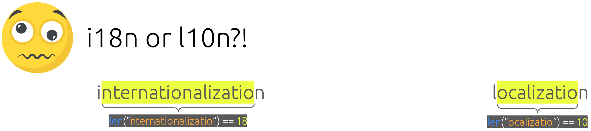

!!! warning
    Defining i18n vs l10n is controversial so this is the rationale we adopted at MkDocs.

A benevolent debate on i18n vs l10n took place on [mkdocs #774](https://github.com/mkdocs/mkdocs/issues/774) where we settled that internationalization (i18n) will refer to the MkDocs core feature used to allow users to localize (l10n) their documentation.

Therefore **MkDocs use the i18n** term to refer to the fact that it supports theme text and dialogs localization (just like Jinja).

### mkdocs-static-i18n

The mkdocs-static-i18n plugin allows you to **support multiple languages of your documentation**
by adding localized versions of your files to your existing documentation pages.

It also allows you to build and serve localized versions of any file extension and automatically display localized images, medias and assets from your Markdown sources.

Check [who's already using mkdocs-static-i18n here](https://github.com/ultrabug/mkdocs-static-i18n/network/dependents?package_id=UGFja2FnZS0xODcyMTI3Nzg3)!

### Github Pages

!!! warning
    GitHub Pages is not intended for or allowed to be used as a free web hosting service to run your online business, e-commerce site, or any other website that is primarily directed at either facilitating commercial transactions or providing commercial software as a service (SaaS).

Websites for you and your projects **hosted directly from your GitHub repository**. Just edit, push, and your changes are live.

**You get one site per GitHub account and organization, and unlimited project sites.**

**Free HTTPS** with support for custom domain names.

Soft limitations:

- 1GB website
- 100GB traffic bandwidth per month
- 10 builds (deploy) per hour

## Creating a multi-language MkDocs site

### What we need

- A fork of [https://github.com/ultrabug/ep2021](https://github.com/ultrabug/ep2021)
- A Python3 virtual environment:

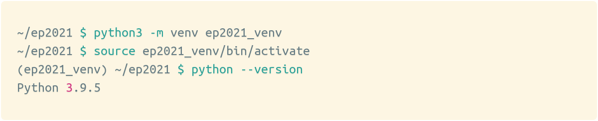

### requirements.txt

Let's see what's inside our `requirements.txt` file and why.

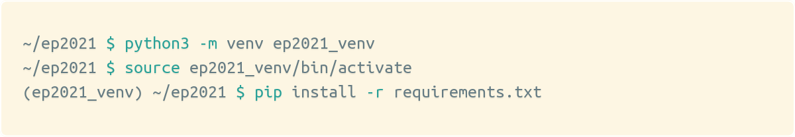

#### mkdocs >= 1.2.2

We do not need `mkdocs[i18n]` which adds support for built-in themes localization since mkdocs-material supports localization on its own.

#### mkdocs-material >= 7.1.11

We want a modern looking, responsive and highly customizable theme with built-in support for a language switcher.

#### mkdocs-static-i18n >= 0.18

Allows to localize our content pages by creating a `.<language>` prefixed version of any file to localize it automatically.

### Localized MkDocs to Github workflow

1. Initialize our project

    ```bash
    mkdocs new .
    ```

2. Build and serve locally, open in browser

    ```bash
    mkdocs serve
    ```

3. Modify content, add assets and localize (translate) our website
4. Local website is auto-refreshed on browser, we preview every modification we make live
5. When done, commit and push changes
6. Deploy to Github Pages

    ```bash
    mkdocs gh-deploy
    ```

7. It's online!

### Initialize our MkDocs project

```bash
mkdocs new .
```

Will create:

- an initial **`mkdocs.yml`** configuration file
- a **`docs/index.md`** documentation home page

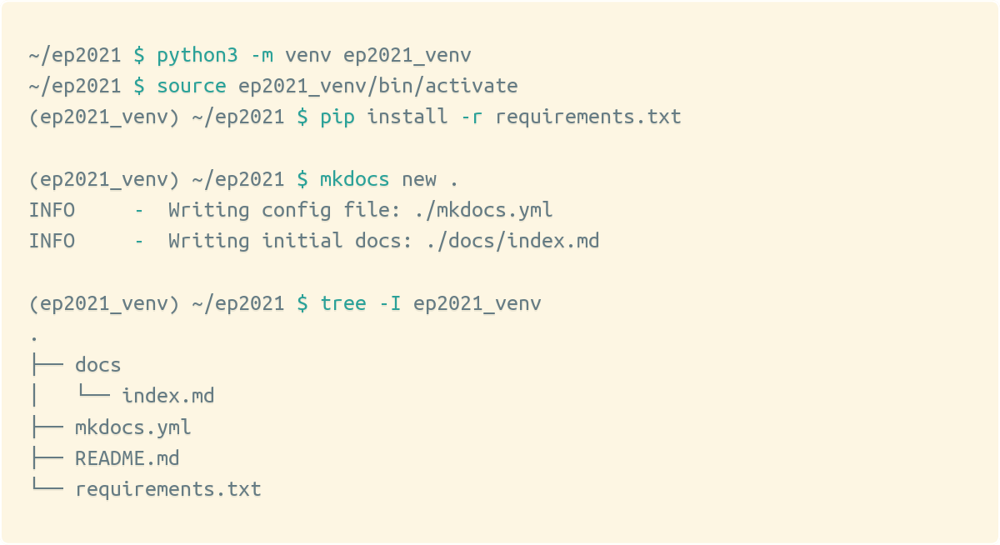

!!! tip
    If you cloned my repository or use your own fork, you can get to this step
    by checking out the `new` branch.
    ```bash
    git checkout new
    ```

### Preview our website locally

```bash
mkdocs serve
```

The above command will **build** our website and **run a local web server** so
we can preview it directly on our browser.

Open this URL on your browser: [http://127.0.0.1:8000/](http://127.0.0.1:8000/)

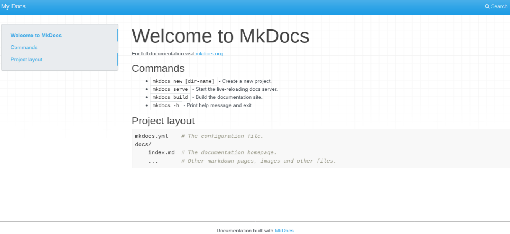

### Changes trigger a refresh

```bash
mkdocs serve
```

**Any change we make** will trigger a rebuild and **refresh our page** in our
browser!

[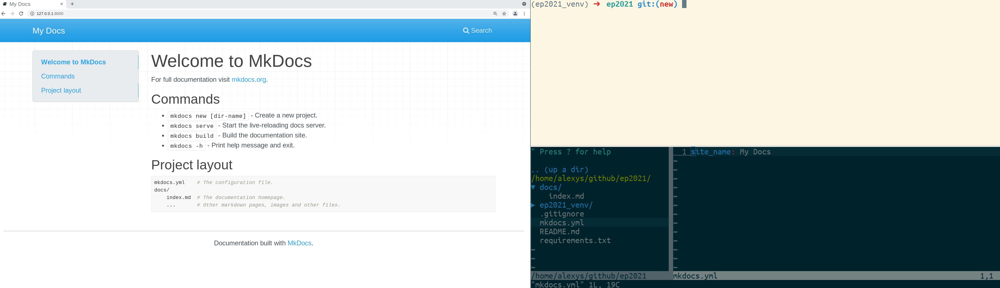](images/record_change.gif)

!!! tip
    If you cloned my repository or use your own fork, you can get to this step
    by checking out the `change` branch.
    ```bash
    git checkout change
    ```

### Switch to mkdocs-material

```yaml
theme:
  name: material
```

Instantaneous switch from the default `mkdocs` theme to the beautiful and
feature rich `material` theme.

[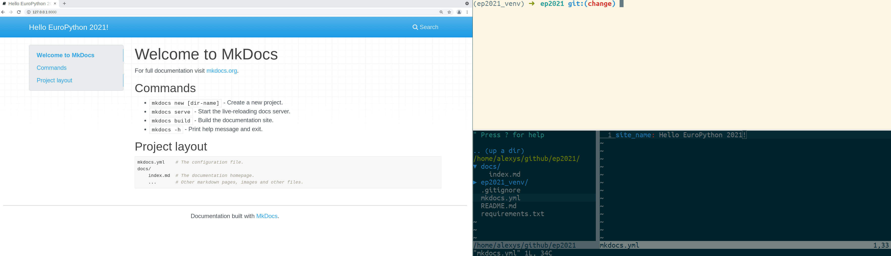](images/record_theme.gif)

!!! tip
    If you cloned my repository or use your own fork, you can get to this step
    by checking out the `material` branch.
    ```bash
    git checkout material
    ```

### Switch to EuroPython colors

```yaml
theme:
  name: material
  palette:
    primary: green
```

The material theme is highly customizable, let's use EuroPython's green color palette.

[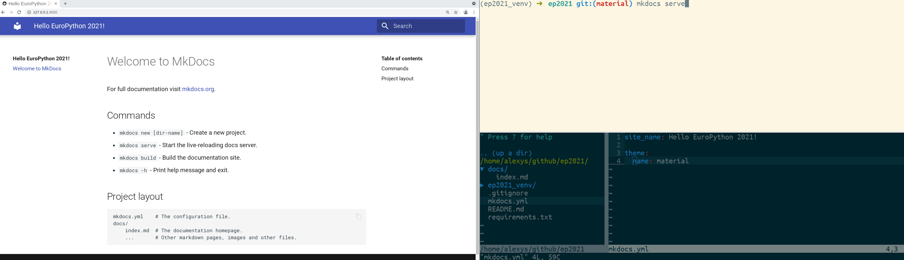](images/record_palette.gif)

!!! tip
    If you cloned my repository or use your own fork, you can get to this step
    by checking out the `palette` branch.
    ```bash
    git checkout palette
    ```

### Add images/assets

The **`docs/`** folder is where we organize our content pages and assets.
Let's modify the home page and add the EuroPython logo.

[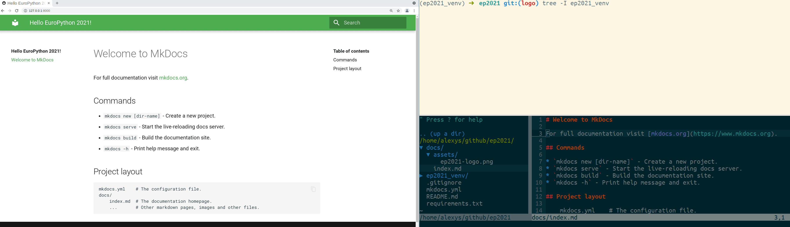](images/record_logo.gif)

!!! tip
    If you cloned my repository or use your own fork, you can get to this step
    by checking out the `logo` branch.
    ```bash
    git checkout logo
    ```

### mkdocs-static-i18n

Will create **`/<language>/`** versions of our website!

```yaml
plugins:
  - search
  - i18n:
      default_language: en
      languages:
        en: English
        fr: Français
```

Will generate those URLs:

1. https://ultrabug.github.io/ep2021/

    ```
    default URL is the English version
    ```

2. https://ultrabug.github.io/ep2021/en/

    ```
    /en/ URL is also the English version, this is the same site as the / URL
    ```

3. https://ultrabug.github.io/ep2021/fr/

    ```
    /fr/ URL is the French version of our site
    ```

The plugin **automatically configures**:

- **search plugin language** and localized content indexation
- **material theme language**
- **material theme language switcher** in the header

### Localizing our content

Let's **translate and localize** our website!

We localize the versions of our pages and assets by
**suffixing them with `.<language>.<extension>``**

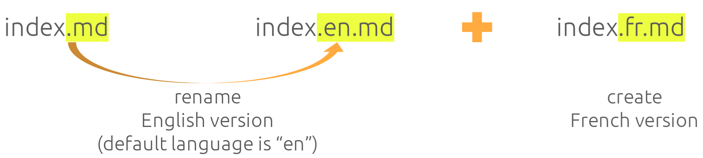

!!! tip
    If you cloned my repository or use your own fork, you can get to this step
    by checking out the `translation` branch.
    ```bash
    git checkout translation
    ```

Let's see the content of the translated files:

#### index.en.md

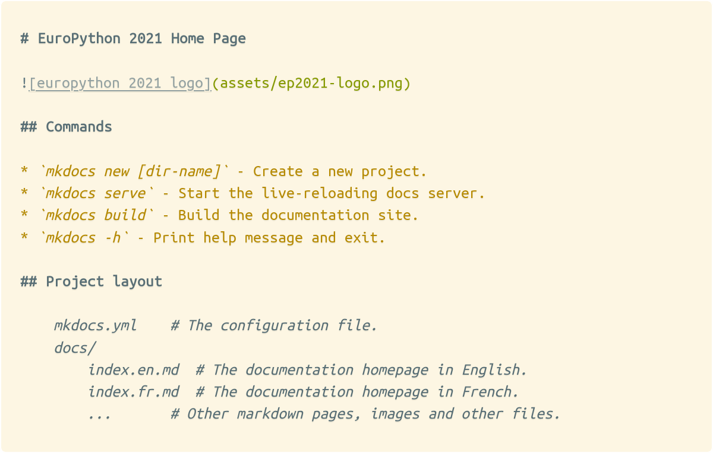

#### index.fr.md

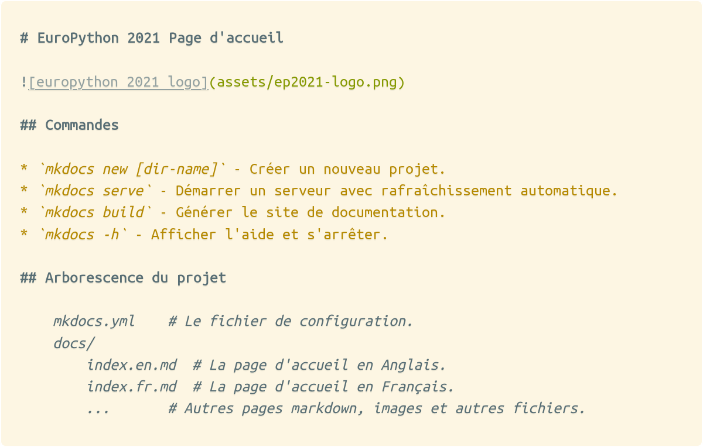

### mkdocs-static-i18n demo

[](images/record_translation_2.gif)

### Automatic Markdown localization

Focus on translating, not referencing localized
versions of your pages and assets!


**Both index.en.md and index.fr.md refer to ``ep2021-logo.png``** in their
Markdown source:

```markdown

```

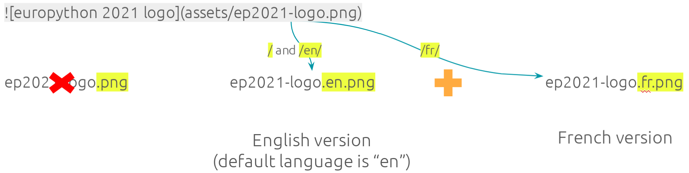

!!! tip
    If you cloned my repository or use your own fork, you can get to this step
    by checking out the `localized` branch.
    ```bash
    git checkout localized
    ```

This means that **the Markdown reference to the image will be localized
automatically** by the plugin!

[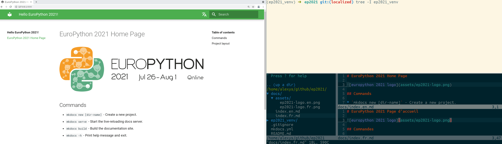](images/record_localized.gif)

### Push our work to Github

```bash
git add
git commit
git push
```

We're done, let's commit and push our content to our Github repository.

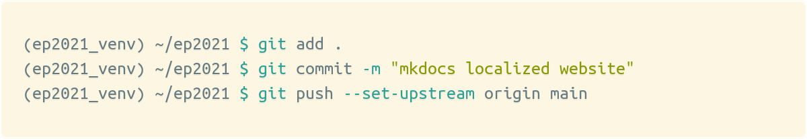

### Build and deploy to Github

```bash
mkdocs gh-deploy
```

The above command will:

1. Build our multi-language website
2. Copy `site/` dir to the `gh-pages` branch
3. Push the `gh-pages` branch to Github

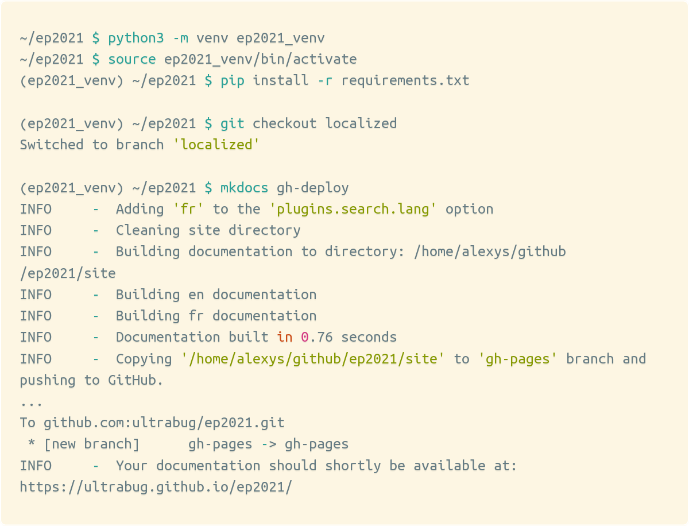

### Github Pages is automatically configured

No configuration needed on your Github repository, it's done automatically.

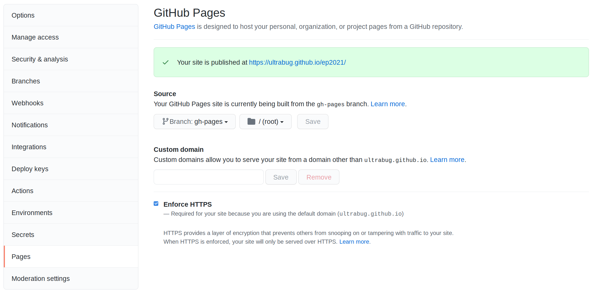

###	Our multi-language MkDocs website is online!

Check out your own URL or the [https://ultrabug.github.io/ep2021/](https://ultrabug.github.io/ep2021/)
website of this repository.

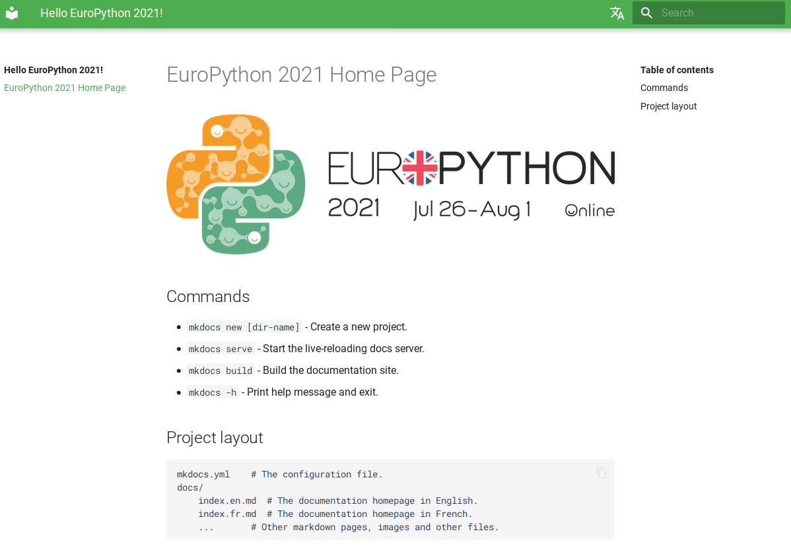

### Automatic mkdocs gh-deploy

Let’s use **Github Actions** to run mkdocs `gh-deploy` for us **automatically when we push** new commits!

Create the file `.github/workflows/gh-deploy.yml`:

```yaml
name: gh-deploy

on:
  push:
    branches:
      - main

jobs:
  build:
    name: MkDocs Github Pages automatic deployment
    runs-on: ubuntu-latest
    steps:
      - name: Checkout main
        uses: actions/checkout@v2

      - name: Set up Python 3.9
        uses: actions/setup-python@v2
        with:
          python-version: '3.9'

      - name: Install requirements
        run: |
          python -m pip install --upgrade pip
          pip install -r requirements.txt

      - name: MkDocs gh-deploy
        run: |
          git pull
          mkdocs gh-deploy
```

Now every time we push new commits to the `main` branch, our website will be automatically deployed and refreshed on Github Pages!

!!! tip
    If you cloned my repository or use your own fork, you can get to this step
    by checking out the `actions` branch.
    ```bash
    git checkout actions
    ```

## Resources

### Some useful and awesome MkDocs plugins

- [MkDocs Wiki's Plugins list (community based)](https://github.com/mkdocs/mkdocs/wiki/MkDocs-Plugins)
- [Plugin to handle URL redirections](https://github.com/datarobot/mkdocs-redirects)
- [Plugin to handle navigation pages ordering in a very flexible way](https://github.com/lukasgeiter/mkdocs-awesome-pages-plugin)
- [Plugin to hook your own functions without having to create a MkDocs plugin](https://github.com/aklajnert/mkdocs-simple-hooks)

## Some useful and awesome Markdown extensions

Check out the sample `mkdocs.yml` available on the `extensions` branch!

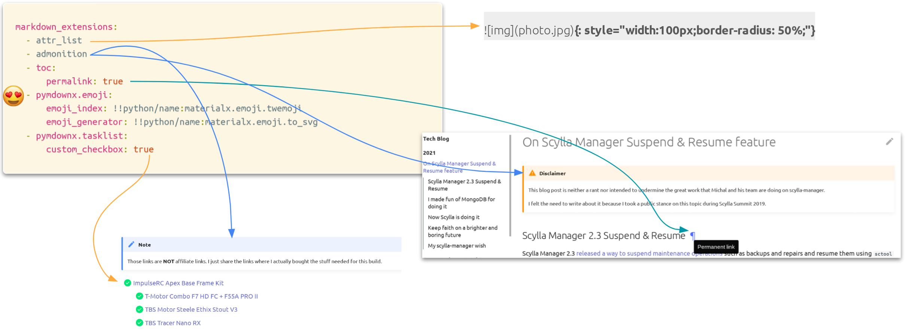

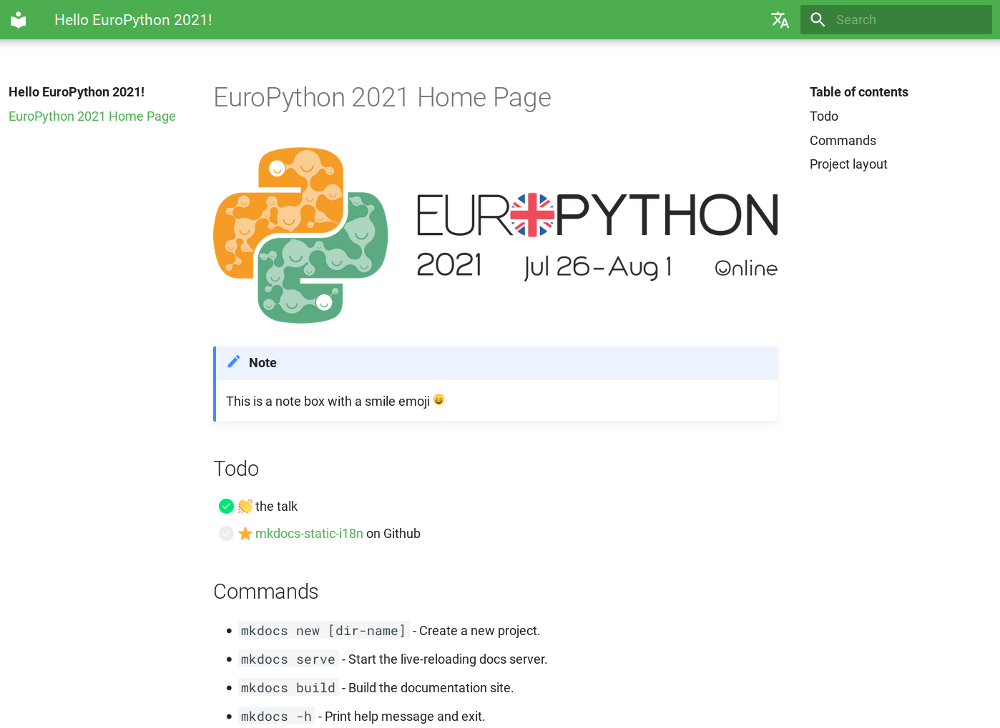

## :heart: Special thanks

- **mkdocs**: `@waylan` `@oprypin`
- **mkdocs-material**: `@squidfunk`
- **mkdocs-static-i18n**: `@Caetan95` `@Stanzilla` `@adamkusmirek`
- **pymdown-extensions**: `@facelessuser`
