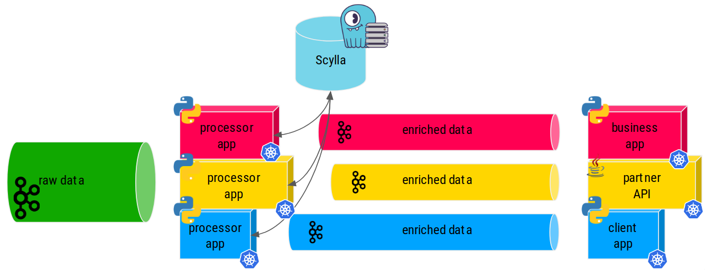
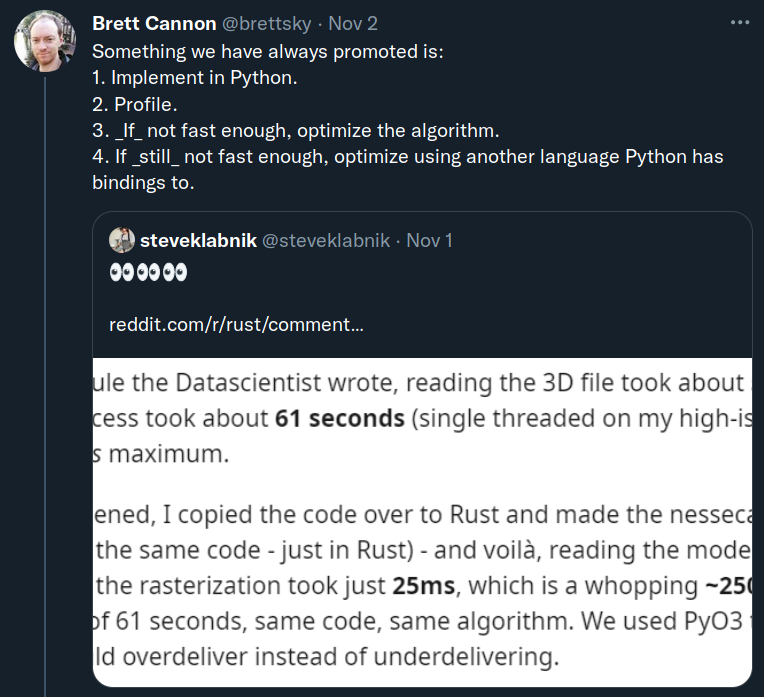
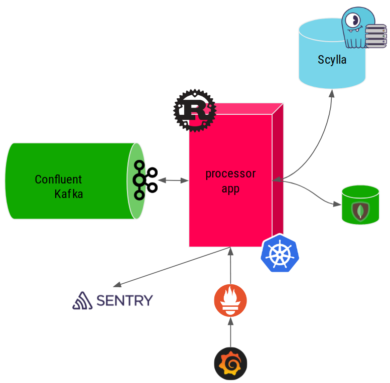
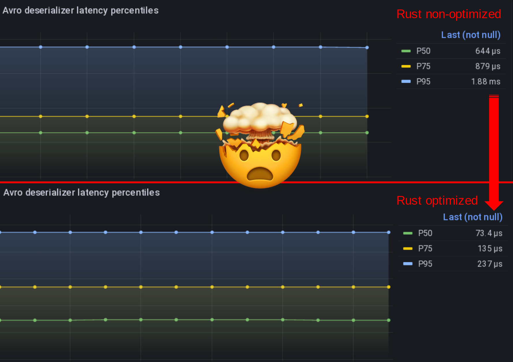
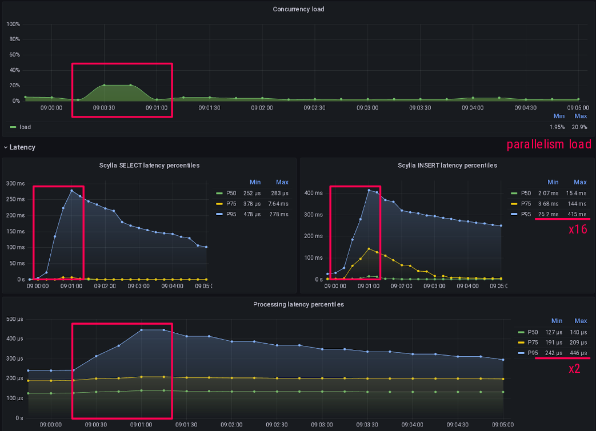

# Learning Rust the hard way for a production Kafka+ScyllaDB pipeline

This is the web version of the talk I gave at [Scylla Summit 2022](https://www.scylladb.com/presentations/learning-rust-the-hard-way-for-a-production-kafka-scylladb-pipeline/).


## Project context at Numberly

You may remember that Numberly is a digital data marketing expert helping brands connect with their customers using all digital channels available.

As a data company, we operate on a lot of data that is fast moving. This **event driven** approach drives our technological choices towards platforms that allow us to process and react to stimulus as close to real time as possible.

As such **we combine Kafka and Scylla superpowers extensively** thanks to streams and specialized pipeline applications that we'll call data processors here.



Each of those pipeline data processor applications prepares and enriches the incoming data so that it is useful to the downstream business / partner or client applications.

Relevance of a data driven decision is at its best when it's close to the event's time of occurrence which means that **availability and latency are business critical to us**.

Latency and resilience are the pillars upon which we have to build our platforms to **make our business reliable in the face of our clients and partners**.

Those data processor apps, kafka, and of course Scylla can't fail, if they do we get angry partners and clients... And nobody wants to deal with an angry client!

## The (rusted) opportunity

The data industry and ecosystems are always changing. Last fall, we had to adapt three of the most demanding data processors written in Python.

Those processor applications were doing the job for more than 5 years, **they were battle tested and trustworthy**.

But I was following Rust maturation for a while, I was curious and it always felt less intimidating than C or C++ to me. So when this opportunity came, I went to my colleagues and told them:

!!! question
    **Hey why not rewrite those 3 python applications that we know work very well with one rust application which we don't even know the language?**

Ok, I must admit that I lost my CTO badge for a few seconds when I saw their faces...

## The (never tried before) Rust promises

Rust makes promises that some people seem to agree with, it's intriguing!

It is supposed to...

- Be secure
    - **Memory and thread safety as first class citizens**
    - **No runtime or garbage collector**
- Be easy to deploy
    - Compiled binaries are self-sufficient
- Make no compromises
    - Strongly and statically typed
    - **Exhaustivity is mandatory**
    - **Built-in error management syntax and primitives**
- Play well with Python
    - PyO3 can be used to run Rust from Python (or the contrary)

But furthermore, their marketing motto speaks to the marketer inside me:

!!! quote
    A language empowering **everyone** to build **reliable** and **efficient** software.

That being said, careful readers will notice that I did not mention *speed* in the Rust promises.

Isn't Rust supposed to be OMG fast? No, they talk about efficiency and it's not the same!

## Efficient software != Faster software

Efficient software does not always mean faster software.

Brett Cannon, a Python core developer, advocates that [selecting a programming language for being faster on paper is a form or premature optimization](https://snarky.ca/programming-language-selection-is-a-form-of-premature-optimization/).

{width=500}

I agree with him in the sense that the word *Fast* have different meanings depending on your objectives.

**To me, Rust can be said to be faster as a consequence of being Efficient**, which does not cover all the items on the list here.

Let's apply them to my context:

- Fast to develop?
    - **No. Python is way faster, did that for 15 years**
- Fast to maintain?
    - **No. Nobody at Numberly does Rust yet**
- Fast to prototype?
    - **No. Code must be complete to compile and run**
- Fast to process data?
    - **Sure. To prove it, measure it first**
- Fast to cover all failure cases?
    - **Definitely. Mandatory exhaustivity + error handling primitives**

As we can see in my case, **choosing Rust over Python will mean that I will definitely lose time**!

!!! check "Quote"
    **I did not choose Rust to be “faster”**. Our Python code was fast enough to deliver their pipeline processing.

So why would I want to lose time? The short answer is **Innovation**!


## The reliable software paradigms

Now what will I gain from losing time other than the pain of using semicolons and brackets?

Supposedly a more reliable software thanks to Rust unique design and paradigms.

In other words, **what makes me slow is also an opportunity to make my software stronger**!

- Low level paradigms (ownership, borrowing, lifetimes)
    - **If it compiles, it's safe**
- Strong type safety
    - **Predictable, readable, maintainable**
- Compilation (debug, release)
    - **Rust compiler is very helpful vs a random Python exception**
- Dependency management
    - **Finally something looking sane vs Python mess**
- Exhaustive pattern matching
    - **Confidence that you're not forgetting something**
- Error management primitives (Result)
    - **Handle failure right from the language syntax**

!!! check "Quote"
    I chose Rust because it provided me with the **programming paradigms at the right abstraction level** that I needed to finally understand and better **explain the reliability and performance** of an application.

## Learning Rust the hard way

Here is an overview of all the aspects and all the technological stacks that I had to deal with. I'll detail the most insightful parts below.

{width=500}

### Confluent Kafka Schema Registry

We use Confluent Kafka Community edition with a **Schema Registry to handle our Avro encoded messages**.

Confluent Schema Registry adds a magic byte to kafka message payloads, breaking vanilla Apache Avro schema deserialization.

Luckily for me, [Gerard Klij had done the heavy lifting in his crate](https://github.com/gklijs/schema_registry_converter) which helped me a lot before I discovered performance problems. We are working on [improving that](https://github.com/gklijs/schema_registry_converter/discussions/71) and I hope to switch back to his helpful project once we're done.

Until then I decided to use the manual approach shown here and **decode Avro messages myself with respect of their schema**:

```rust
/// Deserialize the given kafka raw `message` using the provided
/// Avro `schema` and return a Navigation struct message to be
/// used by the processors.
pub fn get_decoded_message(schema: &Schema, message: &BorrowedMessage) -> Result<Navigation> {
    /*
    DO NOT pass the reader schema as last argument to from_avro_datum
    this implies a resolve() on each value and impacts performances badly
    > Ok(from_avro_datum(&schema, &mut reader, Some(&schema)).unwrap()) // decode + resolve
    */
    let mut reader = Cursor::new(&message.payload().unwrap()[5..]);
    let val = match from_avro_datum(&schema, &mut reader, None) {
        Ok(inner) => inner,
        Err(err) => {
            return Err(anyhow!(err));
        }
    };
    let navigation: Navigation = match &val {
        Value::Record(_) => from_value::<Navigation>(&val).unwrap(),
        _ => {
            return Err(anyhow!("could not map avro data to struct"));
        }
    };
    Ok(navigation)
}
```

### Apache Avro Rust was broken

Then I hit the second wall when even if my reading of the Avro payload was done right **I could not deserialize them**...

As a total Rustian newbie, I blamed myself for days before even daring to open Apache Avro source code and look at it. **I eventually found out that Apache Avro was broken for complex schemas like us**!

It made me wonder if anyone in the whole world was actually using Avro with Rust in production...even more knowing that the project had been given to the Apache foundation without a committer able to merge PRs at the time.

**So here I am contributing fixes to Apache Avro Rust** which eventually got merged three months later in Jan. 2022: [AVRO-3232](https://github.com/apache/avro/pull/1368) and [AVRO-3240](https://github.com/apache/avro/pull/1379).

Anyway, another unexpected fact that Rust allowed me to prove is that **deserializing Avro is faster than deserializing JSON** in our case of rich and complex data structures. My colleague Othmane was sure of it, I could finally prove it!

Once Avro was fixed, I could start experimenting with the `--release` flag and run my code **optimized** which I was not expecting such a speed boost from!

{width=500}

### Asynchronous patterns to optimize latency

Once I was able to consume messages from Kafka, I started looking at the best pattern to process them.

I found the [tokio asynchronous runtime](https://tokio.rs) very intuitive coming from Python asyncio.

I played a lot with **various code patterns to optimize and make consuming messages from Kafka latency stable and reliable**.

One of the interesting findings was to not defer the decoding of Avro messages to a green-thread but do it right in the consumer loop. Deserialization is a **CPU bound operation which will benefit from not being cooperative** with other green-thread tasks!

Similar, allowing and controlling your parallelism will help stabilize your I/O bound operations, let's see a real example of that:



**Deferring the rest of my processing logic which is I/O bound to green-threads helped absorb tail latencies without affecting my kafka consuming speed**.

The Grafana dashboard above shows that around 9:00 something made Scylla slower than usual, **scylla select and insert P95 latencies went up by 16**.

That's where parallelism load (the little bump on the first graph) also started to increase as I had more active green-threads processing messages.

**But it only hit my kafka consuming latency by a factor of 2 at P95**, effectively absorbing tail latencies due to this ephemeral overload!

This is the typical example of something that was harder to pinpoint and demonstrate in Python but became clear with Rust.

### Scylla Rust (shard-aware) driver

I found the [Scylla Rust driver](https://github.com/scylladb/scylla-rust-driver) to be intuitive and well featured, congratulations to the team which is also very helpful on their dedicated channel on the Scylla Slack service, join us there!

The new `CachingSession` is very handy to cache your prepared statements so you don't have to do it yourself like I did at first...

!!! warning
    Prepared queries are NOT paged by default, use [paged queries](https://cvybhu.github.io/scyllabook/queries/paged.html) with `execute_iter()` instead!

I'm showcasing a code example of a production connection function to scylla, using SSL, multi-datacenter awareness and a caching session:

```rust
/// Connect to Scylla and return a `CachingSession` that will
/// be used by the processors.
pub async fn get_scylla_session(
    scylla_nodes: Vec<&str>,
    scylla_user: &str,
    scylla_password: &str,
    ssl_ca_path: &str,
) -> Result<CachingSession> {
    let mut context_builder = SslContextBuilder::new(SslMethod::tls())?;
    let ca_dir = fs::canonicalize(PathBuf::from(ssl_ca_path))?;
    context_builder.set_ca_file(ca_dir.as_path())?;
    context_builder.set_verify(SslVerifyMode::PEER);
    // load balancing policy
    let local_dc = &*DATACENTER;
    let dc_robin = Box::new(DcAwareRoundRobinPolicy::new(local_dc.to_string()));
    let policy = Arc::new(TokenAwarePolicy::new(dc_robin));
    // the size of the prepared statement cache has no impact on the underlying
    // DashMap memory consumption as it is only used by the CachingSession
    // struct logic itself.
    info!(
        "scylla connecting to {:?} as user {} on datacenter {}",
        &scylla_nodes, scylla_user, local_dc
    );
    let caching_session = CachingSession::from(
        SessionBuilder::new()
            .known_nodes(&scylla_nodes)
            .connection_timeout(Duration::from_secs(15))
            .ssl_context(Some(context_builder.build()))
            .user(scylla_user, scylla_password)
            .load_balancing(policy)
            .build()
            .await?,
        1000,
    );
    Ok(caching_session)
}
```

### Exporting metrics properly for Prometheus

Now to Prometheus which even if it comes late on this presentation is actually **one of the first things I did setup on my application**.

For all the experiments I did, I measured their latency and throughput impacts thanks to Prometheus.

**For a test to be meaningful, those measurements must be made right and then graphed right**. Scylla people know this by heart but it's usually harder for mortals like the rest of us...

So here is an example of how I measure scylla query insertion latency.

The first and important gotcha is to setup your histogram bucket correctly with your expected graphing finesse:

```rust
pub static ref SCYLLA_INSERT_QUERIES_LATENCY_HIST_SEC: Histogram = register_histogram!(
    "scylla_insert_queries_latency_seconds",
    "Scylla INSERT query latency histogram in seconds",
    vec![0.0005, 0.001, 0.0025, 0.005, 0.01, 0.025, 0.05, 0.1, 0.25, 0.5, 1.0, 5.0, 15.0],
)
.expect("failed to create prometheus metric");
```

Here I expect scylla latency to vary between 50µs and 15s which is the maximal server timeout I'm allowing for writes.

Then I use it like this: I start a timer on the histogram and record its duration on success with `timer.observe_duration();` and drop it on failure with `drop(timer);` so that my metrics are not polluted by possible errors.

```rust
let timer = SCYLLA_INSERT_QUERIES_LATENCY_HIST_SEC.start_timer();
match scylla_session
    .execute(scylla_statement, &scylla_parameters)
    .await
{
    Ok(_) => {
        timer.observe_duration();
        Ok(())
    }
    Err(err) => {
        drop(timer);
        PROCESSING_ERRORS_TOTAL
            .with_label_values(&["scylla_insert"])
            .inc();
        error!("insert_in_scylla: {:?}", err);
        Err(anyhow!(err))
    }
}
```

### Grafana dashboarding

**One of my best time investment in this project was to create a detailed and meaningful Grafana dashboard** so I could see and compare the results of my Rust application experimentations.

{width=500}

Make sure you graph as much things as possible!

- cache sizes (statements)
- query and throughput rates and occurrence of everything, **discerning the difference between the two**
- make errors metrics meaningful by using labels (by type)
- kubernetes pod memory

Also read the [great article that the folks at Grafana wrote on how to visualize prometheus histograms right in Grafana](https://grafana.com/blog/2020/06/23/how-to-visualize-prometheus-histograms-in-grafana/), it's not as obvious as one might think!

## Did I really lose time because of Rust

The real question is: do I have the feeling to have lost time at all? **Short answer: hell no!**

The syntax was surprisingly simple and intuitive to adopt even coming from Python.

In the end I have to confess that **Rust made me want to test and analyze everything at a lower level and I absolutely failed to resist the temptation**!

So most of my time was spent on testing, graphing, analyzing and trying to come up with a decent and insightful explanation: **this surely does not look like wasted time to me!**

For the number hungry of you in the audience, here are some numbers taken from the application:

- Kafka consumer max throughput with processing? 200K msg/s on 20 partitions
- Avro deserialization P50 latency? 75µs
- Scylla SELECT P50 latency on 1.5B+ rows tables? 250µs
- Scylla INSERT P50 latency on 1.5B+ rows tables? 2ms

## Conclusion: it went better than expected

It went way better than expected!

- Rust crates ecosystem is mature, similar to Python Package Index
- The scylla-rust-driver is stable and efficient!
- It took me a while to accept that Apache Avro was broken, not me...
- **3 Python apps totalling 54 pods replaced by 1 Rust app totalling 20 pods**
- **This feels like the most reliable and efficient software I ever wrote!**

Even if it was my first Rust application, I felt confident during the development process which transformed into confidence in a predictable and resilient software.

After weeks of production, the new Rust pipeline processor proves to be very stable and resilient.

**So now I can fairly say that yes, Rust promises are living up to expectations!**
