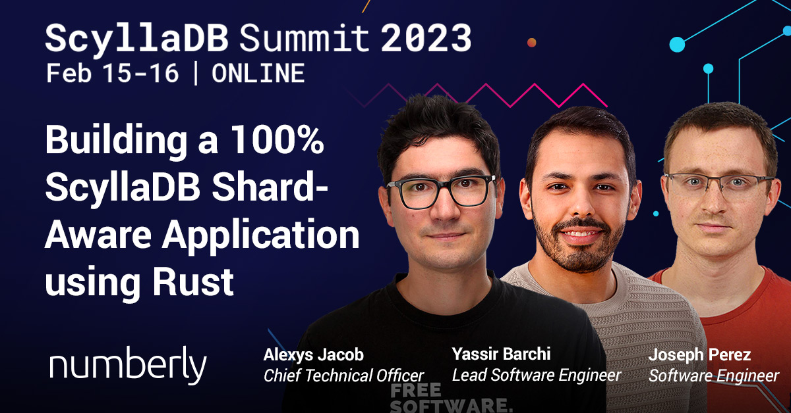

# Building a 100% ScyllaDB Shard-Aware Application Using Rust

I wrote web transcript of the talk I gave with my colleagues at [Scylla Summit 2023](https://www.scylladb.com/presentations/building-a-100-scylladb-shard-aware-application-using-rust/).

You can find it here on the **numberly.tech blog**: [Building a 100% ScyllaDB Shard-Aware Application Using Rust](https://numberly.tech/building-a-100-scylladb-shard-aware-application-using-rust-1aff048e0926).