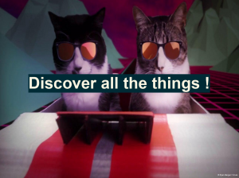

# EuroPython 2016

## Using Service Discovery to build dynamic python applications

- [Download the slides](https://ep2017.europython.eu/media/conference/slides/service-discovery-for-dynamic-python-applications.pdf)
- [Watch the video](https://www.youtube.com/watch?v=S7bsPbJvBzU)

This talk will showcase and compare three **Service Discovery**
technologies and their usage to build a dynamic and distributed
python application:

- consul
- etcd
- zookeeper

After a short introduction to service discovery, we will **iterate and**
**compare** how we can address the concrete and somewhat complex design
of our python application using each technology.

We'll then be able to discuss their strengths, weaknesses and python
bindings and finally showcase the application in a demo.

All the source code will of course be made available for the audience
to benefit and start from for their own use !

## Planning for the worst (interactive talk, with Guillaume Gelin)

- [Download the slides](https://ep2016.europython.eu/media/conference/slides/planning-for-the-worst.pdf)
- [Watch the video](https://www.youtube.com/watch?v=Q8JRs_hPuZA)

This talk is about sharing our experience about how we handled
production problems on all levels of our applications.

We'll begin with common problems, errors and failures and dig on to
more obscure ones while sharing concrete tips, good practices and code
to address them !

This talk will make you feel the warmth of not being alone facing a problem :)
