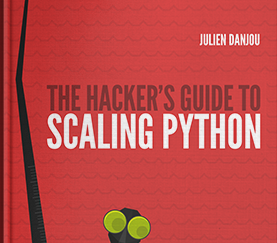

# Scaling Python interview (book)

I've had the pleasure to be interviewed by Julien Danjou for his latest [book called "scaling python"](https://julien.danjou.info/blog/2017/scaling-python-released).

I answered the following questions:

- Could you introduce yourself and explain how you came to Python?
- What do you think make Python great (or not) when building distributed systems? What are the things you consider being advantages or drawbacks?
- What would be your the top N mistakes to avoid or advice/best practice
    to follow when building scalable, distributed systems using Python?

