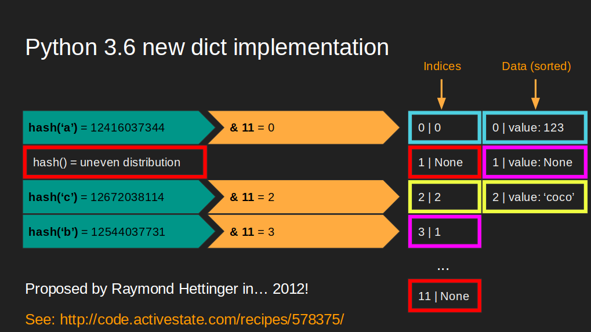

# PyConFR 2018

I had the chance to give three talks there, one of them brand new about my experience in evaluating then getting ScyllaDB in production.

## My journey into joining billions of rows in seconds using ScyllaDB

- [Download the slides](https://ultrabug.fr/talks_slides/PYCON-FR 18_ Joining billions of rows in seconds using Scylla.pdf)
- [Watch the video](https://www.youtube.com/watch?v=DUDaXiuwkkM)

## The rise of Python in the Data communities

- [Download the slides](https://ultrabug.fr/talks_slides/PYCON-FR 18_ The rise of Python in the data communities.pdf)
- [Watch the video](https://www.youtube.com/watch?v=6rCFwjV0J-4&list=PL8uoeex94UhFrNUV2m5MigREebUms39U5&index=71)

## Leveraging consistent hashing in your python applications

I updated it from my 2017 talk with a digression on Python 3.6 new dict implementation.

- [Download the slides](https://ultrabug.fr/talks_slides/PYCON-FR 18_ Consistent Hashing.pdf)
- [Watch the video](https://www.youtube.com/watch?v=Nsq2kQi1O_I)

