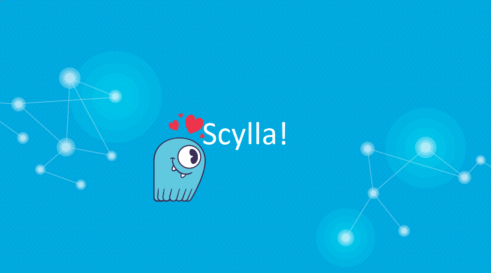

# Scylla Summit 2018

## Scylla User Award: Contribution to Scylla Open Source

I'm proud to have been chosen for the **Contribution to Scylla Open Source** award during the summit.

I've been contributing to Scylla through my Gentoo Linux packaging as well as to the Python code base, writing quite a bunch of blog posts and helping around in the general Slack channel.

## Replacing MongoDB and Hive with Scylla

- [See the slides](https://www.slideshare.net/ScyllaDB/scylla-summit-2018-joining-billions-of-rows-in-seconds-with-one-database-instead-of-two-replacing-mongodb-and-hive-with-scylla)
- [Watch the video](https://www.youtube.com/watch?v=Zpg2vjeVONU)
