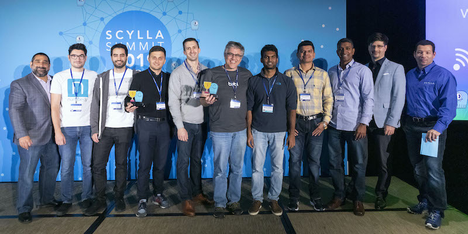

# Scylla Summit 2019

## Scylla User Award : Most innovative use of Scylla

!!! quote
    AdTech pioneer [Numberly](https://numberly.com/) has combined Scylla with Kafka Connect, Kafka Streams, Apache Spark and Python Faust, built on Gentoo Linux and deployed on bare-metal across multiple datacenters, all managed with Kubernetes. All of that resulted in reengineering a calculation process that used to take 72 hours but can now be delivered in just 10 seconds.

## MongoDB vs Scylla: Production Experience from Both Dev & Ops Standpoint

- [See the slides](https://www.slideshare.net/ScyllaDB/mongodb-vs-scylla-production-experience-from-both-dev-ops-standpoint-at-numberly)
- [Watch the video](https://www.youtube.com/watch?v=ch1vRQBiXtI)
