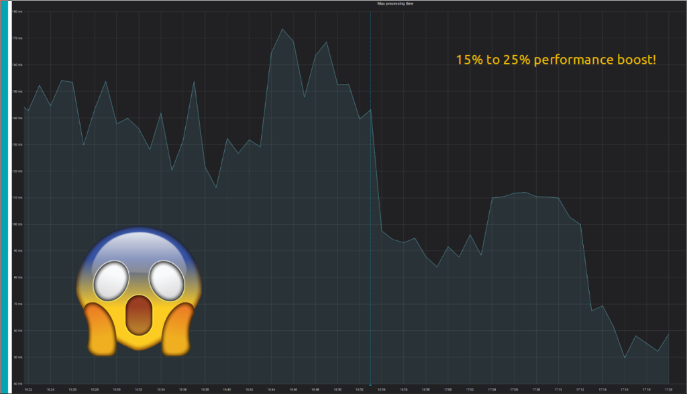

# EuroPython 2020

## A deep dive and comparison of Python drivers for Cassandra and Scylla

Learn about Cassandra & Scylla architectural differences and how we modified the cassandra Python driver to create the scylla-driver that is capable of routing CQL queries down to nodes CPUs!

- [See the slides](https://ep2020.europython.eu/media/conference/slides/a-deep-dive-and-comparison-of-python-drivers-for-cassandra-and-scylla.pdf)
- [Watch the video](https://www.youtube.com/watch?v=vWgTF5xnx8M&list=PL8uoeex94UhHgMD9GOCbEHWku7pEPx9fW&index=26&t=0s)
