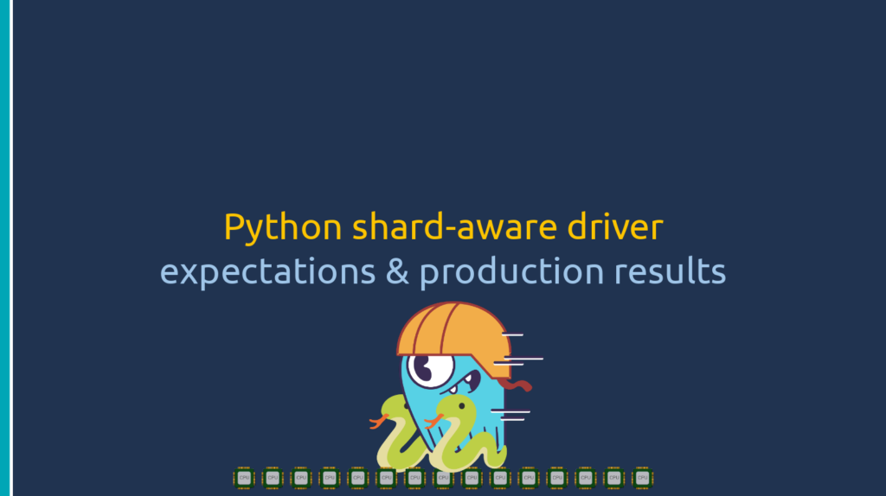

# PyCon India 2020

## A deep dive and comparison of Python drivers for Cassandra and Scylla

I gave an updated talk from the EuroPython 2020 one sharing the recent developments of the Scylla Python driver.

- [See the slides](https://drive.google.com/file/d/1Y1eSBgskMA3A-kfxP8-P0TZxlbLkjVyf/view?usp=sharing)
- Watch the video
