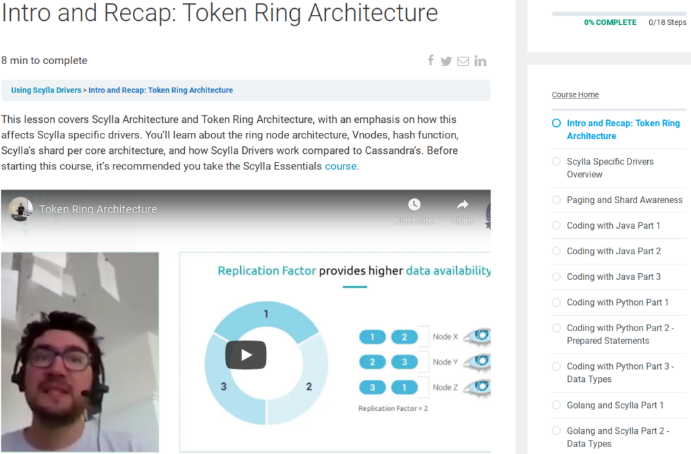

# Scylla University

My presentation of the [Scylla Token Ring Architecture](https://university.scylladb.com/courses/using-scylla-drivers/lessons/intro-and-recap-token-ring-architecture/) and introduction to the [Scylla specific drivers](https://university.scylladb.com/courses/using-scylla-drivers/lessons/scylla-specific-drivers-overview/) are now a part of the [**Scylla University**](https://university.scylladb.com/) courses!

ScyllaDB has also used my 2020 talks material to write two blog posts about how we wrote the Scylla Python driver.

- [Making a Shard-Aware Python Driver for Scylla, Part 1](https://www.scylladb.com/2020/10/13/making-a-shard-aware-python-driver-for-scylla-part-1/)
- [Making a Shard-Aware Python Driver for Scylla, Part 2](https://www.scylladb.com/2020/10/15/making-a-shard-aware-python-driver-for-scylla-part-2/)
