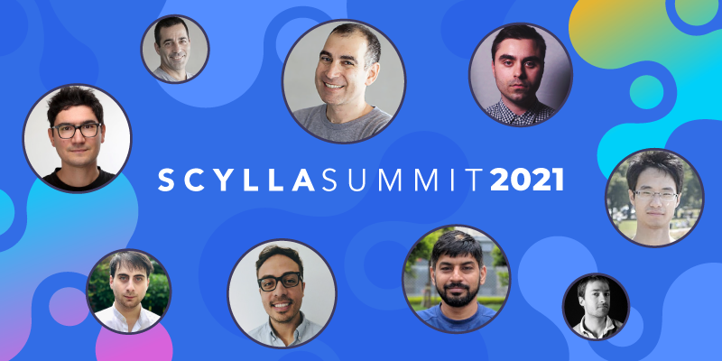

# Scylla Summit 2021

## Scylla User Award : Community Member of the Year

I'm very proud to [have been awared by the Scylla community](https://www.scylladb.com/2021/01/20/heres-to-the-2021-scylla-user-award-winners/) for the third time!

!!! quote
    Scylla Community Member of the Year: Alexys Jacob, Numberly

    Alexys Jacob, CTO of Numberly, is a familiar name for those who track the Scylla User Awards. This year he is recognized for partnering with our engineers for the development of a shard-aware driver written in Python. This new driver provides significantly better database performance for users of the popular Python language. You can follow the course of this development in part one and part two of our blog series on the Python shard-aware driver, and also watch Alexys’ Scylla Summit presentation on Getting the Scylla Shard-Aware Drivers Faster.

Through my work and contributions to the Python Scylla shard-aware driver I found some caveats that could benefit all the others Scylla shard-aware drivers. This inspired a new *advanced shard-aware* CQL port that [Scylla 4.3+](https://www.scylladb.com/2021/01/18/scylla-open-source-release-4-3/) now offers to such newer drivers. The benefit? Faster drivers, faster queries!

## Getting the Scylla Shard-Aware drivers faster

{: style="width:800px;"}

This talk is a [10min talk on newer shard-aware drivers](https://www.scylladb.com/presentations/numberly-getting-the-scylla-shard-aware-drivers-faster/)!
