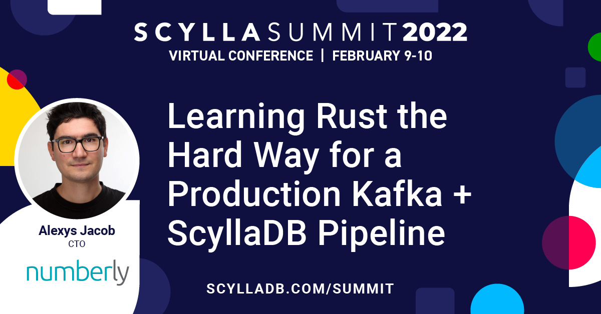

# Scylla Summit 2022

The 2022 edition of [Scylla Summit was full of great presentations](https://www.scylladb.com/scylla-summit-2022/presentations/) and I was fortunate to be part of it.

I shared [my experience of the journey](https://www.scylladb.com/presentations/learning-rust-the-hard-way-for-a-production-kafka-scylladb-pipeline/) that led me rewrite three Python based data pipeline applications into one written in Rust!

!!! abstract

    Numberly operates business-critical data pipelines and applications where failure and latency means "lost money" in the best case scenario.

    Most of those data pipelines and applications are deployed on Kubernetes and rely on Kafka and ScyllaDB, where Kafka acts as the message bus and ScyllaDB as the source of some data enrichment. The availability and latency of both systems are thus very important to us because they mix and match data in the early stage of our pipelines to be consumed by our platforms. Most of our applications are developed using Python. But we always felt that we could benefit from a lower-level programming language to squeeze the performance of our hardware even further for some of the most demanding applications.

    So, when an important part of our data pipeline was to be adjusted to reflect some important changes in our platforms, we thought it was a great opportunity to rewrite it in Rust! Moving to Rust was hard, not only because of the language itself, but because being at a lower level allowed us to see, test, and demonstrate things that we could not pinpoint or explain that well using Python.

    We spent a lot of time analyzing the latency impacts of code patterns and client driver settings and ended up contributing to Apache Avro as we went down the rabbit hole. This session will share our experience transitioning from Python to Rust while meeting the expectations of a business-critical application mixing data from Confluent Kafka and ScyllaDB.

    There will be code snippets, graphs, numbers, tears, pull requests, grins, latency results, smiles, rants of frustration, and a lot of fun!
