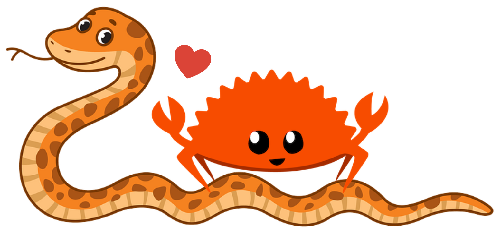

# EuroPython 2023

## Would Rust Make You A Better Pythonista?

*What would a Pythonista gain from becoming a Rustacean other than semicolons and brackets?*

In this talk I'll share the **learnings and achievements** I got by adding the **Rust** programming language into my **Python** life. Illustrating a real story now in production at scale, I'll walk you through all the pains and joys of this unexpected journey which changed me more than I anticipated.

- [See the slides](../assets/EP2023 - Would Rust Make You A Better Pythonista.pdf)
