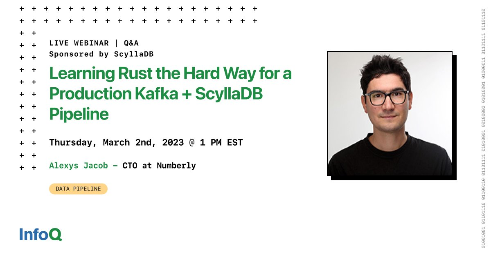

# Scylla + InfoQ Webinar

The [InfoQ community](https://www.infoq.com/) hosted a webinar on March 2nd 2023 where Peter Coreless from ScyllaDB and I shared to stage. This opportunity allowed me to once again update my Scylla Summit 2022 talk and share [my experience of learning Rust the hard way in the migration of Python pipelines to Rust](https://ultrabug.fr/Tech%20Blog/2022/2022-02-21-learning-rust-the-hard-way/).

**This topic does have a lot of traction** it seems, that's for good!

!!! abstract
    Numberly operates business-critical data pipelines and applications where failure and latency means "lost money" in the best-case scenario. Most of their data pipelines and applications are deployed on Kubernetes and rely on Kafka and ScyllaDB, with Kafka acting as the message bus and ScyllaDB as the source of data for enrichment. The availability and latency of both systems are thus very important for data pipelines. While most of Numberly’s applications are developed using Python, they found a need to move high-performance applications to Rust in order to benefit from a lower-level programming language.

    Learn the lessons from Numberly’s experience, including:

    - Rationale in selecting a lower-level language
    - Developing using a lower-level Rust code base
    - Observability and analyzing latency impacts with Rust
    - Tuning everything from Apache Avro to driver client settings
    - How to build a mission-critical system combining Apache Kafka and ScyllaDB
    - Half a year Rust in production feedback
