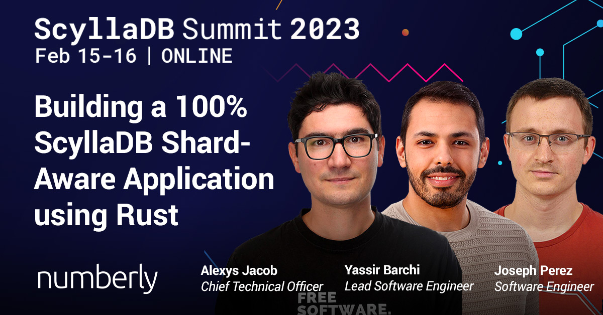

# Scylla Summit 2023

## Building a 100% ScyllaDB Shard-Aware Application Using Rust

Yet another edition of the [Scylla Summit with exciting presentations](https://www.scylladb.com/scylladb-summit-2023/presentations/?siteplacement=stickybanner) which I was fortunate to be part of. But this year I'm proud to have shared the stage with two of my colleagues: Joseph and Yassir!

We shared our **experience and technical achievements** in [building a 100% shard-aware application using Rust](https://www.scylladb.com/presentations/building-a-100-scylladb-shard-aware-application-using-rust/) that allowed us to **leverage the thread-per-core architecture of ScyllaDB inside our own application**!

You can find a **written transcript of the presentation on the [numberly.tech blog](https://numberly.tech/building-a-100-scylladb-shard-aware-application-using-rust-1aff048e0926)**.

!!! abstract

    At Numberly we designed an entire data processing application on ScyllaDB's low-level internal sharding using Rust. Starting from what seemed like a crazy idea, our application design actually delivers amazing strengths like idempotence, distributed and predictable data processing with infinite scalability thanks to ScyllaDB. Having ScyllaDB as our only backend, we managed to reduce operational costs while benefiting from core architectural paradigms like:

    - predictable data distribution and processing capacity
    - idempotence by leveraging deterministic data sharding
    - optimized data manipulation using consistent shard-aware partition keys
    - virtually infinite scaling along ScyllaDB

    This talk will walk you through this amazing experience. We will share our thought process, the roadblocks we overcame, and the numerous contributions we made to ScyllaDB to reach our goal in production. Guaranteed 100% made with love in Paris using ScyllaDB and Rust! 

## Scylla Award: Technical Achievement

This work and the numerous Open-Source contributions that we brought to the ScyllaDB community has been rewarded by the **Technical Achievement Award** from ScyllaDB.

I feel very honored by this award as it demonstrates that any innovative idea can be transformed into breakthrough technical achievements and contributions. Now live in production at Numberly!